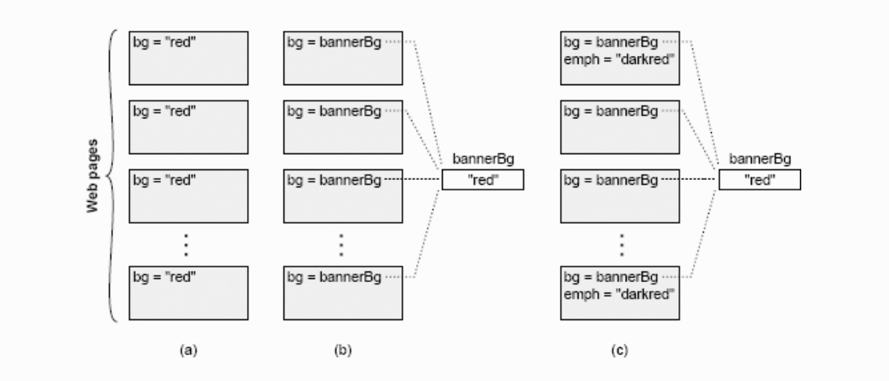

> 翻译自[《A Philosophy of Software Design》](https://book.douban.com/subject/30218046/)，作者[John Ousterhout](https://en.wikipedia.org/wiki/John_Ousterhout)，Tcl脚本语言和Tk工具库的发明人。

## 
第二章 复杂性的本质

&emsp;&emsp;本书讲的是有关如何设计软件系统使得复杂性最小化。那么第一步就是要了解对手。确切地说“**复杂性**”是什么？如何知道一个系统是否有不必要的复杂性？是什么让系统变得复杂？本章会从宏观层面讨论这些问题，随后的章节里会介绍如何依据具体的结构特征在细节层面上识别复杂性。

&emsp;&emsp;识别复杂性的能力是一个重要的设计技能。它会让你在付出很多努力之前就能找出问题关键所在，并在各方案中做出明智的选择。判断一个设计是否简单要比创建一个简单的设计更容易。但是一旦能够判断出系统过于复杂，你就可以用这种能力引导你的设计哲学走向简洁。如果一个设计表现地很复杂，可以试着采用不同的方法看看能不能让它变得更简单。久而久之，你会发现某些技术往往会带来更简单的设计，而其他技术则会导致复杂。这会让你更快地找到更简单的设计。

&emsp;&emsp;另外，本章也会介绍一些基本假设，为后面的内容提供一个基础。后续章节会采用这些材料来证明各种改进和结论。

### 2.1 复杂性的定义

&emsp;&emsp;出于本书的目的，我会采用一种实用的方式来定义“复杂性”。**复杂性是指和软件系统的结构有关，并让系统难于理解和修改的任何事物**。复杂性可以有多种表现形式，比如它会让你很难搞清楚一段代码是如何工作的；它会让你花费巨大工作量才完成一小点改进；它让你搞不清楚要完成改进需要修改系统的哪些部分；它会让你很难在改bug的同时不引入新的bug。如果一个软件系统很难理解和修改，那它一定是复杂的；反之，如果很容易则它一定是简单的。

&emsp;&emsp;另外你还可以根据成本和收益来看待复杂性。在一个复杂的系统中，即使要实现一个小的改进也要花费大量的工作。而在一个简单的系统中，花费更少的工作量就能实现更大的改进效果。

&emsp;&emsp;复杂性是开发人员在试图达到一个特定的目标而在特定的时间点所体验到的感受。它不一定和系统的总体大小或者功能相关。人们经常用“complex”来描述包含复杂功能的大型系统，但是如果这样的系统很容易操作，那么根据本书的定义，它就不能说是complex的。当然，几乎所有复杂的大型软件系统实际上都能难操作，所以它们也算符合我对复杂性的定义。但事实未必一定如此，有可能一个简单的小型系统也会非常复杂。

&emsp;&emsp;复杂性取决于软件里最常见的操作。如果系统中某些部分非常复杂，但这些部分几乎从不需要被处理，那么它们对系统整体的复杂性就不会有太大影响。用数学公式可以粗略的表示为：
$$
C = \sum_{p}{c_pt_p}
$$
&emsp;&emsp;系统总体复杂度C由每个部分p的复杂度 $(c_p)$与开发人员花在该部分上的时间$(t_p)$做加权求和所得。由此可见，把复杂性隔离在一个永远不会被看到的地方，几乎和完全消除复杂性的效果一样好。

&emsp;&emsp;复杂性相对于读代码的人来说比写代码的人更显而易见。如果你写了一段代码，看起来很简单，但是其他人认为它很复杂，那么它就是复杂的。当你遇到这种状况的时候，值得去研究一下其他开发人员，找出为什么这些代码对他们来说很复杂。从你们之间观点的差异中，你可能会学到一些有趣的经验。作为开发者，你的工作并不只是编写一段可以简单执行的代码，而是要编写一段代码，让其他人也能够轻松使用它。

### 2.2 复杂性的表现

&emsp;&emsp;复杂性通常表现在三个方面，下文各段将会详细说明。其中每个方面都会让执行开发任务变得更加困难。

&emsp;&emsp;**改动放大（Change amplification）**：复杂性的第一个表现是一个看起来简单的改动需要在很多不同的地方做代码修改。比如，考虑一个网站包含若干网页，每个网页都会显示一个包含背景颜色的banner。在早期的网站中，如图2.1(a)所示，每个网页中的背景颜色都要各自显式指定。在这种网站中，为了修改背景，开发者就不得不手动修改每个页面。这种修改方案对于一个包含上千页面的大型网站几乎是不可能的。幸运地是，现代网站会使用一些类似图2.1(b)所示的方法，banner颜色会在统一的地方一次性指定，所有单独页面都会引用这个共享的颜色值。使用这种方法，要改变整个网站banner的颜色只需要修改一处即可。优秀设计的目标之一就是减少每个设计决策所影响的代码量，从而让设计的变更不会导致过多的代码修改。

&emsp;&emsp;**认知负荷（Cognitive load）**：复杂性的第二个表现是认知负荷，指的是开发人员需要了解多少信息才能完成任务。更高的认知负荷意味着开发人员不得不花费更多的时间去学习所需要的信息，由于所需信息更多，他们更容易错过一些重要的内容，从而导致错误的风险会更大。比如，假设在C语言中，一个分配内存的函数返回一个指向内存的指针，假定需要调用方来释放内存，这就增加了开发人员使用函数的认知负荷。如果一个开发人员释放内存失败了，就会导致内存泄露。如果系统重构让调用方不再担心内存释放的事（申请内存的模块同时负责释放内存），就会降低认知负荷。认知负荷表现在很多方面，比如包含很多方法的API、全局变量、逻辑的不一致、模块间的依赖等等。

&emsp;&emsp;系统设计者有时会假定通过代码行数来评估复杂性。他们假设如果一个实现方案比另一个短，那么它就是更简单的。如果只是几行代码的修改，那么这个改动就一定比较容易。然而，这个观点忽略了认知负荷带来的成本。我看过一些框架允许仅用几行代码来编写应用程序，但要理解这几行代码是极其困难的。**有时需要更多行代码的方案实际上更简单，因为它降低了认知负荷。**

> 图2.1：网站的每个页面都展示了一个带颜色的banner。(a)中每个banner的背景色都是由各个页面自己显式指定的，(b)中共享变量bannerBg保存了一个背景色值，各个页面都引用这个变量。(c)中有的页面展示了一个附加的着重色，是基于banner背景色之上较暗的阴影效果。如果背景色变了，着重色也要跟着变。

&emsp;&emsp;**不知道的未知（Unknown unknowns）**：复杂性的第三个表现是对于必须要修改哪些代码才能完成任务，或者开发人员必须掌握哪些信息才能成功执行任务这些问题，没有一个明显的答案。图2.1(c)描述了这个问题。网站使用了一个统一的变量来定义banner的背景色，看起来很容易修改。然而有些网页使用了基于背景色的较暗的阴影效果作为着重色，而这个颜色在这些单独的网页中被显式指定。如果banner的背景色变了，为了匹配效果着重色也要跟着修改。不幸地是，开发人员很可能没有意识到这一点，而在修改bannerBg变量的同时没有更新着重色。即使开发人员意识到了这个问题，具体哪些页面使用了着重色也是不明显的，只能通过在整个网站搜索每个网页才能确定。

&emsp;&emsp;在复杂性的这三个表现当中，不知道的未知是最糟的。不知道的未知意味着有些事情你需要知道，但你没有办法把它们找出来，甚至于这个问题是否存在都不知道。而在你做了一些改动出现bug之后，才发现出了问题。改动放大虽然令人讨厌，但是只要清楚哪些代码需要修改，一旦修改完成，系统就会正常工作。类似地，高认知负荷会增加修改成本，但如果明确了要阅读哪些信息，那么更改仍然可能是正确的。而对于不知道的未知，不清楚该做什么，也不清楚提出的解决方案是否会奏效。唯一确定的方法就是阅读系统中的每一行代码，而这对于任意规模的系统是不可能的。即使这样也可能还不够，因为这样的改动可能会依赖于一个未记录在文档中的细小的设计决策。

&emsp;&emsp;对于一个系统来讲，优秀设计的最重要的目标之一就是***明确化（be obvious）***。这个正与高认知负荷和不知道的未知相对。在一个明确的系统中，开发人员可以快速地理解现有代码的工作逻辑以及更改所需要做的工作。一个明确的系统可以让开发人员不用冥思苦想，而快速地猜测要做什么，并且可以确信猜测是正确的。第18章会讨论一些让代码更明确化的技术。