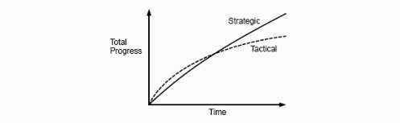

>  翻译自[《A Philosophy of Software Design》](https://book.douban.com/subject/30218046/)，作者[John Ousterhout](https://en.wikipedia.org/wiki/John_Ousterhout)，Tcl脚本语言和Tk工具库的发明人。

## 
第三章 仅是能运行的代码是不够的

&emsp;&emsp;优秀的软件设计最重要的元素之一，是在处理编程任务时所采用的思维方式。许多团队鼓励一种战术式思维，聚焦在怎么让功能尽可能快地跑起来。然而，如果想要获得一个良好的设计，就必须采用更多战略式的方法，投入时间去做干净的设计，同时解决问题。本章节会讨论为什么战略式方法能产生更好的设计，以及从长远看战略式方法实际上比战术式方法成本更低。

### 3.1 战术式编程

&emsp;&emsp;大多数程序员使用一种我称为***战术式编程***的思维方式来进行软件开发。在战术式方法中，人们所关注的是让某些东西正常跑起来，比如新的功能特性以及bug fix。乍一看这个貌似很合理：什么比写出能正常运行的代码更重要的呢？然而，战术式编程让好的系统设计变得几乎不可能。

&emsp;&emsp;战术式编程的问题在于它是短视的。如果用战术式编程的思路来开发，你就会尽力以最快的方式去完成任务，或许同时你还有一个艰难的deadline，在这种情况下对未来的规划就不会成为优先要做的事，你也不会花很多时间去追求最佳设计，只是想让功能尽快跑起来。你会告诉自己，只要能让当前任务更快地完成，增加一些复杂性或者引入一两个凑合的方案也是可接受的。

&emsp;&emsp;这就是系统变得越来越复杂的原因。如之前章节所说，复杂性是有递增性的，而且它并不是由一个特定的问题造成，而是几十几百个小问题积累导致的。如果采用战术式编程，每个编程任务都会造成在复杂性上一定程度的增长。在为了快速完成当前任务的思路下，它们每个可能看起来都像是合理的折中方案。然而，如果每个人都是这种思路，复杂性就会快速地积累。

&emsp;&emsp;不久之后，一些复杂性导致的问题开始出现，你就会希望当初没有走那些捷径。然而，你仍然会告诉自己搞定接下来的功能特性比回头重构已实现的代码更重要。从长远来看，重构可能会有所帮助，但它肯定会降低当前任务的实现速度。所以，你会采用一些临时方案，以快速打补丁的方式来处理你遇到的问题。这无疑会引入更多的复杂性，从而需要更多的补丁来应对。很快代码就会变得一团糟，这种情况下要想把问题清理干净就得花几个月的工作量，而项目计划是无法接受这种延期的。考虑到修改一两个问题，整个情况也无法改善多少，也只能硬着头皮继续这样走下去。

&emsp;&emsp;如果你曾经在大型软件项目里工作过很长一段时间，我猜测你也遇到过这种战术式编程的情况，经历过它所带来的问题。一旦你走上了战术式编程这条路，是很难回头的。

&emsp;&emsp;几乎每个软件开发团队中都会有至少一个开发人员将战术式编程的思路发挥到极致：***战术旋风（tactical tornado)***。”战术旋风”是指码代码比其他人快很多的那种多产程序员，但是他们会一直采用战术式的方式编程。如果要快速实现一个功能特性，没有人比他们完成的更快。在某些团队中，管理者会把这些“战术旋风”当做英雄来看待。然而，旋风过后往往是一片狼藉，那些将来要处理他们代码的工程师们很少会把他们视为英雄。通常“战术旋风”留在身后的这一团糟的代码必须有其他的工程师来处理干净，而这种活又让这些工程师（真正的英雄）看起来比那些“战术旋风”慢很多。

### 3.2 战略式编程

&emsp;&emsp;成为优秀软件设计师的第一步是要认识到***仅是能正常运行的代码是不够的***，为了更快的完成当前任务而引入不必要的复杂性是不能被接受的。系统中一个最重要的方面就是它的长期结构。任意系统中大多数的代码都是基于一个已存在的代码库扩展写成的，所以作为一个开发人员最重要的工作就是让未来的扩展变得更容易。因此，虽然你的代码显然需要能正常运行，但你不能把“可运行代码”作为你的首要目标。你的首要目标必须是做出良好的设计，同时能正常地运行。这就是***战略式编程***。

&emsp;&emsp;战略式编程需要有一个投资的心态，而不是用最快的方法来完成你当前的项目，你必须投入时间去改进系统的设计。如同3.1图所示，这些投资在短时间内会稍微拖慢你的速度，但长期来看会让你的速度更快。

&emsp;&emsp;有些投资是主动的。比如在实现一个新的class的时候，值得额外花点时间去找出简单的设计，而不是有了一个念头马上就实现，可以尝试着去找出几个备选的设计方案，从中选一个最干净清晰的。试着去想象一下系统在未来可能需要改变的一些方面，并确保你的设计是简单的。编写优秀的文档则是另一个主动投资的例子。

&emsp;&emsp;其他投资则是被动的。无论你事先投资了多少，也不能避免在后面的设计决策中不出现错误。久而久之，这些错误会暴露出来。当你发现这些设计问题时，不要简单的忽略或者仅是打个临时补丁，应该额外花点时间去修复它。如果采用战略式编程思路，你会对系统设计持续地做出改进。战术式编程正好相反，它会持续地增加系统的复杂度，直到造成大的麻烦。

### 3.3 要投资多少？

&emsp;&emsp;那么针对战略式编程的思路，投资多少合适呢？像设计一个完整系统这样巨大的超前投资，不是很有效率。如同之前提到的瀑布模型，我们都知道按这种方式玩不转。随着系统经验的积累，理想的设计往往是零零碎碎出现地。因此，最好的方法是在持续地基础上做大量的小额投资。我建议你从整个开发时间里拿出10%~20%来做这件事。这个比例足够小，而不会对你的日程安排有很大影响，同时随着时间的积累，也足够大到能得到明显的收益。由此推算，应用到初始项目将会比纯战术式方法多花10%~20%的时间。这些额外的时间会带来更好的软件设计，而你在几个月内就会体会到其中的好处。用不了多久，你的开发速度就会比战术式编程至少快10%~20%。从这点上看，你的投资就是免费的：从过去的投资中获得的收益将为你节省出足够的时间来弥补未来投资的成本，你也会很快收回最初的投资投入。图3.1说明了这种情况。

> 图3.1：一开始，战术式编程会比战略式编程更快，然而在战术式编程下复杂性也会快速积累，从而导致生产力降低。随着时间推移，战略式编程会取得更大的进展。该图仅是一个定性说明，我并没有任何通过经验测量得到的准确曲线。

&emsp;&emsp;相反地，如果采用战术式编程，在项目初期你可能会提前10%~20%的时间完成开发，而随着复杂性越积累越高，你的开发速度会越来越慢。用不了多久，开发速度就会下降至少10%~20%，而在开始时节省的所有时间很快就会还回去，并且在余下的系统生命周期里，你会比采用战略式编程开发得更慢。如果你还从未在这种质量严重降低的代码库中工作过，可以和有经验的开发者聊一聊：他们会告诉你，糟糕的代码质量至少会降低20%的开发速度。

### 3.4 创业和投资

&emsp;&emsp;在某些环境下，针对战略式方法会有很强大的反对力量。比如，创业公司在早期阶段，面对早期版本的快速发布要求，会承担巨大的压力。在这些公司里，即使10%~20%的时间投资可能看起来都是无法承受的。这就导致很多创业公司采用的都是战术式编程的思路，在前期设计乃至中间发现的问题上，都花费很小的工作量去处理。他们自认为这样做是合理的，如果后面成功了，他们就会有足够的钱聘请更多的工程师来清理这些问题。

&emsp;&emsp;如果你所在的公司倾向于这种思路，那你就要意识到，一旦代码库变成了一坨意大利面（spaghetti），那么它几乎就不可能再被修复了，你可能要为产品的整个生命周期支付高昂的开发成本。此外，好的（或坏的）设计的影响会来得很快，所以很可能这种战术式编程甚至都不会加快你的第一个产品版本的发布。

&emsp;&emsp;另一个要考虑的问题是一个公司能成功最重要的因素之一是工程师们的素质。降低开发成本最好的办法就是招聘优秀的工程师：他们并不比平庸的工程师贵很多，但有着高出很多的生产力，然而，最好的工程师对良好的设计是非常在意的。如果你的代码库成为了一堆垃圾，消息传出去，就很难招聘到好的工程师。结果，你很可能只招聘到一些平庸的工程师，这会增加你未来的成本，甚至于导致系统结构进一步地退化。

&emsp;&emsp;Facebook就是一个面临战术式编程问题的创业公司的例子。很多年里，公司的座右铭就是"快速行动，打破陈规"（Move fast and break things）。刚从学校毕业进入公司的新人会被鼓励立即投入到公司代码库的开发中；而对工程师来讲，在工作的第一周，向产品库提交代码是很正常的事。积极的一面是，Facebook建立了一个给员工赋权的良好的公司形象。工程师会有很大的自由度，几乎没有什么规则来限制他们。

&emsp;&emsp;Facebook作为一家公司已经取得了巨大的成功，而它的代码库却因为公司采用战术式方法而遭到破坏。很多代码都不稳定，也很难理解，只有很少的注释和测试，而且很难处理。随着时间的推移，Facebook意识到它的文化是不可持续的。最终，Facebook将它的座右铭改为“基于坚实的基础设置快速发展”（Move fast with solid infrastructure），以鼓励它的工程师们投入更多时间到良好的设计上。至于Facebook能不能成功清除那些年使用战术式编程造成的问题，还有待观察。

&emsp;&emsp;公平而言，我应该指出，Facebook的代码可能并不比创业公司的平均水平差多少，战术式编程在创业公司中很常见，Facebook只是一个特别明显的例子。

&emsp;&emsp;幸运地是，在硅谷使用战略式编程的思路也有可能获得成功。Google和VMware几乎是与Facebook同时期发展起来，但这两家公司都采用了更具战略性的方法。它们都非常重视高质量的代码和良好的设计，并且都构建了使用可靠的软件系统解决复杂问题的复杂产品。在硅谷，它们强大的技术文化已广为人知。很少有公司能和它们竞争顶尖的技术人才。

&emsp;&emsp;这些例子表明，一个公司可以用任一种方法取得成功。但是，在一家重视软件设计并拥有干净代码库的公司工作会有趣地多。

### 3.5 结论

&emsp;&emsp;良好的设计并不是免费的。它需要你进行持续的投入，这样的话小问题就不会积累成大麻烦。幸运地是，良好的设计最终会让你收回成本，而且比你想象的还要快。

&emsp;&emsp;至关重要的是要始终如一地使用战略式方法，同时把相应的投资看作是马上要做的事情，而不是将来。当人们陷入开发困境的时候，很容易把清理工作推迟到危机结束之后。然而，这就像是一个大滑坡，在当前危机之后，几乎可以肯定会有另一个，而在其后还会有下一个。一旦你开始推迟做设计改进，很容易就无限期地推迟下去，而你的开发文化也很容易变为战术式方法。有关设计的问题解决的时间越长，它就会越变越大，从而令解决成本变得更加令人生畏，就越容易让人想把解决的时机推迟。而最有效的解决方法就是让每个工程师持续小量地投入到良好设计的改进工作中。