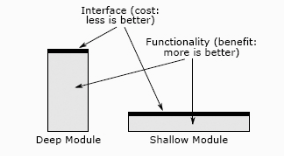

> 翻译自[《A Philosophy of Software Design》](https://book.douban.com/subject/30218046/)，作者[John Ousterhout](https://en.wikipedia.org/wiki/John_Ousterhout)，Tcl脚本语言和Tk工具库的发明人。

##  <center>第四章 模块应该是深的</center>

&emsp;&emsp;管理软件复杂性最重要的技术之一，就是把系统设计成让开发人员在任何时候都只需要面对总体复杂性的一小部分。这个方法叫做***模块化设计***，本章会介绍相关的一些基本原则。

### 4.1 模块化设计

&emsp;&emsp;在模块化设计中，软件系统会被分解为相对独立的一组模块。这里所说的模块可能有多种形式，比如class、子系统或者服务等。在理想世界中，每个模块都完全独立于其他模块，一个开发人员可以基于任何一个模块进行开发，而无需了解其他模块的任何内容。而在现实世界中，一个系统的复杂性是由其最差的（最复杂的）模块的复杂性所决定的。

&emsp;&emsp;不幸地是，理想世界是可望不可即的。模块必须靠它们包含的函数和方法间的彼此调用才能协同运转，这就要求模块间必须了解彼此的相关信息才行。于是模块间就会产生依赖：如果修改了一个模块，那么其它模块也要做相应的修改。例如，方法的参数造成方法与调用方法的代码间产生依赖，如果方法所需的参数有改变，那么所有调用该方法的代码都必须修改，以保持和方法签名一致。依赖也有许多其他形式，可能会变得非常不明显。总之，模块化设计的目标就是为了将模块间的依赖最小化。

&emsp;&emsp;为了管理依赖，我们把每个模块分为两个部分来考虑：***接口*** 和 ***实现***。接口包含了让工作在其他模块的开发人员使用该模块所必须了解的所有内容。一般来说，接口描述的是模块是什么，而不是它怎么做。而实现则包含了接口所承诺的功能执行代码。开发人员要想在一个特定模块上工作，必须了解该模块的接口和实现，以及被其调用的其他模块的接口。他不应该也不需要去了解他所工作模块之外其他模块的实现细节。

&emsp;&emsp;考虑一个实现了平衡树的模块，它可能包含了复杂的代码以确保树能维持平衡。然而这个模块的复杂度对外部用户来讲是不可见的，用户只是看到了一些相对简单的接口，它们提供了在树中插入、删除、获取节点等操作。要想执行插入操作，调用者仅需要提供新节点的key和value即可。而实现中对树的遍历及节点的分拆在接口中是不可见的。

&emsp;&emsp;就本书而言，任何具有接口和实现的代码单元都可以叫模块。面向对象语言中的每个class都是一个模块。class中的方法，或者非面向对象语言中的函数，也可以被看做是模块：它们都具有接口和实现，模块化设计技术也适用于它们。更高层面的子系统或者服务也是模块；它们的接口可能有不同的形式，例如内核调用或者http请求。本书中大多数关于模块化的讨论都会关注对class的设计，同样的技巧和概念也可以应用到其他类型的模块中。

&emsp;&emsp;最好的模块是那种接口比实现简单的多的模块。这样的模块有两个优点，首先，简单的接口可以最小化该模块对系统其他部分带来的复杂性。其次，如果模块在更改时保持它的接口不变，那么就不会影响到其他模块。如果一个模块的接口比它的实现简单的多，那么在不影响其他模块的前提下，可以针对模块的很多方面做更改。

### 4.2 接口是什么

&emsp;&emsp;一个模块的接口包含两类信息：正式的和非正式的。一个接口正式的部分是在代码中显式指定的，这部分是可以通过程序语言检查来判断正确性的。例如，一个方法的正式接口就是它的签名，包含方法名、参数类型、返回值类型以及方法抛出的异常信息等。大多数程序语言能保证对每个方法调用都可以提供正确数量和类型的参数，以匹配该方法的签名。一个类的正式接口包含所有public方法的签名信息，以及所有public成员变量的类型和名字。

&emsp;&emsp;每个接口还包含一些非正式元素。它们并没有以程序语言可以理解或可执行的方式予以指定。一个接口的非正式部分包括了它的高级行为。比如一个函数功能是删除由它的一个参数所命名的文件，或者一个类的用法有所限制（比如一个方法必须在另一个方法之前调用），这些信息也算是接口的一部分。一般来讲，如果开发人员需要了解特定的信息才能使用模块，那么这些信息就是该模块接口的一部分。接口非正式的方面只能通过注释来描述，而程序语言无法保证描述是完整和准确的<sup>注1</sup>。对大多数接口而言，非正式的方面要比正式的方面更大更复杂。

&emsp;&emsp;一个被清晰定义的接口的好处之一就是能够确切地表明为了使用关联的模块，开发人员需要了解哪些信息。这有助于消除2.2小节中所说的“不知道的未知”这样的问题。

> <font size=2>注1：存在这样的语言——主要在研究社区中——语言可以支持使用规范正规地描述方法和或者函数的整体行为。同时支持对规范的自动检查，以确保它和实现相匹配。一个有趣的问题是，这样的规范是否可以取代接口的非正式部分？我目前的观点是，对于开发人员来说，用英语描述的接口可能比用正式规范语言编写的接口更直观，也更容易理解。</font>

### 4.3 抽象

&emsp;&emsp;术语***抽象 (abstract)***与模块化设计的思想密切相关。**抽象是针对一个实体的简化视图，它忽略了不重要的细节。**抽象的用途体现在它可以让我们去思考和掌控复杂的事物。

&emsp;&emsp;在模块化编程中，每个模块都提供了接口这样的抽象形式。接口体现了模块功能的简化视图；而从模块抽象的立场来看，实现的细节是不重要的，所以它们在接口中被省略掉了。

&emsp;&emsp;在抽象的定义中，“不重要”这个词至关重要。抽象中省略掉的不重要的信息越多越好。然而，细节只能是在不重要的情况下才能从抽象中省略掉。抽象可能会在两个方面出错：首先，它可能包含了一些并不是真正重要的细节信息，如果是这样，就会使抽象比所需要的更复杂，从而增加了开发人员使用抽象的认知负荷。其次是抽象省略掉了真正重要的细节，从而导致晦涩不清：只关注抽象的开发人员无法获得正确使用抽象所需的所有信息。一个省略掉重要细节的抽象是***错误的抽象***：它可能会显得简单，但是事实上并不是。设计抽象的关键点在于理解什么是重要的，并且找到最小化重要信息数量的设计方案。

&emsp;&emsp;举个例子，考虑一个文件系统。文件系统所提供的抽象忽略掉了很多细节。比如，选择存储设备上哪些块用于给定文件中的数据的机制。这些细节对于文件系统的用户来讲是不重要的（只要系统提供足够的性能）。然而，文件系统的其他一些实现细节对用户来讲则是重要的。大多数文件系统会在主内存中缓存数据，为了提高性能，它们可能会将新数据延迟写入到存储设备中。一些应用，比如数据库，需要确切地知道数据什么时候写入到存储中，这样他们就可以确保在系统崩溃后数据被保留。因此，将数据刷新到辅助存储的规则必须在文件系统的接口中可见。

&emsp;&emsp;我们依赖抽象去管理复杂性并不只是发生在编程中，它在我们的日常生活中是无处不在的。微波炉所包含的复杂的电子元件，可以将交流电转换成微波辐射，并将这种辐射散布在整个烹饪腔内。幸运地是，用户所看到的是简单地多的抽象，包含的只是几个控制时间和微波强度的按钮。汽车也提供了一个简单的抽象，可以让我们在不了解电机、电池电源管理、防抱死刹车、巡航控制等机制的情况下驾驶汽车。

### 4.4 深度模块（Deep modules）

&emsp;&emsp;最好的模块是那些提供强大功能同时又有简单接口的模块。这里我用术语***deep***来描述这样的模块。为了让深度的概念可视化，假设每个模块都是由一个矩形表示，如图4.1所示。每个矩形的面积都正比于对应模块实现的功能。而矩形的上边沿表示对应模块的接口；边长则表明接口的复杂性。最好的模块应该是deep的：在简单的接口之后，隐藏着大量的功能。深度模块是良好的抽象，因为它内部的复杂性对其用户可见的只是一小部分。



> <font size=2>图4.1：深的和浅的模块。最好的模块是深的：它允许通过一个简单的接口访问大量的功能。浅的模块具有相对复杂的接口，但是没有太多的功能：它没有隐藏太多的复杂性。</font>

&emsp;&emsp;模块深度是考虑成本与收益的一种方式。模块提供的收益就是它的功能，而成本（以系统复杂性而言）就是它的接口。模块接口体现了模块对系统其他部分施加的复杂性：接口越小越简单，它所引入的复杂性就越少。最好的模块是那些带来巨大收益而又花费很小成本的模块。接口是好的，但更多或更大的接口不一定更好。

&emsp;&emsp;Unix和类Unix操作系统，比如Linux，提供的文件I/O机制是关于深度接口的一个漂亮的例子。它仅为I/O提供了5个基础的系统调用，而且这些函数的签名很简单。

```c
int open(const char* path, int flags, mode_t permissions);
ssize_t read(int fd, void* buffer, size_t conut);
ssize_t write(int fd, const void* buffer, size_t count);
off_t lseek(int fd, off_t offset, int referencePosition);
int close(int fd);
```

&emsp;&emsp;系统调用*open*使用了一个如/a/b/c这样分层结构的文件名参数，同时返回一个整数类型的文件描述符，做为指向打开文件的引用。而*open*的其他参数提供了一些可选信息，比如该文件是为了读还是写而打开，如果文件不存在是否要新建文件，对于已创建文件它的访问权限是什么等等。系统调用*read*和*write*是在应用存储的缓冲区和文件之间传送数据；而*close*会终止程序对文件的访问。大多数文件数据都是被连续访问的，所以连续访问被设置为缺省方式。然而，也可以调用*lseek*去改变当前的访问位置，实现对文件的随机访问。

&emsp;&emsp;Unix I/O的现代版实现需要数十万行代码，这些代码用于处理诸如下面这样的复杂问题：

+ 如何在磁盘上表示文件以达到有效率的访问？
+ 如何存储目录，如何处理分层结构的路径名以找到相对应的文件？
+ 如何实现权限机制，使得一个用户不能修改或删除另一个用户的文件？
+ 如何实现文件访问？例如，如何在中断处理程序和后台代码之间划分功能，以及这两者之间如何安全通信？
+ 当存在对多个文件的并发访问时，使用什么调度策略？
+ 如何将最近访问的文件数据缓存在内存中，以减少磁盘访问的次数？
+ 如何将各种不同的辅助存储设备（如磁盘和闪存驱动器）合并到一个文件系统中？

&emsp;&emsp;所有这些以及更多的问题，都是在Unix文件系统实现中解决的。它们对于仅使用系统调用的程序员是不可见的。多年来，Unix I/O接口的实现已经发生了根本的变化，但是5个基本的内核调用一直没有改变。

&emsp;&emsp;深度模块的另一个例子是有关程序语言的垃圾收集机制，比如Go或者Java。这种模块根本没有接口；它在后台无形地回收未使用的内存。向系统中添加垃圾收集机制，系统整个接口实际上缩小了，因为它消除了释放对象的接口。垃圾收集的实现非常复杂，但是对于使用语言的程序员而言，复杂性被隐藏了。

&emsp;&emsp;像Unix I/O和垃圾回收这样的深度模块提供了强大的抽象，因为它们易于使用，而且隐藏了巨大的实现复杂性。

### 4.5 浅模块（Shallow modules）

&emsp;&emsp;另一方面，浅模块是指接口与它提供的功能比较相对复杂的模块。例如，一个实现了链表的class就是浅的。操作一个链表不需要太多代码（插入或删除一个元素仅需要几行代码），所以链表抽象并没有隐藏很多细节。链表接口的复杂性几乎与它的实现复杂性相当。浅类有时是不可避免的，但是它对于管理复杂性提供不了太多帮助。

&emsp;&emsp;这里有个关于浅模块的极端的例子，来自于软件设计课上的项目：

```java
private void addNullValueForAttribute(String attribute) {
    data.put(attribute, null);
}
```

从管理复杂度的立场看，这个方法只会让事情更糟，而不是更好。这个方法没有提供任何抽象，因为它的所有功能通过接口都是可见的。例如，调用方可能需要知道属性被存储在*data*变量中，而考虑接口并不比考虑实现更简单。如果该方法要被文档准确的描述，那么文档说明会比方法的代码还要长。调用该方法甚至比调用方直接操作数据变量所需的击键次数还要多。这种方法增加了复杂性（开发人员要学习新的接口）但没有提供任何补偿性的收益。

> <center>📚<font color=red><b>危险信号：浅模块</b></font>📚</center>
>
> ***浅模块的接口相对于它提供的功能来说是复杂的，对管理复杂性帮助不大。因为它们所提供的收益（不需要了解它们内部如何工作）被学习和使用它们接口的成本所抵消了。小模块往往是浅的。***

### 4.6 Classitis

&emsp;&emsp;不幸地是，在今天深度模块的价值并不是被广泛认可的。编程的传统智慧讲究class应该是小的，而不是深的。学生们经常被教导关于class的设计最重要的事是要把大class拆分成一些小class。针对于方法类似的建议也经常被提起：“任何超过N行的方法都应该拆分成多个方法”（N可以低至10）。这种思路导致了大量的浅class和浅方法，增加了整个系统的复杂性。

&emsp;&emsp;针对"class应该是小的"思路的极致情况，我称作***classitis*综合症**，这源于一个错误的观点，“class是好的，所以class越多越好”。在遭受classitis困扰的系统中，开发人员常被鼓励最小化每个新类中的功能数量：如果想要更多的功能，那就引入更多的类。Classitis可能会导致很多独立的简单的class，但是会增加整个系统的复杂性。小class不会包含很多功能，所以不得不编写很多小class，每个小class都有自己的接口。这些接口积聚在一起在系统层面造成了非常的大复杂性。由于每个class都需要包含样板内容，所以小class还会导致冗长的编程风格，

### 4.7 例子：Java和Unix I/O

&emsp;&emsp;Java类库是当今classitis最明显的例子之一。Java语言并不需要大量的小class，但是classitis文化看起来已经在Java编程社区扎下了根。例如，为了实现打开文件并从文件中读取序列化对象，你必须创建三个不同的对象：

```java
FileInputStream fileStream = new FileInputStream(fileName);
BufferedInputStream bufferedStream = new BufferedInputStream(fileStream);
ObjectInputStream objectStream = new ObjectInputStream(bufferedStream);
```

FileInputStream对象只提供基本的I/O能力：它不能执行缓存式I/O，也无法读写序列化对象。BufferedInputStream基于FileInputStream增加了缓存功能，而ObjectInputStream在其基础上增加了读写序列化对象的功能。在以上代码中，前两个对象fileStream和bufferedStream，在打开文件的处理中没有调用过一次，所有后面的操作都是调用的objectStream对象。

&emsp;&emsp;必须要求显式地创建一个单独的BufferedInputStream对象，是一个特别烦人的事（而且容易出错）。如果开发人员忘了创建这个对象，没有缓存能力的I/O就会变慢。也许Java开发人员会争辩说，并不是每个人都想对文件I/O做缓存处理，所以它不应该在基本机制中创建。他们可能会说，最好把缓冲分开，这样人们就可以选择是否使用它。提供选择是好的，但是**接口应该设计成让常见的情况尽可能简单**。使用文件I/O的每个用户几乎都需要缓存，所以这种方式应该是缺省提供的。对于那些不需要缓存的少数情况，库可以提供一种机制来禁用它。任何禁用缓存的机制都应该在接口中单独提供（例如，通过为FileInputStream提供不同的构造函数，或者通过禁用或替换缓存机制的方法来实现），让大多数开发人员甚至于无需知道它的存在。

&emsp;&emsp;相反地，Unix系统调用的设计者针对常见情况做了简化。例如，他们意识到I/O的顺序访问是最常见的，因此将其设定为缺省行为。使用lseek系统调用，随机访问仍然相对容易实现，但是只进行顺序访问的开发人员不需要知道这种机制。如果一个接口包含很多功能，但是大多数开发者只需要知道其中几个，那么针对这个接口的有效复杂性就只是这几个常用功能的复杂性。

### 4.8 结论

&emsp;&emsp;通过将接口从模块实现中分离出来，我们可以向系统其他部分隐藏模块实现的复杂性。模块的用户只需要理解模块接口提供的抽象部分。在设计class和其他模块方面，最重要的问题是要将模块设计为深的；针对常见的使用情况，模块应该使用简单的接口，同时提供重要功能。这最大化了针对复杂性的封装。