> 注：这是多年前人人网上的一篇文章，现如今已人去楼空。文章个人观点的意味很浓厚，在这里不争对错，只为了让未曾经历或关注过的玩家了解那段曾经有过的国产单机岁月。

 

## **对游戏的一些感想（转轩辕剑吧轩辕少年）**

作者： [于泽珩©](http://blog.renren.com/GetEntry.do?id=444772944&owner=222062953)

链接：http://blog.renren.com/share/231740184/1535535367

 

### 1、对游戏的评论标准

&emsp;&emsp;接触游戏已经18年了，对游戏的欣赏水平一直都在进步，衡量一款游戏好坏的标准也一直在改变，在此先回顾一下我个人鉴赏游戏标准变化的几个阶段。其中有很多时期的观点在现在看来非常弱智，但既然已都是往事，也不妨都拿出来晒晒太阳。 

+ **90年以前：能玩就是好，不能玩的就是差。** 

  这个时期才刚接触FC游戏不久，完全没有什么欣赏游戏的概念，买来一盘卡，插进去开机，标题画面过后，能直接开打的就是好游戏；出来一堆选单的“文字卡”就是破烂。对一个未上小学的准玩家来说，选择游戏也就是这么简单，那时是最幼稚的，但也是最快乐的，随便一款破烂不堪的弱智游戏就能疯狂打上一整天，反复通关N遍。 

   

+ **90年-92年：画面强的就是好，画面弱的就是差。** 

  90年以后，FC游戏玩了几百款，具有了一定的鉴赏能力，随后又接触了很多MD游戏和街机游戏，再回头看FC简直不堪入目。从此深刻地感觉到画面是最重要的，画面精美就是大制作，画面简陋就是小游戏。这种观点在现在看来比较菜鸟，但在当时是绝对正确的，因为现在游戏的画面已经达到了一个不错的水准，提升与否只是“好”和“更好”的区别，并不是非常重要；而那时的画面正是“不堪入目”和“可以入目”的差别，这种差距就是致命性的，显然不能一概而论。这个时期的我属于正傻逼等级，判断游戏好坏唯一的标准就是画面，坚信魂斗罗比超级玛利强十倍，任何一款MD游戏都比任何一款FC游戏好。 

   

+ **93年-95年：好玩的就是好，不好玩的就是差。**

  93年开始接触PC游戏，开始广泛涉猎ACT之外的游戏类型，经营模拟、策略战棋、养成、冒险、H...感觉黑白单调的游戏世界瞬间就变得丰富多彩。 角色扮演游戏也是在这年才开始接触的，只是当时还没听说过RPG这个词，和朋友或同学谈论时只会将其形容为“能控制自己和别人说话，还能买东西的游戏”，当时全学校包括我在内只有2个人有电脑，说这些自然过于超前了，所以也一直是孤独的在游戏世界中探索。 这个时期体验到了各种类型游戏不同的魅力，明白了游戏并不一定只有动作。 大航海时代2、美少女梦工厂2、三国志3&4、枫之舞、仙剑奇侠传、炎龙骑士团2等国内外绝世经典都是这个时期接触到的。由于可选择的游戏实在过于繁多（一张盗版游戏光盘就包括百款游戏以上），所以自然要挑选“好玩”的来玩，遇到让人一玩就上瘾的游戏就拼命玩，玩了半天还不知所云的就直接删除。这时的判断标准虽然简单，但其实却是最正确的真理，在没有任何网络、杂志的条件下，被当时上小学的我爱不释手的几款游戏，多年之后无一例外的都被公认为经典。也就是从这时期开始我才算是一名玩家，因为已经有了很成熟的判断游戏好坏的能力。 

   

+ **95年-9X年：剧情感人的就是好，否则就是渣。（仙剑至高，其余都是渣） **

  95年玩了仙剑奇侠传，深深为之疯狂，从此对任何经典的动作/策略游戏都不屑一顾，偏执的以为只有剧情感人的RPG才是王道。很长一段时间中陷入了魔道，认为游戏不是玩的，只是欣赏情节的，那些玩操作、玩系统的游戏都是破烂，只有仙剑最高。也不知过了多少年才彻底摆脱了这种错误观点，大概是其后一款又一款彻底超越仙剑的作品让我逐渐清醒了吧。 这个时期的想法虽然现在看来也很弱智，但却并不鄙视那时的自己，因为仙剑奇侠传确实是一款有着如此伟大魅力、可以让人迷恋到失去理智的作品。即使是十多年后的今天，回忆当时初玩仙剑的点点滴滴，也不由得一阵心悸。 

  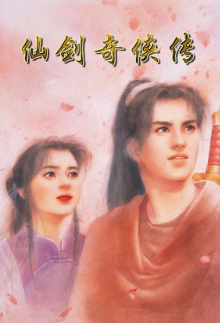

  
《仙剑奇侠传》Dos版封面

  仙剑奇侠传，一辈子的感动。 

   

<!-- more -->

+ **98年-00年：守护者之剑最高，其他都是二流。 **

  98年，风雷小组的处女作品守护者之剑横空出世，其水准之高令人震惊，剧情之起伏震撼比仙剑有过之而无不及；人物塑造的纯熟成功，不逊于中上等的日本漫画；音乐一流（和仙剑同作曲者）；画面更是美的令人激赞，游戏时最大的感觉就是：“我难道是在玩TVGAME吗？！” 可以说守护者之剑是第一款让我脱离不理智的仙剑情结的游戏，从此明白了一个事实：仙剑并不是无法超越的。同一年也玩了最终幻想7，虽然是款系统绝佳的超级大作，但语言问题玩起来很不爽（当时日语水平尚未达到绝顶，很多地方看不懂），剧情第一的情结仍然根深蒂固，再加上一直喜欢日式和中式的风格，对最终幻想这类欧式风格浓厚的游戏实在是无法接受。而且游戏这种东西，感觉是最重要的，喜欢和不喜欢都不需要什么理由。所以在我心中最终幻想的地位是远远不如守护者之剑的，一直到现在也是如此。 

  99年守护者之剑外传--无尽的宿命上市，平心而论这就是个利用守1剩下一些零碎素材东拼西凑再加点东西，随便编些简单剧情，在短时间内匆匆制作推出的小作品而已，完全无法算是一线RPG。但我在强烈的守护者之剑情结的影响下，完全无视无尽宿命的任何缺点，疯狂的宣传赞美此作，胡乱贬低其他任何作品，被周围人视作疯子&弱智。 

  2000年守护者之剑2上市，上市前的4个月没有一天能睡好觉，期待度之高，比起后来仙剑2、空之轨迹SC都有过之而无不及。玩过之后更是被那极富冲击力的剧情，尤其是那彻底颠覆世界伦理道德的结尾所震撼，那种发自内心的惊愕感过了很久很久都挥之不去。其后更坚固了守护者之剑系列在我心中的神圣地位。

  
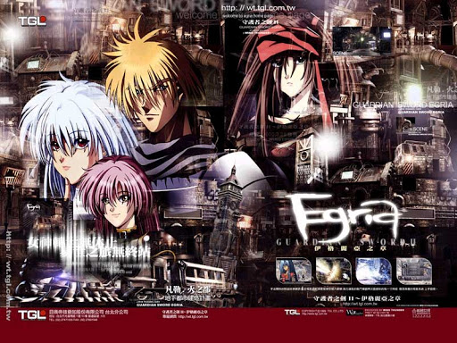 

  
《守护者之剑II - 伊格利亚之章》

  从初玩守1，到结束守2后的N个月，2年的时间里我都一直坚信守护者之剑系列是世界第一的游戏作品。对一个高中年龄层的玩家来说，这种愚蠢的想法很不应该了，但也能从侧面看出守护者之剑系列确实是非凡之作。 守护者之剑系列是我第2个盲目崇拜到失去理智的游戏作品，也是最后一个。 

   

+ **99年--01年：系统优秀强大的游戏才是好游戏。 **

  99年--01年是国产单机游戏的颠峰时期，超级大作不断涌现。先后接触了天地劫、轩辕剑3、天之痕、武林群侠传、幽城幻剑录等一流RPG作品。刚从仙剑情结中脱出又马上陷进更深的守护者之剑情结中的我，便在这一个又一个优秀作品的冲击下慢慢清醒，01年感受过幽城幻剑录之后，明白了两个早该明白却一直没明白的重要道理：

  + 游戏的娱乐性和艺术性一样重要；
  + 永远没有最好的游戏，无聊的XX情结只能害自己错过更多的精品。 

  这时期最大的收获就是体会到了“系统”对一个游戏是多么的重要！像守护者之剑那样极端执着于剧情和艺术性虽然也未必就是错误，但毕竟不能所有游戏都那么做，而且艺术性和游戏性并不是矛盾，大可二者兼顾。守护者之剑系列近乎为0的游戏性也确实是个无法否认的遗憾。 

  轩辕剑3，天之痕，幽城幻剑录。这三款游戏之所以能一直在玩家中享有极高的声誉，靠的就是出色的游戏系统+优秀的剧情+优秀的音乐+优秀的画面。平心而论，画面，音乐，剧情，这传统三要素中的任意一项，轩3、天之痕、幽城三作都要逊色于守护者之剑2三分。但最终这三部作品的地位和知名度都远高于守护者之剑2。这就是因为这三作都有很完善的游戏系统，守2却没有，这三作都很“好玩”，有丰富的支线任务、炼化系统、隐藏要素，而守护者之剑2的可玩性几乎没有。 

  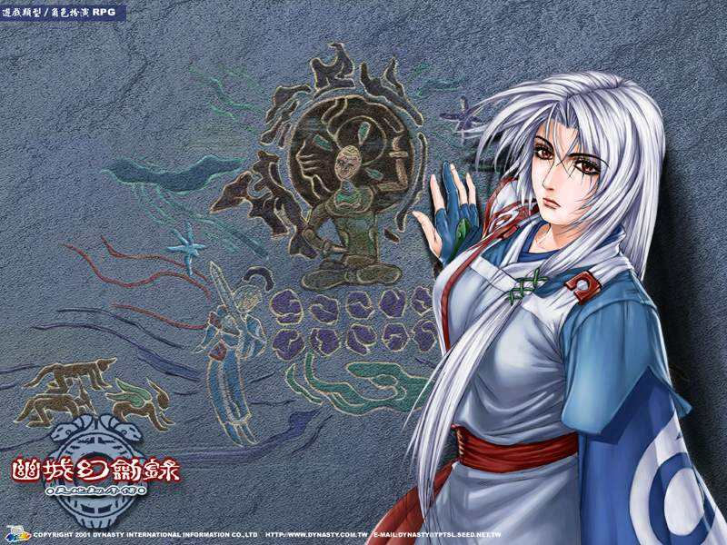

  
《幽城幻剑录》-冰璃

  游戏毕竟是用来玩的，在轩3、天之痕、幽城之后，再看大部分国产RPG，都已经很拙劣了，那种打开菜单后只有：状态，法术，物品，系统四项的游戏在如今的时代根本已不能再算是游戏，电子小说式的RPG已经被彻底淘汰了。玩游戏，“玩”游戏，“好玩”才是一个游戏的重点。 

  而玩过空之轨迹后再玩轩辕幽城等国产大作，一样也觉得根本玩不下去了。凡事就怕对比，别人在进步，自己停滞不前就要被淘汰。光以简单的战斗为例子，我们在玩惯了45度角的战斗模式后再玩FC时代那种面对面式看不见自己只有一堆选单的战斗模式就会觉得很难接受；在习惯了空之轨迹的战斗模式后再玩轩辕幽城那样的战斗模式也会觉得很简陋，说不出的别扭，好像有力使不出的怪异感觉。这绝不是什么个人喜好的问题，两种战斗模式本身就不是并列的两种形式，而是可玩性天差地远的一次进化，如果国产游戏继续坚持传统战斗模式，下场将会是万劫不复。 

  既然说到了系统，那这里再来说一下英雄传说6--空之轨迹的系统为什么好。之所以一直狂赞此作的系统，不单是因为其好玩、丰富、有创意。好玩丰富有创意，即使是很多国产游戏也可以做到。而空之轨迹的系统不单只是好玩，而且几个系统的结合，还有系统和游戏剧情、背景设定的结合都处理得非常严谨。 

  首先是导力器，这东西是整个世界的核心，连魔法都要用它来发动。打倒怪物后得到7种耀晶片，再到导力工房加工成结晶回路，最后用结晶回路配出各种各样魔法，6个结晶回路可以随意搭配，千变万化。而且还能影响角色各属性，随意培养角色的发展方向，给游戏增加了无穷的战略性和自由度。看似复杂麻烦，但游戏中却非常简单上手，把看似复杂的系统做到简单无比，这就体现着制作者的深厚功力。 

  对比一下，神魔和幽城的五魂化蕴系统就相形见拙了，没有提示，条件苛刻，不看攻略很可能连个屁都配不出来，等级高高还在用一些初级法术。这样的设定就不是在享受而是在被游戏玩了。而空之轨迹的全部魔法配置方法都记载在游戏菜单的游击士手册里，随时可以参考，这样完全公开的设计不但没有影响游戏的乐趣，反而让玩家觉得非常方便有趣。 

  料理也一样，空之轨迹中并不单只是捡材料制造料理，在战斗中吃了加血，而且和剧情紧密结合，不单在城镇里的餐馆中可以学到一些新菜式，还有很多支线任务也和料理有关，这样的系统已经不再是冷冰冰的游戏设置了，而是真实世界一般的存在。这些料理让游戏世界充满了活力和人文气息，而不是一个个简单的补血道具。 

  最简单最基础的几个打怪掉东西、配料理、配魔法系统，就将游戏中几个重要系统和故事情节完美联系到了一切，游戏的战斗系统体现着背景设定的导力原理，料理系统又将游戏城镇中的餐厅活性化，几个系统互相影响，紧密结合，丝毫不显露刻意设置的痕迹，丝毫不违背游戏世界观，简直是浑然天成。 

  再看幻想三国志2，三国时代的背景，硬配上魂晶就稍微有一点牵强，顶多是不过不失，虽然也可以给游戏增加乐趣，但明显就是硬安上去的游戏设定，距离空之轨迹这般完全不着痕迹、和剧情紧密结合的境界还差很远。 

  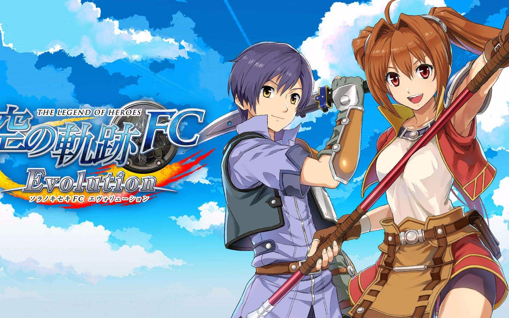

  
《英雄传说-空之轨迹》

  空之轨迹里这些不着痕迹的老练处理令人绝赞，这就是接下来所说的更进一步的标准——完善的细节处理。

    

+ **02年--04年：系统优秀强大，拥有完整世界观，细节处理完善，人物塑造细腻的作品才是好作品。**

  单机游戏逐渐萧条，新上市的大作越来越少，我也有了更多的时间重新回味旧游戏。这几年曾多次产生过迷惑，明明轩辕剑3、幽城幻剑录在系统、耐玩度、剧情、画面、音乐各方面都如此优秀，可为什么感觉还是没有那些画面粗糙、音乐刺耳、只有剧情也很优秀的日本老游戏经典呢？甚至像战国美少女这种日本小制作RPG，玩过之后都会有一些在国内一流大作中根本没有的感动，反复体会了无数的作品，终于明白了一个非常重要的道理：细节和剧本一样重要。 也就是一个“表现力”的问题。 

  举个最简单的例子，金庸的小说部部精彩，神雕侠侣、倚天屠龙记、鹿鼎记无论是文学造诣、情节曲折度都远在仙剑奇侠传之上。但改编成的电脑游戏部部平庸，根本远无法和仙剑奇侠传相提并论。是因为删改过大吗？肯定不是，有的游戏一字不改，连旁白都照搬了下来，可还是感觉很二流。 这就足以说明问题了：游戏和电影小说不一样，好剧本好只是做出好剧情、好游戏的前提条件而已，剧情优秀的精品RPG并不只是有个好剧本就可以了，完善细节的处理、节奏的合理把握、镜头适时的切换、人物每句台词的润色修饰、细腻的人物心理活动描绘、甚至场景美术和室内家具摆设、人物一个撩头发的小动作等无数小细节都直接影响着剧情水准的高低。游戏是一个立体的东西，各部分必须结合的很完美才能成为真正的精品，单只靠搬来平面的剧本，像小说一样只注重描述主角的故事根本行不通的。 

  细节对游戏是非常重要的，游戏是玩的，所以就必须给玩家无处不在的惊喜，至于很多从头到尾没有小细节的游戏，与其称其为游戏，不如说是一套代码。 像空之轨迹，开始时卡西乌斯让买利贝尔通讯，如果把钱花完了再去杂货店，约修亚会说真拿你没办法，又乱花钱，我付了吧，一点最微小的细节都处理得这么细致，简单的一句隐藏台词，就把约修亚平时攒钱、艾斯蒂尔爱乱花钱的特点又表现了一次，绝对不像国产游戏里那样身上没钱还把情节继续下去。 

  蔡斯城的中央工房，电梯就可以到1--5楼和地下室，但旁边却另有一个楼梯！连上下楼都有两种方式！停电之后更是满街漆黑，电梯和扶手梯都停了，非常真实！ 

  最后在王城和洛伦斯交手之后，洛伦斯从城墙上跳到海里，艾斯蒂尔和雪拉扎德震惊至极，赶快冲过去往海面看，而科洛斯却没一起跑过去，而是跑到祖母身边就停下了，非常的人性化！

  利贝尔通讯也是游戏中一大特色，在杂货店可以买到这刊物，随游戏进展可以不断买到最新号，而且都可以打开阅读，上面详细记载着游戏世界内发生的事情，还有利贝尔王国的一些景点介绍。 在杂志上看过有关某地区的介绍之后，等情节发展到亲身来到此地时，感觉也是非常奇特。 更加令人惊奇的是最后到王都格兰赛尔甚至可以看见这家杂志社！还可以进去和编辑们谈话！一切都是那么真实、那么完整，用一个朋友的话来说：“真实得令我不敢相信，完整得让我窒息。” 

  还有SC中的钓鱼，钓上的鱼不单可以做料理，有时鱼肚子中还会有一些稀奇古怪的东西。甚至钓到的鱼的大小、长度都有记载，还可以跑到钓鱼俱乐部刷新记录！任何小系统都是完善无比。 还有在一般的RPG里鞋子只是普通装备，而空之轨迹中艾斯蒂尔的爱好就是收集运动鞋，在游戏中有个支线任务是测试新鞋，看着艾斯蒂尔兴高采烈地试穿新鞋后，再到装备菜单看那双装备在身上的运动鞋，便觉得那也都不是普通的一个脚部装备了，而是一个真正存在的物品。 游戏最开头童年艾斯蒂尔对卡西乌斯的一句“是不是钓鱼杆和运动鞋”贯穿游戏始终，人物塑造的丰满细腻程度，用“有血有肉”这种平凡的词汇根本无法形容其万一，简直就是一个一个真实存在的人。 

  我说的这些东西单拿出来都不算太惊人，但一个游戏如果包含几百个甚至上千个这种优秀的小细节，玩10遍都还能有新发现，震撼之巨大根本无法用语言形容。一款游戏做到这么完善，真的只能用可怕来形容。玩了空之轨迹后再玩其他的二流RPG，感觉就是一个完整真实世界和一个骗小孩剧本的差距。 

  然后再来说人物塑造。在稍微像样的一款游戏里，“人物塑造”的及格线都是非常低的，随便画个帅哥，配上几句通顺或不通顺的台词，配上几个五颜六色的武功魔法特效，一个人物轻轻松松就出来了。但这种“人物”只能给小学生欣赏。 我一直以为人设是国产游戏的一大软肋。从95年的老仙剑到今天的幻想三国志2，国产游戏几乎就没有几个真正意义上的成功人物。可能很多人觉得国产游戏里的角色已经很好了——比如深入人心的逍遥灵儿月如，一肩担尽古今愁的宇文拓大人，被千年宿命捉弄的霍雍冰璃等等等，我承认这些人物确实深入人心，但他们的深入人心都是因为游戏剧情的精彩，说白了只是精彩剧情的附属品，他们是因为精彩的剧情才成功，只要有剧情，把人物换个名字和形象也不会有什么影响。人物本身并没有真正的灵魂，缺少从骨子里散发出的角色魅力。 

  日本有几十年的动漫游戏的沉淀累积，这方面的差距是巨大的，在很多日本优秀作品中通常是不用花太大笔墨就能塑造出非常有血有肉的人，举个最简单的例子：八神庵。格斗游戏里的角色，十年的台词加起来不到200句，但十年来的国产RPG，又有哪个人物塑造的比八神庵真实、有血有肉？又有哪个人物的影响力能达到八神庵的十分之一？半个也没有！ 

  日本游戏里的人物和动漫里一样，塑造得都是非常细腻，一句对白，一个眼神，一个小动作，无不体现出人物的个性。 在人物塑造的细节上，国产游戏一般采取回避态度，即总是由剧情来引导人物，而不是由人物来推动剧情的发展，精彩的剧情下，是非常苍白的人物。 

  还是那句话：中国的游戏编剧完全有能力写出好情节，但却没能力驾驭好情节，把很多好情节表现的乱七八糟，不知所云。 原因就是细节处理的能力太差，还有就是不会塑造人物性格。 

  细节的重要性和人物细致描绘说完了，接下来更重要的就是“世界观”。但世界观这东西比较复杂，我把它放在第5章中单独论述，暂且先按下不表。 

   

+ **05-06年：在保持完成度高的前提下，系统优秀强大，游戏性强，拥有完整严谨世界观（仅限带剧情的游戏类型），塑造人物细腻（仅限带剧情的游戏类型）的游戏才是好游戏。 **

  领悟了“系统”和“世界观”两大重要因素后，问题又来了：极少数的几款国产游戏，其系统和世界观都已经很不错了，但为什么还是和日本一流作品有很大差距？答案很简单，就是游戏本身的完成度差距巨大。日本的一流游戏做完了，而国产的一流游戏根本就没做完！ 

  很多国产游戏号称大制作，但花上一下午就能通关。举个例子就是圣女之歌，3.6G，6张CD的一款RPG大作，没有任何隐藏要素，一个下午就可以玩到120%通关，这样的游戏，完成度也就是20%的样子了。虽然我很喜欢圣女，也以为它的画面是国内第一，音乐剧情都一流，但这根本就不是一款商业游戏应有的规格，作为一个艺术品，它很好，但作为一款游戏，根本不合格，96年玩的很多日本游戏的试玩版都比这个耐玩的太多太多了。 

  继续以我一直强烈推崇的空之轨迹为例子，游戏里每一个NPC都有自己的名字，游戏中只要发生了任何事件，周围几个城市村庄的全部NPC的对话就会全部更新，都在谈论最新发生的事情，甚至连一些距离很远，之前去过现在已经不用再去的场景里的NPC一样全部更新。 而且同卖道具的、卖武器的、开旅馆的人说话，都有谈话和购物两个选项，当然他们的对话也是随时更新的，因为他们都是人，不是卖东西的摆设。 

  而即使是顶尖的国产游戏轩辕剑3，你在威尼斯和NPC们说话，有的担心自己站岗的孙子，有的想买礼物给老伴，墓地的女人为财产分配而烦恼，你解决了她的难题后她会很感谢。 恩，不错，好像很用心。但接着玩下去，从威尼斯跑到巴格达最后跑到中国长安，赛特死了又活，时间过去了N年，再回到威尼斯，老头还在说给老伴买礼物，偷偷来卖宝石的商人还躲在墙角没走，墓地里的女人还守在墓地，见了你还是只会说谢谢。 一切没有任何改变，死气沉沉的感觉几乎令人窒息，曾经生动的NPC在一瞬间全变成了死人一样的存在。 

  这些NPC是人吗！？他们根本就不是人！！他们就是一个道具，一个告示牌！！他们在那里永远只会说同一句话！！这就是完成度比较低的表现。只是游戏主体做了出来，根本就没有加工修饰到完善。 

  幽城幻剑录就稍微好些，NPC对话有少数几个小更新，但也是一个档次。卖菜的在城里永远只会叫卖，下棋的永远坐在那里下棋，客栈的人永远坐着不动，当然台词也永远不买。 

  而空之轨迹中的NPC都是一个个活生生的人，他们不但永远都在谈论最新的事情，发生了一点小事对白就更新，而且他们还都有自己的性格，在停电时他们会跑到街上议论，在店里工作的人到了晚上会回家休息，有些人甚至还会旅游到另一个城市住到旅馆里，你进去旅馆还可以和他们叙旧。 

  差距，天上地下。 

  买利贝尔通讯杂志也是空之轨迹完成度的一个重要体现，一个游戏丰富到了可以买杂志看，完成度之高不用多说都可以理解了。 在空之轨迹SC中更是变本加厉，队伍可以任意编组，不同组合遇到任何事件都会出现完全不同的对话内容，文本量瞬间翻了N倍。到最后的中枢塔一共5层，每层有一个BOSS看守，带特定的人物去挑战还会出现特殊剧情。 

  在剧情上，玩穿空之轨迹大概需要30小时，玩穿幽城大概需要20小时。但实际剧情量的差距却远远不止如此。玩幽城大概60%-70%的时间都用在迷宫和战斗中，其他国产游戏迷宫和练级也都占了很大比重，而空之轨迹中80%的时间都是在发展剧情，经常出现三四十分钟的连续情节，完全不需练级也可以轻松通关，除了最后的迷宫之外其他的迷宫都异常简易，真正计算情节量的话，密度相差大概10倍左右。 

  在表现手法上，国产游戏的情节事件往往就是几个人面对面站着讲对白，很少有什么动作，一般最常见动作就是一道闪光下来，人物突然出现/消失。 其他需要动作的时候一般都处理非常简单，像问情篇中重楼杀屠肆那情节，重楼根本就没有动，只是在屠肆身上播放了一段战斗招式特效，然后他便半透明--消失了，非常敷衍了事，如果是日本游戏处理这种情节，自然是抬手--出招--命中--喷血或爆炸倒地死亡，绝对会专门为每段情节制作很多动作。 幽城中冰璃第一次登场时和第一次见皇甫申时有两下飞身截招的动作，让人印象深刻，可惜这种小动作非常少，在很多二线游戏中甚至一次都看不见。 

  但在空之轨迹的事件中人物的小动作极多，一切事件都有无数的小动作，肢体语言非常丰富。而且一些大场面如飞船降落、多人混战的情节都直接在游戏画面上表现，绝不切换。这样做真实感要强得多。 

  最后就是空之轨迹中其他的很多小设定，都是在游戏主体制作完成后经过长期讨论完善给加上去的，而国产游戏往往到最后也只是把游戏主体才做完，细枝末节根本顾不上。 

  总之，在高完成度的游戏里，无论大事小事，只要你想的到的，制作者都考虑到了；你没想到的，制作者一样考虑到了。想把游戏的要素全研究透？根本没有可能！除非把自己累死。作为玩家你可以拼命探索这个游戏世界，获得一个又一个惊喜。 

  而在低完成度的游戏里，你能做的就只有赶快通关。 
  
   

&emsp;&emsp;最后总结一下。完成度是衡量作品好坏的最根本条件，其次重要的是游戏系统，接下来是世界观，然后才是画面音乐剧情等表像的东西，剧情除了剧本外还包括节奏、细节、人物对白等每一个细微方面。 这也是目前得到的最终结论。像仙剑奇侠传3这种徒有虚名的“大作”，完成度不到50%，系统平平，世界观完全没有，最重要的3个要素全部严重不合格，就算画面音乐剧情全部超一流，这游戏也仍然是个苍白无力的庸作，更何况3D画面极端拙劣，剧情不知所云，只有音乐不错。所以说它是臭作也便毫不为过了。

 

### 2、国产游戏

&emsp;&emsp;国产游戏从起步、发展、成熟、衰落，到现在也有十多年了。首先来简单回顾一下国产游戏的发展史。（有些台湾年末发行的游戏，次年才在大陆发行，下面则都以大陆的发行时间为准了）

&emsp;&emsp;要说国产游戏，最早的可以追溯到上个世纪的80年代，那时便已经有了很多国产益智小游戏，如推箱子打砖块等，还有大富翁1代。但要说真正有影响力的国产游戏，还应该从90年算起。这时出现的轩辕剑1，神洲八剑，侠客英雄传1都是最早的中文RPG，这3个游戏除了神洲八剑我没有打穿之外，剩下2个都穿了3遍以上。（94年复习的） 可虽然打穿了N遍，再问我剧情，仍然是一点印象都没有，提起轩辕剑1，除了开始时找绳子下井，中间进塔打妖怪，最后火凤凰变身成店小二之外便什么都想不起来了，整个游戏里印象最深的倒是最开始城中某间屋子里那个妓女。 这是因为那时的游戏刚刚起步，基本没有剧情可言，从头到尾的平铺直叙，在现在看来连个普通玩家创作的剧本大纲都不如。可即使如此，这些作品在当时也让看惯了日文英文的玩家眼前一亮。 

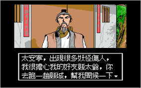

《轩辕剑1》过场情节

 

&emsp;&emsp;93年开始，像样的国产游戏越来越多，并且各种类型都有，对战、射击、文字冒险、养成、要什么有什么，比起后来全都跟风去做武侠RPG的场面，这个时期当真是“百家争鸣，百花齐放”，从某种意义上说我以为93、94两年才是国产游戏的颠峰年代。 这个时期诞生了无数优秀的作品，而且什么类型都有，对战游戏有快打至尊、武林、武将争霸、格斗悍将；养成游戏有明星志愿；文字冒险游戏有悲恋湖杀人事件，战棋游戏有天使帝国、魔法世纪、炎龙骑士团；策略游戏有三国演义、桌面游戏有大富翁2、求婚365日、富甲天下；横版过关游戏有西游记。。。RPG更是多到让人眼花缭乱，真的是要什么有什么，整个游戏市场热火朝天。 

&emsp;&emsp;这个时期比较著名的游戏除了上面说的那些，还有最早的金庸小说改编游戏：笑傲江湖、射雕英雄传和鹿鼎记，射雕的品质可以说是惨不忍睹，笑傲就好的多了，几段动画直到97年看都很有感觉，鹿鼎记因为程序原因，90%的电脑都无法正常运行，打穿过此作的玩家是凤毛麟角。 

&emsp;&emsp;大宇的妖魔道品质平平，不过阵亡时的音乐和仙剑一模一样，连“胜败乃兵家常事也，大侠请重新来过吧”的字样都一样，为这个倒是值得收藏一套的~ 

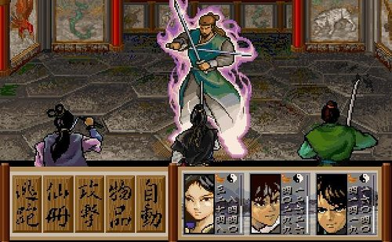

大宇《妖魔道》

&emsp;&emsp;大宇的大富翁2影响很大，在当时可谓是家喻户晓。 

&emsp;&emsp;这个时期最最最最出色的作品则是两款ARPG游戏：三界喻——邦沛之谜和聊斋志异。 ARPG，确实是ARPG游戏！而且是非常成熟完善的ARPG，在93年，中国就有了非常优秀成熟的动作角色扮演游戏了，比DIABLO早了整三年，但在当时并没引起什么反响。 

&emsp;&emsp;三界喻和聊斋志异这两款游戏的品质之高，在现在看来也是一流的。开放式地图、昼夜更替、隐藏物品装备、无数支线任务、N多原创系统。。。。完全难以相信是两款93年的国产游戏。这两款作品的创意、娱乐性、还有完成度不知比现今很多粗制滥造的国产游戏强了多少万倍。 

&emsp;&emsp;另外尤其要再说一下三界喻这款游戏，其迷题的难度大概是幽城幻剑录的一千倍以上，简直是令人发指，游戏里没有任何提示，解密时也没有选项，都要手动输入答案，可能游戏早期A城某个民房里堆了12个箱子，到游戏中期F城迷宫里问一个和箱子完全没有任何关联的怪问题，就必须输入12才能通过，难度之高简直是匪夷所思，让人根本就无从动脑。另外还有一些纯粹没有提示的另类题目，比如问太阳和月亮在哪月的哪天同时出来，必须要手动输入回答13月、32日，不然剧情永远通不过。这个游戏不看攻略打穿的可能性是0.0000000%，（当然游戏的趣味性也是和难度相称的）有老机器的人实在是值得尝试一下。 

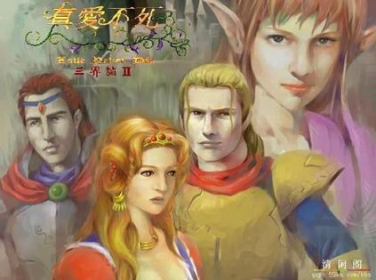

《三界喻2》

 

&emsp;&emsp;94年，国产游戏更加成熟，此年诞生的轩辕剑2和倚天屠龙记都具有不错的水准，轩辕剑2更是卖到了日本。说实话，倚天屠龙记的剧情把原著删砍的肢离破碎面目全非，轩辕剑2的剧情也是相当幼稚肤浅，严格来说，或者不严格来说二者都不能算是佳作。但因为难度适中，系统工整，画面又属上乘，在当时大受欢迎也就不足为奇了。 

&emsp;&emsp;94年熊猫科技的对战游戏：三国志武将争霸2是款超强的对战游戏，品质、打击感、操作性、平衡性几乎可以和街霸2相比，现在看来也非常不可思议。 

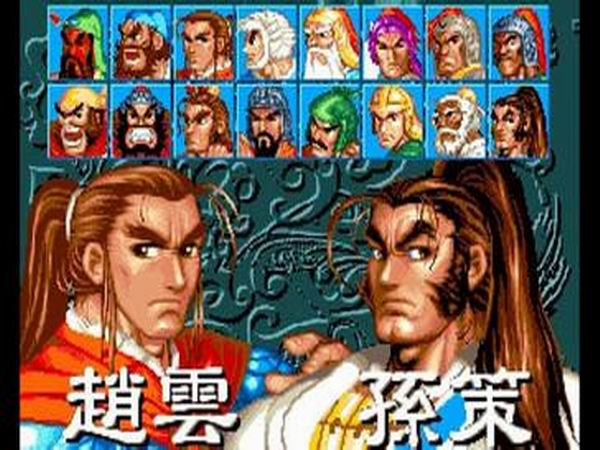

《三国志武将争霸2》

&emsp;&emsp;大宇的天使帝国2比1代更加好玩，多路线的设计加上当时很少见的全美女阵容让人欲罢不能，最后一关的BOSS叫碧娜维姬，现在都忘不掉。 

 

&emsp;&emsp;95年，中文新游戏无数，但一切作品的光芒都被一个作品彻底掩盖了下去。这个作品自然就是我们所熟悉的仙剑奇侠传。 有关仙剑本身自然是不用多说了，这个游戏在国产游戏中的影响力绝对是空前绝后的。只有一点需要特别一提，那就是现在很多人都只说仙剑是赶上了好年代，运气好而已，放到98年出都不可能成功云云。这种说法是很愚蠢的，仙剑之所以会如此成功，运气和年代因素不到10%，90%还是因为游戏本身的水准确实极端出色，和同时期的日本RPG比也是绝对一流的水平。所谓“之后无数游戏超越了仙剑，但不被玩家认同”的说法更是放屁，真正超越了仙剑的国产游戏都是21世纪上市的，98年以前的国产游戏根本没有一个能和仙剑相提并论，当时的人们还比较弱智，很多人以为画面同一水准就是不相上下，曾经见过不少言论说97年的老神雕和仙剑不相上下，简直是搞笑。 

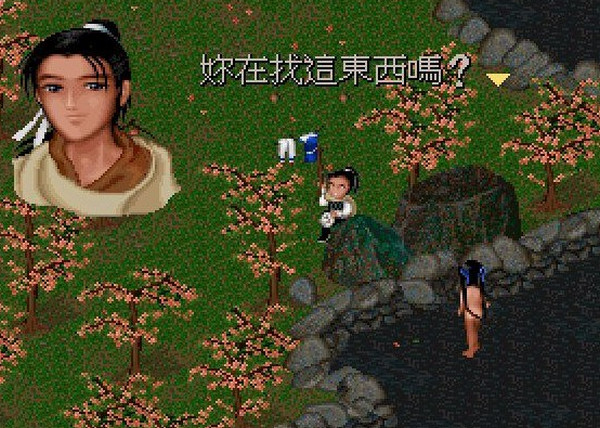

《仙剑奇侠传》经典情节

&emsp;&emsp;仙剑的剧情比同时期游戏处理得细腻很多，头像也很精美，音乐水准更是超高，至今为止我也以为老仙剑的音乐在国产游戏中数一数二。不加任何感情色彩地看待这款游戏，它仍然也是个经典。 对仙剑的感情实在太深了，当时玩了几十遍，每个事件点都存档，然后再买来一百片三寸盘把所有存档文件备份，（当时根本没有刻录机、网络、移动硬盘或别的任何东西，备份的唯一办法就是拷软盘）而仙剑的存档文件又很大，一张软盘只能放7个存档文件，到现在我还留着几十张当年的仙剑存档软盘，每张都写着事件点：“打蛇妖男”、“地道里打女飞贼”、“大理城的黑苗奸细”。。。。现在拿起来看真是怀念，看着一摞花花绿绿的三寸盘，不禁想道：当时为什么不压缩了再备份呢！？ 
&emsp;&emsp;PS：为了看酒剑仙的飞葫芦，彩依献身那段长剧情也看了无数次，当时真是千看不厌。 

&emsp;&emsp;这年在仙剑奇侠传的威势下仍然让人留有深刻印象的游戏就只有仙剑的同门师兄：轩辕剑外传--枫之舞和汉堂的炎龙骑士团2了。 

&emsp;&emsp;枫之舞的品质之高，我一直认为在轩辕剑系列中是绝对的NO1，剧本之精彩令人拍案叫绝（是真正的拍案叫绝，我当时玩时几乎就要激动的拍桌子），音乐更是有如天籁，简直就像是把人拉回了那个年代、那个世界。游戏的气氛、细节、可玩性，无一不是一流。 后来的轩辕剑3和天之痕虽然在可玩性远远超越了枫，但我仍然认为枫是轩辕剑系列，乃至整个中文RPG中的顶级作品。 可惜，这样的一个作品，因为题材偏深，在当时受众面很窄，处境和01年的幽城幻剑录非常相似。（当年主要玩家的年龄层比现在还要低不少） 

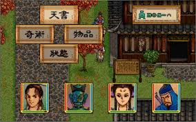

《轩辕剑外传-枫之舞》

&emsp;&emsp;炎龙2则是汉堂第一个大人气作品，游戏难度很高，汉堂的这个特色在这时就开始了，画面人物较糙、战斗场面超赞这两个特色也是从这时就开始了。游戏的剧情很用心，转职和隐藏职业在当时也让人废寝忘食去研究，第一次看到最后的隐藏关时的激动心情更是令人毕生难忘。 

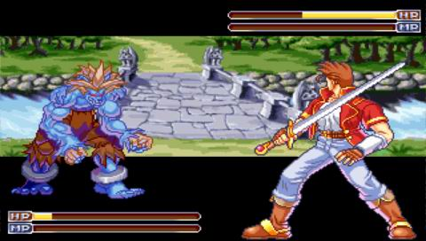

汉堂《炎龙骑士团2》

&emsp;&emsp;95年是大陆家用电脑的普及年，从此年开始电脑游戏玩家的数量开始直线上升，盗版光盘游戏也是从这时开始兴起的，价格在40元--60元一张，但仍然有无数人大喊超值。

  

&emsp;&emsp;96年,仙剑奇侠传大成功之后，几乎全部公司都去做武侠RPG，一夜之间，曾经五颜六色的国产游戏都变成了清一色的武侠RPG。所有作品都在模仿仙剑或试图超越仙剑，但都以惨败收场，智冠的新蜀山剑侠号称要超越仙剑，最后成了当年最大笑料，倒是智冠的另一部作品金庸群侠传意外大获成功，开放式剧情令人大开眼界，在当时玩家中的影响力仅次于仙剑，当时玩中文游戏的人基本没有一个不玩金庸群侠传的。 

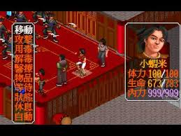

《金庸群侠传》战斗画面

&emsp;&emsp;光谱的运镳天下之四大镳局是当时少有的国产优秀策略游戏，在这个时期光谱就开始专心制作经营/策略类游戏了。 

&emsp;&emsp;大富翁3相比2代做了些改进，继续保持着大人气。 

 

&emsp;&emsp;97年，台湾游戏在仙剑的阴影下处于最黑暗期，加上DOS平台正在向WINDOWS平台转换，很多公司都停止了大动作，倒是内地发行的剑侠情缘比较有影响力。平心而论剑侠1的品质在当时还算可以的，虽然远远无法和仙剑比，但绝对值得一玩。但大概是因为制作人拼命吹嘘什么民族、大气、国产，让我对这个游戏非常没有好感，总有种本能的厌恶。几年之后更是恬不知耻的将自己作品和仙轩双剑硬凑成了什么国产三剑，脸皮之厚足令星宿老仙甘拜下风！！ 

&emsp;&emsp;这年度最优秀的作品莫过于宇峻的超时空英雄传说2——复仇魔神了，这款战棋可说是继天使帝国2、炎龙骑士团2之后第三款一流的国产战棋游戏，剧情和可玩性都达到了非常高的水准，被多数老玩家公认为超时空系列的最高一作。 

&emsp;&emsp;侠客英雄传3算是这段时期一款不错的武侠RPG，另外1代之后就是3代也算是国产游戏史上的七大不思议之一了。 

&emsp;&emsp;智冠的神雕侠侣完全COS仙剑，但水准差了十万八千里，很快便被人遗忘了，另一款金庸作品天龙八部之六脉神剑更是款准垃圾。 

&emsp;&emsp;汉堂的炎龙外传--风之纹章毁誉参半，只有汉堂FANS叫好，大部分玩家根本无法忍受其落后时代N年的画质。 

&emsp;&emsp;智冠的三国演义2宣传力度相当强悍，公然向KOEI叫阵，最后游戏品质垃圾无比，从此三国演义这名字变成了国产游戏史上的污点之一。 

&emsp;&emsp;97年真正最出名、最有影响力的国产游戏并不是剑侠或复仇魔神，而是我们伟大的红色经典游戏：血狮。此款游戏号称中国的C&C，但品质之烂简直是惊天动地无法形容，简单说，你想象中它能有多烂，它就比你想象中还要烂，烂到根本看不出是一款游戏。 自血狮之后，国产游戏的声望瞬间一落千丈，很多人自此开始完全无视国产。（当然这种行为是非常蠢的） 

 

&emsp;&emsp;98年，WINDOWS平台已经彻底成熟，国产游戏开始复苏，守护者之剑、北方密使都是当年很优秀的作品。大富翁在这年发行了第4代，大受好评，也是目前为止评价最高的一作。大宇的阿猫阿狗和目标的铁甲风暴也勉强算个拿的出台面的作品。奥汀的幻世录和三国群英传2在本年上市，奥汀的知名度也是从发行了这两作后才开始大振。98年影响力最大的国产游戏是智冠的风云之天下会，和软件与光盘捆绑的销售模式让全国震惊，销量高达17万，引起了无数激烈的大型争论，低价游戏也是由此开头的。 

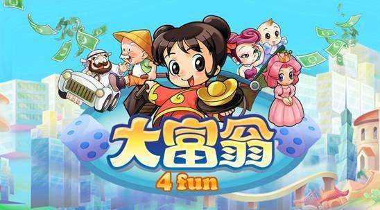

《大富翁4》

 

&emsp;&emsp;99年，国产游戏再次迎来了一个鼎盛期，风色幻想、无尽的宿命、古文明霸王传，基本上每个月都有十来款国产游戏上市。 

&emsp;&emsp;古文明霸王传是一款相当优秀的战棋，丰富的职业、多线多结局、隐藏关还有复制存档和其他玩家对战的功能。在我心中丝毫不逊色于复仇魔神，很多设定都蛮有新意，不过其过于单调苍白的剧情是个遗憾。

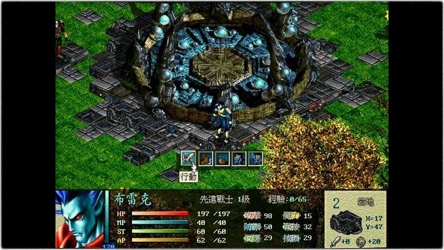 

《古文明霸王传》

&emsp;&emsp;风色幻想在99年初初露峥嵘（之前的魔法大陆不算），引起了不少好评，但这游戏给我的第一印象却是非常的差，人物肖像画的粗糙至极，简直就像是一堆剪纸片，比96年的三流游戏还要糙。虽然3D画面在当时算不错，剧情也比较出色，但最终印象还是很差。（直到今天我对风色系列的看法也是一样，虽然剧情越来越曲折复杂，但人设实在是太难看，画得非常假，表情处理更是令人不忍目睹） 

&emsp;&emsp;守护者之剑外传—无尽的宿命其实是款流程极端简短的二线作品，不过画风比较日式，画面很精美，战斗场面也继承了一代的华丽，不逊于汉堂的游戏，加上动听的音乐，感性化的剧情。。虽然是款小制作，但也绝对是一款非常优秀的小制作。 

&emsp;&emsp;**本年最值得一说的国产游戏自然是汉堂的天地劫。蛰伏3年的汉堂，一出手便是这款惊天之作。虽然游戏的画面给人的第一感觉简直可以算是复古，但看惯以后就会觉得除了分辨率低之外，表现力和构图都是很精美的，游戏的音乐在战棋游戏中也算丰富，曲目比幽城更多。 战棋游戏最重要的三点：平衡性、可玩性、剧情，神魔都接近完美，在很多人眼里甚至是款比幽城更出色的作品。** 

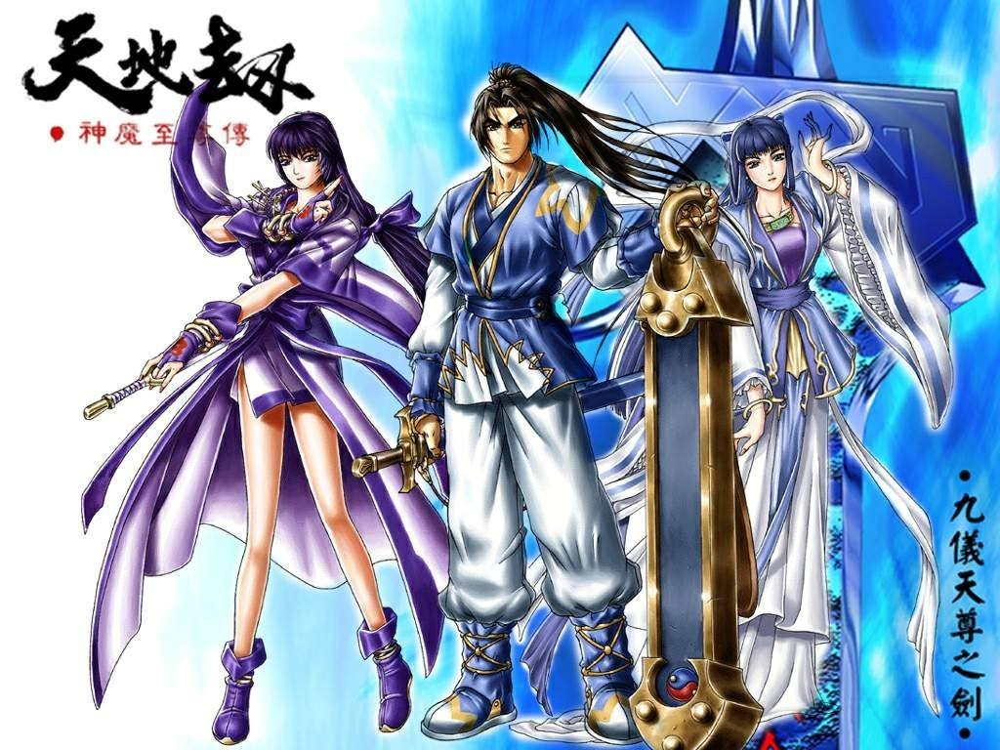

汉堂《天地劫-神魔至尊传》

&emsp;&emsp;如果这款作品不赶工直接做成RPG的话，那在轩辕剑3之前就会成为国产RPG的新里程碑。 

&emsp;&emsp;这年开始，以38元的心跳回忆为首，大陆的正版游戏掀起了低价狂潮，88、128、148的价格体系瞬间落为28、38、49，连生化危机2这种神级大作都卖到了38元（实际上是76），从此越来越多的人开始接触正版游戏。 

&emsp;&emsp;智冠的电脑游戏世界系列在当时成功树立了品牌效应，新绝代双骄、霹雳英雄榜、鹿鼎记2等中文RPG大作都是以此名牌的名义推出。霹雳英雄榜上市前智冠拼命宣传了一下布袋戏，但却没引起什么效果，最终游戏销量也很惨淡。 绝代双骄的人气就很高了，UJ的人设非常好看，游戏水准也属上乘，除了迷宫过于垃圾外没有什么明显缺点，情节的改编也算成功，可以说是有史以来最成功的武侠小说改编游戏。新绝代双骄的品牌由此时开始便树立了。 鹿鼎记是第一款把智冠早年的有头没尾金庸系列补完的游戏，具有一定的可玩性，是款中规中矩的作品。 

&emsp;&emsp;99年上市的烈火文明又是一款垃圾中的垃圾，这款游戏基本上就是RPG版的血狮，人设恶心，音乐无法入耳，剧情老土还装前卫。最BT的是在P2 300/64MB内存为豪华配置的时期，这游戏即使用当时顶级的P3 500/128MB内存玩也是超级龟速，进出场景、遇敌战斗等都要等待5分钟以上。 

&emsp;&emsp;奥汀的圣石传说是款极优秀的ARPG，在现在也可以一玩。在台湾普遍都认为此作是霹雳游戏的NO1。（奇侠传也只是第二）可惜大陆没有代理。 

&emsp;&emsp;世纪巨作轩辕剑3在本年底发行，不过在内地是2000年初才上市。放在后面说。 

 

&emsp;&emsp;2000年，这年的主角自然是轩辕剑3，此作的品质将当年的同类作品远远抛在了后边，绝对算是国产RPG又一个里程碑，也是国产游戏在WINDOWS平台上第一个精品大制作，可玩性相当高，直到今天还一直在热卖中。 游戏最大的好创意我认为就是进入炼妖壶的设定，在多数RPG中可以乱闯民宅翻箱捣柜，却无法和身边朝夕相处的队友说一句话，令人感觉非常遗憾。而轩3中随时可以进入壶里和队友聊天，不同时期聊天内容也完全不同，很多对白非常精彩，甚至比主线还有意思，令人拍案叫绝。（这里做的这么棒，外边的NPC要是有一半用心该多好！） 其实这个创意还有很大挖掘潜力，比如购买家具装饰壶中世界、特定时期在壶内发生一些隐藏事件等等，可惜这个创意后来演变成了垃圾一样的天书系统，不提也罢。 

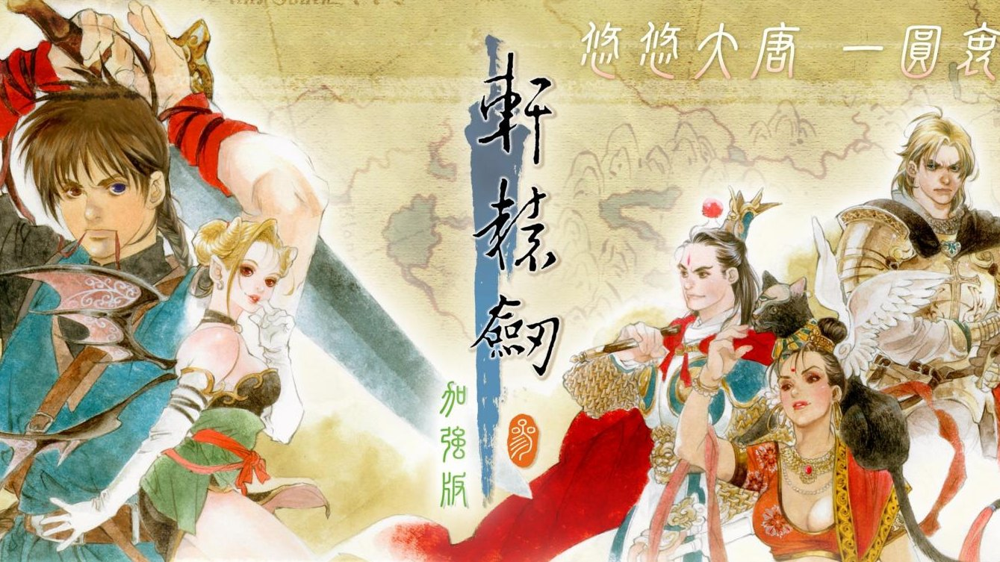

大宇DOMO开发的《轩辕剑3》

&emsp;&emsp;风色幻想SP4月上市，这游戏不多加评论了，弘昱的FANS都很狂热，说风色坏话要被拍砖的。不过真是很受不了风色的画风。。。。 

&emsp;&emsp;明星志愿2和明星志愿2000都在2000年上市，这两套游戏可以说是国产同类游戏中的顶峰了，当时各玩了不下20遍。游戏的创意和可玩性都很好，但平衡性非常差，认识一个人，不反复读档，可能3年什么都不干全部事件都去找她也都遇不到几次，不看攻略想刻意玩出某事业结局和感情结局基本都是不可能的。 

&emsp;&emsp;新绝代双骄2在8月上市，采用了双主角系统，令人耳目一新，支线繁多，再加上十多种结局和UJ一贯的精美人物肖像，上市后马上又是好评不断。这款作品已经很成熟了，比起1代真是有了明显的改进，是一款用心制作，完成度很高的好游戏。 

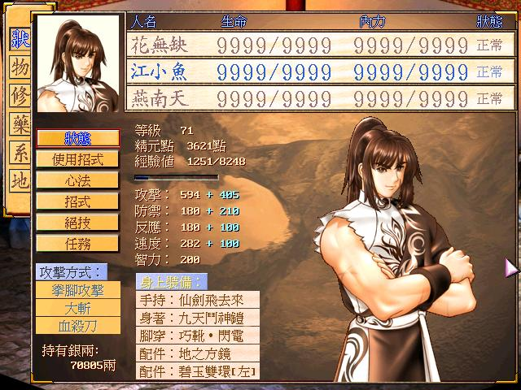

《新绝代双骄2》

&emsp;&emsp;2000年另一个重点作品就是风雷的守护者之剑2。最阴暗的灰色、绝望和最热血的爱情、希望并存，这就是守2最有魅力、最震撼人心的地方。此作剧情的冲击力之高，远远超过了仙轩幽城等作品，就算是在日本游戏中也找不出很多可媲美的作品。 

&emsp;&emsp;智冠的丢人系列第三作：三国演义3上市。对此作的评价就一句话：去玩光荣的三国志吧。 

&emsp;&emsp;求婚365日2是名作续集，比大富翁4和N年后的大富翁7好玩太多了，不过游戏名声比大富翁系列差太多了，反而没什么人知道。 

&emsp;&emsp;汉堂的作品疾风少年队跳票很久之后终于也在8月上市，绝赞！！校园题材的游戏，处处能感觉到强烈的汉堂风格，汉堂FANS如果不玩通此作简直是罪过。 

&emsp;&emsp;目标年底推出的傲世三国比较出名，卖到了欧美日本，个人很不喜欢此作，一个词概括就是不伦不类，画虎不成反类犬。宁愿去玩帝国时代。 

&emsp;&emsp;其余一些游戏如古龙群侠传、剑侠情缘2、笑傲江湖等都是宣传猛烈，品质恶劣，不值一提了。笑傲的3D画面不堪入目，很多人从此开始谈昱泉而色变；（昱泉随后的笑傲2和外传、神雕1、2、小李飞刀全是不堪入目之作，就不再提了） 剑侠情缘2更是不堪，扯着民族旗帜拉玩家支持，里面剧情之老土令人发指，战斗模仿暗黑，一群武林高手乱发魔法火球冲击波，滑稽之极矣哉。 

&emsp;&emsp;2000年最意义重大的国产游戏除了轩辕剑3和守护者之剑2外就是霹雳奇侠传了，完全没有任何支线，系统很简单，流程也不长，几乎可以算是纯粹看剧情型的游戏了，但就是这样的一款游戏却吸引了N多人，靠的完全就是霹雳超强的魅力，很多大陆人都是由此作而迷上了霹雳。 

&emsp;&emsp;第一次玩这游戏时只是想看看客串的李逍遥，但玩到李逍遥出场时被霹雳的剧情彻底震惊，早就完全无视他了，六年的仙剑情结不及霹雳布袋戏3个小时的冲击，霹雳剧情的精彩程度由此可见一斑。 其实之前的霹雳英雄榜的宣传力度比奇侠传还要大，但游戏本身不好玩，剧情又从半截开始，台湾人非常熟悉，大陆人却觉得莫名其妙，再加上奇侠传有无数原动画，界面和善，系统简单，瞬间就让无数人领略到了霹雳的真正魅力。 

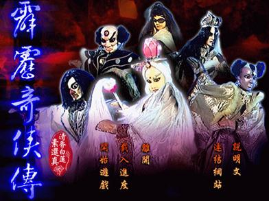

《霹雳奇侠传》

 

&emsp;&emsp;2001年是国产游戏的又一个颠峰时期，大作整年不断。

&emsp;&emsp;年初，天之痕在内地上市发行，将轩辕剑的影响力提升至了顶峰，无数人都认为轩辕剑3比天之痕好，天之痕小家子气，儿女情长没内涵，但我一直以为天之痕比轩辕剑3强太多了。首先天之痕的完成度就要比轩3高太多了，它是一款非常完整的游戏。再有就是天之痕的十神器概念的提出将轩辕剑的世界观完美的拓展到了一个新境界，如能好好延续，也许轩辕剑现在已经是个国际级别的系列了，但只可惜轩4和苍之涛抛弃了系列的核心，将十多年的苦心经营毁于一旦，令人唏嘘不已。 

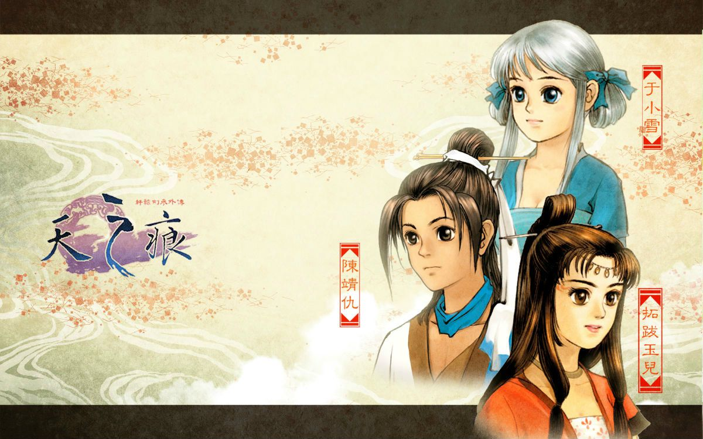

《轩辕剑3外传-天之痕》

&emsp;&emsp;何然古月圣复出的情节让无数老玩家感动，那种恍若隔世的感觉真是令人体会到了时间的魅力。试想如果95年的枫之舞里让他们两个复出，会有如此巨大的震撼吗？肯定没有的。就因为隔了8年才再次出现才会有这么大的震撼。曾经玩轩2的小屁孩们长大之后再次看见了当年的英雄，心情自然不会平静。 这就是时间的魅力，比起精彩的剧情，时光本身也有强悍的魅力。短篇漫画故事、单款不成系列的游戏即使再精彩无法给人带来这种感动。 

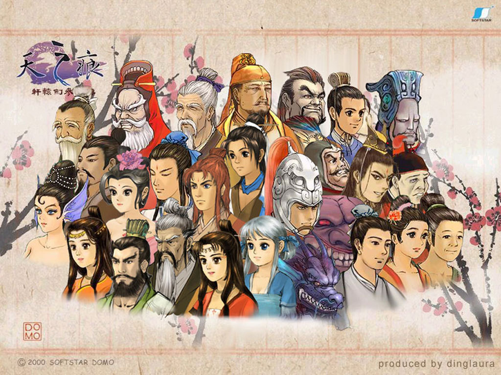

《天之痕》群像

&emsp;&emsp;同期上市的还有奥汀的堕落天使，这款作品虽然有些模仿FF8，但本身也是个很不错的另类作品，场景模型和怪物设定都很精致，怪物鉴赏模式更是有国际大作的风范。令人感到遗憾的就是肖像不太精美，后期情节过于拖拉。但总体还是好作品，如果不是和天之痕撞车，肯定会有更多非奥汀FANS喜欢上它。 

&emsp;&emsp;随后上市的轩辕伏魔录是轩辕剑系列的一部砸招牌作品，不伦不类的3D战棋加上平铺直叙的标准式剧情让人失望。平心而论这款游戏并不算太差，在国产同类游戏中至少也能算是中等水平，只可惜轩辕剑这顶大帽子它实在担当不起。游戏虽然让人失望，不过因为游戏里附送了天之痕的OST，绝版后一直是抢手货。 

&emsp;&emsp;汉堂的致命武力令人赞赏，未来的高科技战争的本就是个难把握又冒险的题材，但汉堂就是喜欢冒险和创新，创造出了这款难得的精品战棋。游戏从头到尾只有6个人，没有加减队员，没有装备，连升级都有限制，完全就是，令人失望的是剧情非常平庸，根本没有好好去表现“未来世界战争”的气氛和状态，这题材的20%潜力都没有挖掘出。 

&emsp;&emsp;大富翁5改成了即时制，可惜彻底失败，骂声如潮水，是此系列评价最低的一作。 

&emsp;&emsp;暑假档期出现了无数RPG作品：秦殇、月影传说、浣花洗剑录、楚留香新传、武林群侠传、新仙剑奇侠传等等等等。年底的三国赵云传也算是一款值得一玩的作品。 

&emsp;&emsp;其中秦殇是款历史感厚重的游戏，游戏性尚可但略显沉闷，此作在日本倒是意外很受好评。 

&emsp;&emsp;月影传说比剑侠情缘2还是强了一些的，但老土的剧情仍然令人发笑，总觉得西山居的编剧都是60年代出生，没接触过任何动漫和日式游戏的老古板，做出的情节简直土到掉渣。 

&emsp;&emsp;浣花洗剑录的战斗方式在国产游戏中独一无二，很有意思，但除此之外基本就没有亮点了，人物肖像之拙劣滑稽达到了恐怖的程度。 

&emsp;&emsp;楚留香新传，装上之后简直吓了一跳，粗糙不堪的配角头像和大地图，连情节都不连贯，乱七八糟的，完全就是个未完成品。但装上桃花传奇之后瞬间改观，可惜第一遍的恶劣印象还是消之不去，对此作的印象也一直不算太好。 装上桃花传奇的完整版楚留香新传如果是75分，那没有桃花传奇的楚留香最多45分。如果有人手里有楚留香却没有桃花传奇，那么我强烈建议你，不要玩这个游戏了。 

&emsp;&emsp;新仙剑奇侠传无疑是下半年最受关注的作品，情节没有做太大改动，99%和老仙剑一样，画面虽然精美了许多，但MP3音乐听起来却怎么都不如当年的MIDI好听，精致的头像也是怎么看怎么别扭，几乎所有玩家都公认失去了老仙剑的清灵韵味。 

&emsp;&emsp;仙剑客栈也随后上市，不过品质平庸，勉强值得一玩的水平而已。虽然说是仙剑客栈，人物也是李逍遥赵灵儿林月如阿奴，但玩起来却感觉不到丝毫仙剑的感觉，还加进一堆什么洪七公楚留香小李飞刀，几乎像是款同人作品，没有自己的魂。

&emsp;&emsp;武林群侠传是暑假最后一天上市的，果然是好饭不怕晚，刚一面市就好评如潮。超级丰富的系统、超强的可玩性、无数分支结局事件都是国产游戏中所仅见，玩20遍根本是非常正常的事情。此作的品质令人震惊，在国产游戏中最少可以排进前五。 

&emsp;&emsp;**2001年最伟大的作品自然是11月份面世的汉堂巨作——幽城幻剑录。这款游戏也不必多说了，在很多FANS的心中此作是国产游戏中至高无上的NO1甚至心中第一游戏，在我眼里幽城幻剑录也是国产游戏中最优秀的作品。（没有之一！）虽然距离日式一流RPG还有巨大差距，但已经具备了相当高的可玩性和回味性。 **

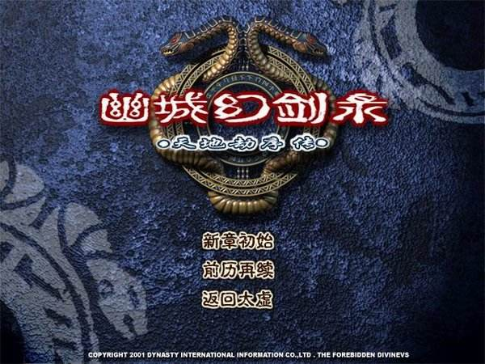

《幽城幻剑录》

简单评论一下这款游戏，画面和同期的轩3、天之痕相似，同处于2D的顶尖水平，到后期出现的许多壮观场景足以让叫嚣汉堂游戏画面差的傻子闭嘴。游戏的音乐还算好听，但曲目实在太少，这么庞大的一款RPG游戏一共只有24首曲子，这在95年都说不过去的。游戏战斗场面仍然保持了汉堂的激烈精彩，但比起神魔和寰神来略有不如，可能是因为幽比较偏重法术，近身乱舞系的招式实在太少了。 

&emsp;&emsp;很多人都赞美幽城的支线实在伟大了不起，但在我看来幽城的支线是非常失败的，甚至是游戏中的一个污点。 难度太苛刻影响娱乐性的缺点暂且不提，更重要的是支线剧情在情节上和主线结局根本毫无关联，所谓“无数支线影响着主线结局”只是硬凑上去的。 实际上大部分支线剧情根本就和主线无关，处理得非常涣散生硬，大多数都和游戏背景故事设定、主线情节没什么关联，只是完成后得到的一些道具影响主线结局而已，却因此变成了必须要严格探索完成的必须事件，非常的牵强没意义，不但对主线剧情没有辅助加成的帮助，相反还影响了整体主线故事的节奏。 也就只有雅布斯系列的支线比较有价值而已，因为通过这个人可以更深入了解探询幽城的世界观，幽城的世界在这个西方炼金术士的口中得到了进一步的补完。 

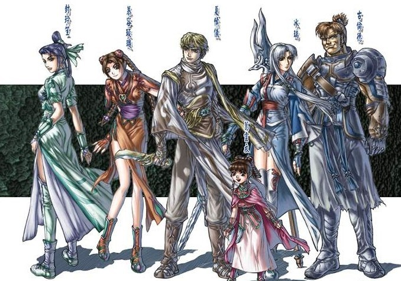

《天地劫-幽城幻剑录》主角群像

&emsp;&emsp;至于幽城真正的最大优点，并不是那堆乱七八糟不知所云的破支线任务，而是延续、结合了神魔至尊传的完善世界观，精彩的千年轮回主线剧情，水准中等偏上的画面配乐以及还有出色的战斗场面等各方面要素。这些都处于优良水准的要素，再加上制作者认真的制作态度，这才造就了这款完成度很高的经典游戏。 

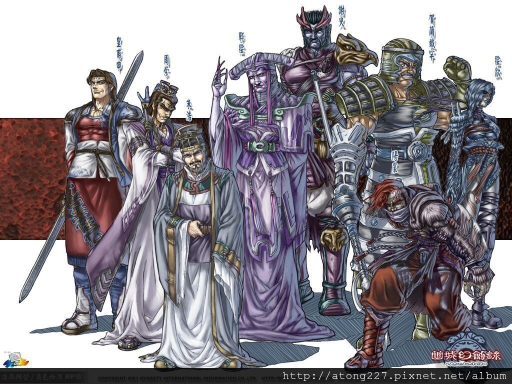

《天地劫-幽城幻剑录》反派群像

&emsp;&emsp;幽城幻剑录无愧于第一国产游戏之名。 

 

&emsp;&emsp;2002年，年初的致命武力2和1代就是上下集的关系，敌人数量单一，音乐很差，几乎让人睡着，当初所说的加重剧情要素到最后也不过是马马虎虎的几段简单情节而已。只是一款将致命武力的故事了结的应付性作品而已。其后上市的三国群侠传只能用江郎才尽来形容了，场景非常简单，根本没有用心制作，完全无法和前作武林群侠传相提并论。 

&emsp;&emsp;跳票很久的最初幻想终于面世，不过游戏基本是FC水平，成了国产游戏继血狮和烈火文明后又一个反面教材。 

&emsp;&emsp;智冠的第七封印算是当年一部精品，画面水准在当时看来非常高，战斗系统也很爽快，只是剧情差了些，有头没尾，庞大世界观中的很多东西都没有交代就END了。 

&emsp;&emsp;这年的好游戏很多，垃圾也有，最恶心的就是碧血情天和冰雪传奇，看过人物肖像之后就能恶心得三天吃不下饭。 

&emsp;&emsp;02年最重大的事件就是寰宇之星的崛起，从年初的群英传3、幻世录2，到后来的圣女之歌、大富翁6、风色幻想2、天使帝国3，寰宇之星的产品线之强令全国玩家疯狂，知名度瞬间就超越了老牌大公司智冠。 

&emsp;&emsp;这年最重点要说的就是宇峻的作品--新绝代双骄3。本作是在古龙小说的剧情结束后，UJ原创情节的作品。 这款游戏我玩了将近10遍，并且没有厌倦，以后可能还会再玩。 

&emsp;&emsp;绝3的画面比2代有了不小的进步，游戏流程颇长，音乐也保持着中上水准。最值得一提的就是游戏系统，实在是太丰富太出色太好玩了，多人编队、游泳飞剑破石轻功鉴定、配料理配药材、武功修炼、饲养宠物、多如牛毛的支线和隐藏情节、十多种结局、丰富的道具装备。。。绝对可以说是国产RPG史上可玩性最高、完成度最高、系统最完善的作品了，而且比第二名高出巨大的一截，简直令人震惊！ 只可惜RPG另一个重点：剧情，绝3并不算太好，也就是80分的水平，并且仍旧感觉有一点幼稚，所以最终此作还是没有成为公认的超级经典，太可惜了。 

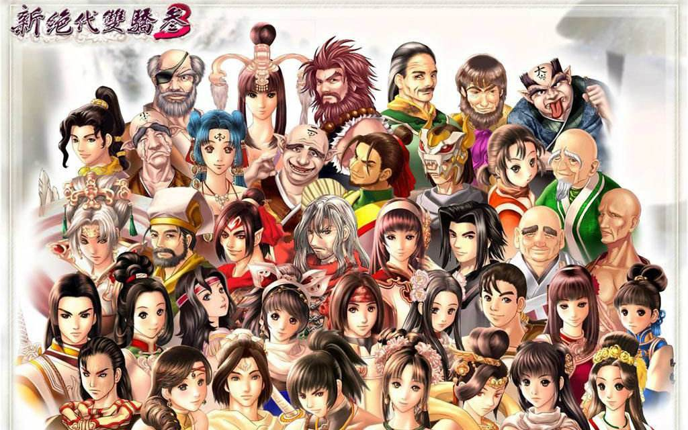

《新绝代双骄3》群像

&emsp;&emsp;新绝代双骄3在我心中的国产RPG中大概也就是第8到第10名的位置，但从纯游戏性的角度上分析，我甚至以为它才是国产游戏史上最优秀的RPG作品。在很多地方比幽城和轩辕剑系列都要好，而且好不少。只可惜此作的剧情未达登峰造极的地步，不然不单是天地劫系列和轩辕剑系列就都要靠边站，就算是被称作神作都不为过了。 

 PS：后来出的资料片明月孤星就比较令人反胃了，虽然邀月复活的情节也很吸引人，还特意加了召唤兽，但剧情设定在N年之后，满街的NPC却还在讨论孤苍雁，非常不用心，这种不注重细节的设定是我最厌恶的，比死机BUG还厌恶百倍。 不过毕竟是白送的东西，就当是个同人小补丁吧，也不用发牢骚。 

&emsp;&emsp;和绝3同期的轩辕剑4引起了更多的关注，但拙劣的3D画面配上丢失了灵魂的剧情设定令人惋惜，对此作懒得发表任何看法，唯一吸引我的地方就是再次复出的辅子辙，桑纹锦，壶中仙，疾鹏。 在轩辕剑4里最荒唐的就是有壶中仙，却没有炼妖壶。一个重要度比轩辕剑只高不低的灵魂道具就没随随便便舍弃了，光这一点，这游戏便注定拙劣，除非它的游戏性胜前作10倍。 

&emsp;&emsp;2002年底，智冠北研的天龙八部上市，这款游戏的品质非常高，大受好评，是第一款真正成功的金庸小说改编游戏。可惜此作之后，智冠就彻底放弃了单机，天龙八部也便成了遗作。（后来的如来神掌和新月剑痕时北研已独立，不算智冠旗下小组了） 

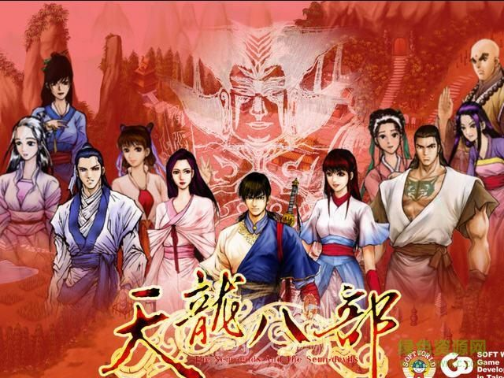

智冠版《天龙八部》

 

&emsp;&emsp;2003年初，让无数玩家等到吐血的仙剑奇侠传2终于上市了，但却遭到了无数骂声。一直不理解，这游戏明明很好啊，我们等仙剑的续集等了8年，为了什么！？不就是为了知道林月如是死是活吗！不就是为了知道李忆如和王小虎长大以后有什么经历吗！不就是为了再看一眼李逍遥阿奴李大娘林天南书中仙天鬼皇吗！仙剑2都给我们了！这就很好！在游戏开始菜单的背景音乐播放了12秒时，

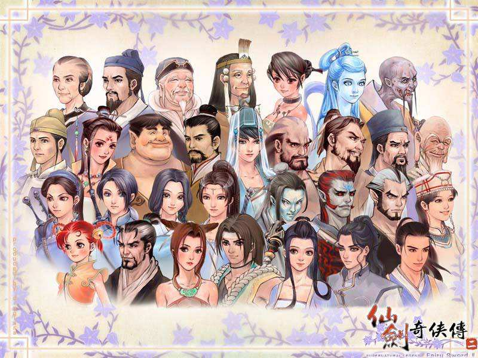

《仙剑奇侠传2》群像

&emsp;&emsp;我就觉得：八年没白等。 

&emsp;&emsp;作为仙剑的续集，它最大的缺点就只是出的太晚了。 

&emsp;&emsp;年初的异域狂想曲是款佳作，奥汀继堕落天使后又一款另类作品，并且另类程度之高在国产游戏中绝无仅有，绝对值得一玩，只可惜大陆版有删减。 另外的三国群英传4就不提了，对这系列没太大兴趣。 

&emsp;&emsp;和仙2同期上市的刀剑封魔录大受好评，虽然人设丑陋，剧情基本没有，不过游戏的关键不在这里。此作的操纵感非常好，远胜秦殇等国产ARPG名作。一个字概括，就是爽。 

&emsp;&emsp;反三国志是纯恶搞的三国游戏，品质平庸，没什么可说。 

&emsp;&emsp;天河传说的支持者虽不多，但玩过的人却都给予强烈好评，一般这种游戏都不错。但因为3D画面不好看，一直到05年我才把它打穿，灰色的世界确令人难忘，虽然游戏性不高，但也值得一玩。 

&emsp;&emsp;阿玛迪斯战记和寰神结是汉堂最后的绝作。 

&emsp;&emsp;寰神结的品质根本无法同幽城相比，战斗难度之变态让我非常鄙视汉堂制作人的无聊，这样的难度不能算难，而只能算是设定失败。但即使如此，最后的结局动画瞬间让一切怨恨和牢骚变成了感动。。。 

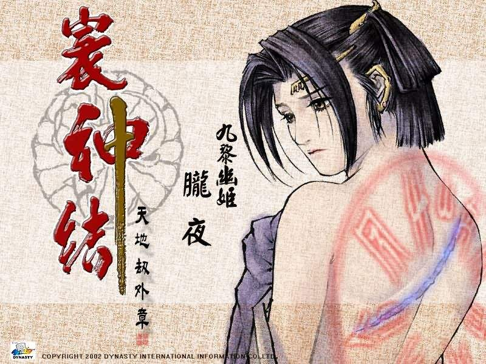

汉堂《天地劫-寰神结》

&emsp;&emsp;而阿玛迪斯战记就好的多了，非常有特色的一款战棋游戏，汉堂在疾风少年队中尝试了校园题材，在致命武力中尝试了未来题材，这次又在本作中尝试了欧式风格，比起只会死啃武侠的公司来，实在令人敬佩万分！ 游戏的画面很精细，人物肖像越看越有味道，极有神韵。战场也非常壮观，经常出现百人混战的场面。虽然剧情非常简单老套，几乎可以说是走形式，没有都无所谓。但即使如此这游戏也让我打穿了将近10遍。 

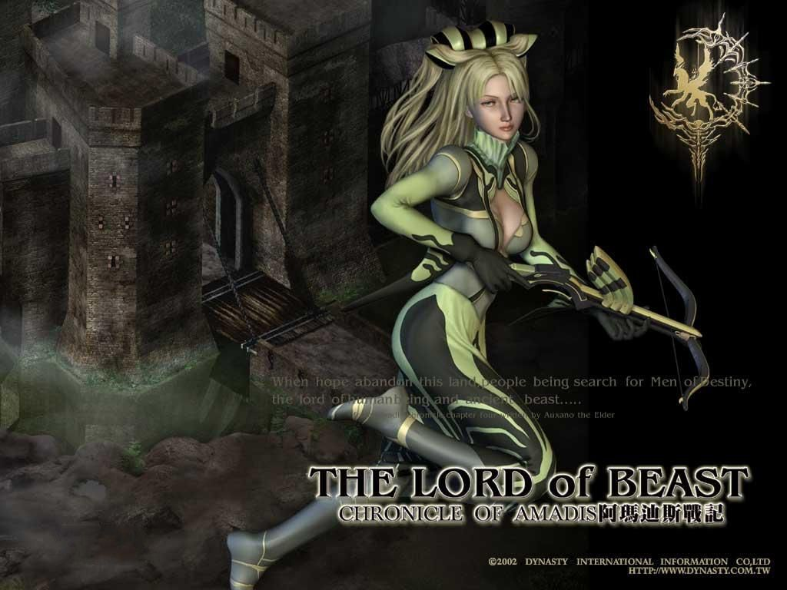

汉堂《阿玛迪斯战记》

&emsp;&emsp;仙剑奇侠传3是一款超级恶心的游戏，烂到极点的3D画面，超级不方便的操纵和视角，无休止的迷宫，平庸不连贯的剧情，做作的人物（重楼就是画宇文拓而不成，反似的犬），毫无营养的粗糙对话。。。简直就是一无是处。但这些都无所谓，垃圾也不是没见过，再来一个又何妨。但问题是这垃圾的名字偏偏是我心中伟大的“仙剑奇侠传”，这就实在令人难以忍受了。 一向不喜欢过分辱骂游戏的我对这款游戏用尽了一切肮脏刻薄的语言，并且仍然觉得不解气。这个游戏将仙剑的招牌毁得惨不忍睹，让我深刻的体会到了狗尾续貂这个词的含义。 

 PS：上段中说是一无是处只是为了表达鄙视的情绪，其实这游戏并不是一无是处。首先是人物肖像非常精美，甚至比宇峻和风雷游戏的肖像还好看，非常令人震惊（只可惜游戏不配）。 再有就是音乐也算比较好听。 

&emsp;&emsp;幻想三国志的游戏系统仍然很用心，但剧情过于幼稚肤浅，开始还很吊人胃口，但后面越来越乱来，典型给初中小女生玩的，几乎就像是一部三流的言情小说，远逊新绝代双骄3。 

&emsp;&emsp;征天风舞传是弘昱非风色系列的RPG作品，号称是三国志异，但实际上除了借用了几个三国志的人名以外根本就没有丝毫和三国有关的地方，再加上弘昱的风格离“三国”二字实在是相差太远，这款游戏是怎么玩怎么别扭。 

&emsp;&emsp;圣女之歌2是寰宇暑假五游戏里我最喜欢的一作，当年对守护者之剑迷恋成痴，对风雷的作品总有非常深厚的偏爱，圣女2总算将圣女的故事暂时告一段落，但后面还有很多事情没有交代，等待多年的圣女3也没有任何消息。另外在游戏中有守护者之剑中的修特和雪丽客串，再次让我激动了一阵。 

&emsp;&emsp;年末上市的大富翁7市场反响不错，比6评价要高，虽然很多老玩家都说4更好，但实际上只是怀念那份回忆，真正玩过7再去玩4，根本就难以忍受了。 

&emsp;&emsp;2003年是寰宇之星的鼎盛时期，大作不断，真是霸气十足，只可惜从04年就开始走下坡路了。 

 

&emsp;&emsp;2004年，目标软件年初的复活还算值得一玩，目标的游戏里这个算是最有浪漫色彩的了，虽然感觉还是比大部分台湾沉闷古板，但游戏本身的品质还是不错的。 

&emsp;&emsp;轩辕剑的续作苍之涛继续采用难看的3D引擎，非常难看。剧情倒是很不错，只可惜人物的对白设计极差，所有台词都没有经过修饰润色，完全不能体会出人物性格，像在念稿子，而且非常没水准，动辙出现“我做的没错，我做的一切都是对的”、“我对你这么好，你为什么不能理解我的苦心”之类干巴巴的对白，再加上音乐本身也缺乏活力，玩起来令人窒息，最后的结局虽然血腥味过重，但不能不承认是个好剧情。 可好剧情又怎样呢？三句半对白，一分钟不知所云的低分辨率3D动画，OVER！还是我先前说的，有好剧本，却连10%都表现不出来。日本RPG哪怕只是邻家大叔擦伤了膝盖，都能处理得比苍之涛这结局煽情有味。（日本不比，只比轩辕剑3那几种静态图，苍之涛逊色的也不是一点半点） 

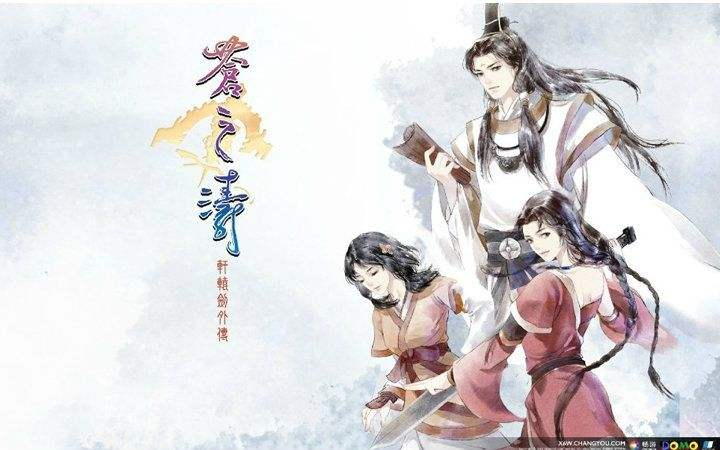

《轩辕剑4外传-苍之涛》

&emsp;&emsp;游戏最大的缺点还不是弱智的对白和拙劣的3D画面，而是丢失了轩辕剑的魂。在苍之涛中，把轩辕剑改成九环金背大砍刀对剧情是没有丝毫影响的，在游戏里轩辕剑和木剑的区别只是攻击力数值的不同而已，原来优秀的世界观荡然无存。 

&emsp;&emsp;问情篇就不多说了，之前我一直都以为仙剑3是大宇最低作品，没想到问情篇更甚，近乎弱智的人设和对白和恶心的迷宫对玩家的耐心有着毁灭性的打击，每次看见这款游戏配上“仙剑奇侠传”这5个字，都感到一阵发自内心的恶心。

&emsp;&emsp;对大宇这两款作品另一大超级不满就是画面，哪怕是使用日本同期的玩家向RPG游戏制作软件——RPG制作大师XP做出的同人小游戏，画面也要比大宇这两款“年度大作”强了一个档次。 

&emsp;&emsp;四大名捕是第一款温瑞安小说改编游戏，不过品质并不令人满意，之后上市的两款续作铁手和会京师也都不怎么样，不再提及了。

 &emsp;&emsp;北研的如来神掌品质平庸，和天龙八部差距巨大，几乎没引起什么反响就销声匿迹了。 

 

&emsp;&emsp;2005年，整整一年，国内发行的国产游戏就只有游宝岛、风色幻想3、风色幻想4、三国群英传5、新月剑痕等几款，可谓是相当凋零。 

&emsp;&emsp;本年唯一可以称得上精品的国产游戏只有UJ的幻想三国志2而已，幻三2还是基本来说还是很赞的，但有很多地方处理得太煞风景，游戏开头张祭出场的超紧张剧情和奈何桥的离别伤感剧情居然都用一堆Q版3D动画来表现，气氛荡然无存，真怀疑制作人自己有没有试玩，综合来看此作仍然没达到绝代双骄3的水准。 

&emsp;&emsp;阿猫阿狗2？。。。。这里不要再增加更多的脏话了，还是接着说2006年吧！ 

 

&emsp;&emsp;2006年，红色经典游戏??林海雪原在全世界60亿玩家的疯狂期待下上市了！！！销量达到了120亿套！！平均每个地球人买了两套！！1999元的豪华版和8万元一套的超豪华版也被抢购一空，国产游戏在佘先生的带领下必将雄霸世界。 

&emsp;&emsp;上一段为废话，请自动过滤。2006年初，三国群英传6、大富翁8、明星志愿3在4月前后同期上市，群6完全没兴趣玩，略过；大富翁8还是万年不变的买地盖房，一些创新都是在此基础上进行的，可谓是治标不治本； 明星志愿3倒是很好玩，不过实在太粗制滥造，完成度巨低，令人遗憾，让我想起了当年没有桃花传奇的楚留香新传。 “萧条”也就是对国产游戏目前情况最好的形容词。 下半年顺利的话轩辕剑5大概也能出了，因为得知了此作的一些细节，大感失望，但看画面却很不错，希望到时能让人满意。

  

&emsp;&emsp;国产游戏诞生过很多款优秀的作品，但真正可以配的上世界级精品的作品，一个也没有！ 勉强来充的话，枫之舞、幽城幻剑录、天地劫可以算，仙剑奇侠传、天之痕和新绝代双骄3也可以算，其他就再没一个了。其他作品再如何放宽标准，离经典二字也相差太远了。 

&emsp;&emsp;国产游戏成功过，辉煌过，在不短的一段时期内完全做到了和日本游戏、欧美游戏鼎足而三并且处于强势地位（当然只是在国内而已）。但创意的匮乏，资金短缺再加上玩家不支持正版，导致恶性循环，常年停滞不前，眼睁睁地看着和日本欧美的差距越拉越大，最后在网游的巨大冲击下，奄奄一息再难复苏了。 

&emsp;&emsp;国产游戏，以后有没有希望？我的观点是：完全没有，丝毫没有。 日本游戏起步本来就比国产游戏早很久，又没有欧美游戏那么大的文化隔阂，对游戏的主要消费者——学生群体来说，替代国产游戏是非常容易的。（对少数国产游戏死忠者例外） 日本游戏的水准不断高速提升，而国产游戏连止步不前都没几个公司可以做到，都在退步吃老本，我们现在想每年玩到一款2000年轩3水平的游戏都是作白日梦。 这样下去，再过2、3年，这个差距便会彻底拉到一个超越了玩家接受极限的地步，到那时即使是国产游戏的死忠支持者，在心理上也再难接受如此巨大的差距，最终便会下定决心倒戈，国产游戏的末日已不远矣。 

&emsp;&emsp;在2001年时曾经坚信国产游戏有一天会接近日本。到现在则已经非常清楚的认识到了一个事实：国产游戏和日本游戏、欧美游戏的实力差距过于巨大，已经没有了什么可比性，更无法谈什么超越，永远不能超越。所以目前对国产游戏的希望很简单：不要死，制作一些能让人玩的游戏就行！（几乎又回到了最早的FC时代标准） 当然，这个“能玩”是以2006年的标准来判定的“能玩”，要求也并不低。像阿猫阿狗2那样的东西，在有些人眼里也许是个无厘头式的搞笑经典，但在我看来就是款绝对不能玩的废品。

 

### 3、什么是大作 

&emsp;&emsp;无论是在网络上，杂志上，或者论坛上，经常都会看见“大作”、“小品”等形容游戏的词汇，并且使用率非常频繁。 那么判定游戏是算“大作”还是“小品”的标准是什么呢？一般来说有以下几种观点。 

+ 首先是容量论。4CD就是大作，1CD就是小品。持这种观点的人完全可以去死。 

+ 还有就是技术论，采用最新技术的精致游戏就是大作，画面简单的游戏就是小品。这又是一种白痴观点，持这种观点的人一般分不清什么是游戏，什么是电影；什么是玩的，什么是看的，固执地认为画面等于一切。（事实上即使是电影，画面论也绝对受人鄙视，更别说是游戏）这些人大多都很浮躁，没什么内涵，只希望借助游戏获得些刺激而已。 

+ 再然后是题材论：剧情深奥，包含深厚历史知识和文化底蕴的写实派作品就是大作，轻松题材的动漫风格作品就是小品。 绝大多数初级玩家都是这种观点，在他们眼里魂斗罗是大作，超级玛利是小品；轩辕剑是大作，英雄传说或勇者斗恶龙是小品；历史RPG或策略游戏是大作，横版过关的动作游戏或卡通对战游戏就是小品...如此这般，这种观点在真玩家眼中是极端荒谬的，比之容量论和技术论也高明不了太多。 

  深度在哪里？深度在表面！只有可以让大多数人理解的深度才能算是深度，如果不能让多数玩家产生共鸣，只能给创作者自我陶醉，那么这作品就绝对是失败的。 

  汉堂败了，败的很彻底，这是血的教训。天地劫三部曲如此优秀，但事实也是如此无情，就因为游戏题材稍微有些晦涩，就遭到了多数玩家的无视，直接导致了失败。我们可以说是不懂艺术的屁孩子太多了，但就算真是如此又怎样？他们是SB，我们鄙视他们，但汉堂还是死了。 

  异域惊魂曲是经典，勇者斗恶龙一样也是经典，轩辕剑是精品，疾风少年队也一样是精品。题材论是绝对站不住脚的，真正的好剧本，可以深奥晦涩，一样也可以通俗易懂。 

  游戏题材深奥也没有错，但也要讲究方法策略，要有个循序渐进，逐渐让玩家接受适应融入的过程，汉堂游戏的题材本来就偏深，战斗难度又高，谜题、迷宫、界面没有一处体贴人的，玩家不被吓跑才奇怪了。还是那句话，赌气是最蠢的行为，也许这是艺术家的通病。 

   

&emsp;&emsp;稍微有些跑题了，最后说出我的结论。判断一款游戏是否大作的标准很简单，好玩的游戏就是大作，不好玩的游戏就不是。 

 

### 4、有关游戏间的比较 

&emsp;&emsp;经常会有这样的情况：有人发篇分析比较两款游戏优劣的贴子，明明写的有些道理，可总有些人跳出来叫道：这两个游戏不能比啊！！发这种贴子没有意义！！ 

&emsp;&emsp;为什么不能比呢？原因无非就是日本公司和中国公司财力相差太大啦、两个游戏类型不同啦、两个游戏年代相差太久啦、甚至连游戏题材不同都可以当作不能比较的理由。 

&emsp;&emsp;这些“不能比”的原因全是屁话。 

&emsp;&emsp;公平？说这种话的人，你以为自己是法官吗？你以为自己的一条评论有多重要吗？你以为自己的一条评论会让游戏公司关门倒闭还是会引起国际争端？说好听一点，顾忌太多了；说难听一点，还真拿自己当个人！——笑止！ 

&emsp;&emsp;按照那些人的观点，必须是同一国家、同样规模的公司制作、同一年上市（用不用精确到月、日？）、同样类型、同样题材、风格的两款游戏才能比较。这样的话也根本没有任何游戏可以相比了，全都并列世界第一好了。 

&emsp;&emsp;玩家就是玩家，只在乎一款游戏好玩不好玩，部分（而且绝对是大部分）初级玩家甚至根本不知道也没兴趣知道制作公司和代理公司为何物，他们去软件店挑选游戏，看见一款新上市的国外RPG大作卖69元，一款2年前出品的国产游戏也卖69元，他们岂会管你什么中国日本、制作经费云云，更不会SB到去管日本欧美游戏产业比中国早开始了几十年，他们只关心哪个游戏更好，哪个好就掏钱买哪个。 

&emsp;&emsp;现实就是如此。国产游戏随时随地都在和比自己强N倍的国外游戏竞争，所以自欺欺人、逃避现实也都是毫无意义的。国产游戏必须要和日本游戏比，和欧美游戏比！ 

&emsp;&emsp;这个世界上也没有任何两款游戏，甚至没有任何两样事物是不能相比的。  &emsp;&emsp;反恐精英和街头霸王2哪个好？街霸2好！为什么？因为我喜欢。 
 &emsp;&emsp;仙剑和英雄无敌3哪个好？仙剑好！为什么？因为我喜欢。 
 &emsp;&emsp;俄罗斯方块和英雄传说5海之槛歌哪个好？海之槛歌好！为什么？因为我喜欢。 

&emsp;&emsp;比较游戏，就这么简单。每个人都有绝对权威的评论观点。

 

### 5、什么是世界观

&emsp;&emsp;世界观是游戏的灵魂，不管是角色扮演、战棋、甚至是凌辱调教类的HGAME，只要是有剧情的好作品，都必须要有自己完整严谨的世界观。 

&emsp;&emsp;首先最重要的、无论如何也要明白的事情是：这里的“世界观”是一个日本人很早以前在游戏动漫领域中提出来的概念，是日语中的单词“世界観（せかいかん）”直接从字面翻译过来的，是一个日语名词。 中文给翻译成“世界观”的话其实并不准确，不过玩游戏较多的人应该都懂它的意思，所以一般大家也都这么说。 就像“人气”这个词一样，大家都明白是受欢迎的意思，谁也不会误以为这词是指“人身上的气”。可能是因为中文里也有“世界观”这个词，所以有些人经常会误解游戏领域中“世界观”一词的含义。 这个词和中文里“人生观、世界观、价值观”的那个“世界观”毫无关系，虽然写出来都是同样的3个字，但含义却南辕北辙，绝对不能混为一谈！ 此“観”非彼“观”，非要咬文嚼字的话，那就可以理解成：“世界设定”。 

&emsp;&emsp;这个世界观的概念比较虚，很难说清楚，但其实也很简单，玩游戏时间较长的人或看动漫较多的人应该是不用说都可以理解。用最通俗的话来说，就是创造出来的一个独有的世界，以及它的整套世界规则。 

&emsp;&emsp;怎样的世界观就是最成功的呢？简单说就是让人信服的严谨完善的世界观。 像龙珠里抬手一个气功就能炸掉太阳系，世界的国王是一只狗，圣斗士里的战斗主角吃多少招天崩地裂的必杀技也不会死。 随便这么画，不被以为是垃圾才怪。但这两部漫画却细致地勾画出了一个完整的世界，让观看者接受了超级赛亚人、圣衣、小宇宙等设定，之后任作者再怎么天马行空去编故事，只要符合这一套规则，观看者就能接受。这就是成功的世界观。 如果龙珠的续集抛弃了战斗力和气决定一切的设定，而出现“学习XX武功”的情节；或是圣斗士像普通格斗漫画那样一拳一脚的拆招，那就是违背了原有的世界观，绝对要被欣赏者唾弃。 

&emsp;&emsp;所谓“独有的、原创的”世界观绝不是说必须是创造一个虚构奇异的世界，起一堆亚克雷斯、迪斯提鲁克之类的古怪名字，配上史莱姆、哥布林、古代翼龙等怪物才行，而是指设定出一套完整的特性、规则，哪怕是以现实世界的历史为背景，一样可以说是“原创世界观”。 总之一句话，世界观指的是“规则”和“特性”，而不是历史文化背景，更不是什么对世界的观点。 

&emsp;&emsp;例举一个有着非常优秀的原创世界观，并且又没有脱离现实世界的作品：北斗神拳。这部经典的漫画作品便有着非常严谨完善的世界观，世界背景、社会结构、人物的思维方式、全部都符合自己的世界观。像这样的世界观就是成功的优秀的。 

&emsp;&emsp;世界观并不是说说就可以的，重要的是要确确实实地表现出来，让人信服。像仙剑3那样在杂志宣传稿里大吹六界，游戏中却一点体现不出来，这就是毫无意义的。 

&emsp;&emsp;在空之轨迹SC的第8章，全国的导力系统瘫痪，整个世界马上就变了一个样子，几乎是天翻地覆：电话无法使用，通讯只能靠走路送信；飞船无法航行，去任何地方也要长途跋涉用步行的；驱散魔物的导力灯熄灭了，魔兽成群；蔡斯的电梯无法启动了，只能走楼梯；卢安的吊桥无法拉起/放下了，想过河只能排队做小船；甚至连主角都不能再使用任何魔法了，因为魔法要使用导力器发动，主角身上的导力器失效了，所以不能再用。 

&emsp;&emsp;如此这般，考虑得非常全面，让玩家可以对“以导力器为核心的世界”这个设定有一个超级深刻直观的感受体会，想不接受它的世界观都不行。 

在这里以世界观塑造的5个档次的作品来做示例，简单论述一下这个所谓的世界观。 
完美级别：英雄传说系列，霹雳布袋戏 
优秀级别：天地劫三部曲 
良好级别：轩辕剑系列（4代和苍之涛除外） 
平庸级别：仙剑奇侠传，新绝代双骄 
差劲级别：仙剑奇侠传3，太极张三丰 

&emsp;&emsp;霹雳布袋戏中，素还真200岁，但他的师弟无忌天子至少在800岁以上；同是主要人物，崎路人死了就永远死了，素还真死了又能复活；傲笑红尘的辈份比叶小钗高，但叶小钗的曾孙子却是傲笑红尘的义子。这些以常理判断非常荒唐的剧情在霹雳中非常多，但即使如此却没有任何一个看霹雳的人会觉得这些是漏洞BUG。这就是因为霹雳布袋戏拥有着绝对完美严谨的原创世界观，在它的世界规则里发生这些就是正常的，这些在此世界观之外看来很荒诞不可信的情节，在霹雳的世界观里不但可以自圆其说，并且可以让人毫不勉强地信服，绝不会让人觉得不知所云或没水准，这就叫一流世界观了！ 

&emsp;&emsp;英雄传说的世界观比起霹雳布袋戏可说是各有所长，都是一流也。 其中卡卡布三部曲完整创造了一个世界，整个大陆的地理位置、历史背景、社会体系、宗教信仰、大陆上人的思考方式、生活习惯、乃至人物的服装风格等等等都设定得非常严谨，这些东西共同组成了整个卡卡布世界，即卡卡布的世界观。而空之轨迹另起新灶后创造的世界观一样非常优秀，以导力器为核心的世界到底有多完整、多成熟，用我的语言无法表述，只要玩通英6的人都会有最直观的体会。 

&emsp;&emsp;真正世界观优秀的成功作品，可以给人一种游刃有余的感觉，简单说就是让人觉得哪里都考虑到了。就算是作品中没提到的一些地方，你自己想想也都能找到答案。 

&emsp;&emsp;天地劫系列的世界观虽然和霹雳布袋戏或一流日本游戏动漫的世界观设定相差甚远，但在国产游戏中已经是非常难得的了，在国产游戏中是绝对的第一。游戏里任何法术、物品、怪物、人物间的亲敌关系都是遵照着五魂设定而生，在国产游戏里是绝无仅有的。 

&emsp;&emsp;轩辕剑系列的剧情不比天地劫系列逊色，在文化底蕴上犹有过之，但在世界观的完善度上还是有一段差距的。本来天之痕之后如果能将十神器的故事继续和真实历史故事结合制作续作，那么轩辕剑系列一定可以塑造出超越天地劫的完整世界观，可惜轩辕剑4和苍之涛把一切都毁了。 

&emsp;&emsp;仙剑奇侠传就是一款非常优秀的游戏，但在游戏中只是讲述了一个故事，基本没有世界观可言。因为那时也没考虑那么多。没考虑就没考虑，也不影响它是一个好游戏，可随后仙3和问情篇却画蛇添足，硬扯什么六界世界观。他们倒是敢吹牛，可惜这些东西在游戏中完全体会不出。体会不出也没关系，老老实实学习一代就好了，可仙3编剧能力不行，就故意哗众取宠，弄出些完全背离1代精神的故事，让仙剑奇侠传的招牌蒙羞，让吾等狂爱仙剑的人如今听了仙剑二字第一反应就是退避三舍。

 

### 6、什么是完成度

&emsp;&emsp;完成度。这是经过无数讨论和研究后最终得出的“判断游戏好坏的最根本标准”。 

&emsp;&emsp;这就好比一篇文章，是否有自己的中心，是否有自己的风格，文法是否华丽等等，这些固然都很重要，但最最最重要的还是：文章是否写完了！如果根本连写都没写完，这段缺两句连不上，那里又忽然凭空冒出一个根本没交代过的人物，最后草草收场，剩下一堆重要情节都没有交代。那么这篇文字作为一篇给人看的正式文章就是绝对的垃圾，哪怕它是莎士比亚的草稿。 

&emsp;&emsp;一篇草稿大纲，写的再好，也没资格和一篇平庸的完整著作相提并论。就算这草稿写完以后注定是一部经典巨著，但只要它还没完成，那一切就都是空话。 

&emsp;&emsp;轩辕剑3被很多人奉为经典。 

&emsp;&emsp;但如果告诉你在设定初期轩辕剑3和天之痕是一个游戏，妮可和莉莲本来是一个人，卡玛和薇达本来是一个人，赛特和卡玛是前世的恋人，游戏中出现无数时光的倒流，历史的改变，把“因”与“果”的道理探寻得淋漓尽致，发人深省，但最后全放弃了，你会怎么想？ 

&emsp;&emsp;如果告诉你这个游戏因为公司内部的争权夺利影响进度而硬给拆成2个作品（轩3和天之痕），并且连拆过后剩的50%剧本也被砍的七零八落，最后剩下的部分几乎就是体无完肤的残渣，最多不到原来的20%，你会怎么想？ 

&emsp;&emsp;如果告诉你轩辕剑3原本设定的无数伏笔、人物之间的关系、深刻的剧情都完全整段地删除了，甚至轩辕剑3这个游戏原本非常深刻宏大的中心思想“因果定律”都临时被改成了什么“和平才是王道”。 一切一切，就因为赶档期，那你会怎么想？ 

&emsp;&emsp;也许这个和原剧本相比近乎于狗屎的轩辕剑3仍然具有相当的品质，仍然可以让很多玩家满意（我也很满意！玩了十遍！）。 但一个比轩辕剑3丰富庞大精彩数倍的游戏，就因为无耻龌龊的“赶工”而永远消失了，这是谁都无法否认的事实。 这种无耻的行为难道不值得鄙视吗？ 

 &emsp;&emsp;如果以一款游戏的标准来判断，轩辕剑3的完成度是30%，或者再高些，如果只以剧本来判断，我可以负责任的说，轩辕剑3的完成度是0%。 

&emsp;&emsp;任天堂为了制作完美的游戏，在自家公司的主机面临崩溃的情况下仍然一再拖期拼命完善游戏的可玩性，不制作出100%完成度的游戏宁可破产。而我国的游戏公司却只重视眼前利益，为了赶档期不惜把一个又一个应该是经典的游戏砍成太监。 

&emsp;&emsp;把游戏以很高的完成度做完，是一个游戏人最基本的职业道德。技术不如国外可以追，游戏不能做到和外国一样好，但可以做的和国外游戏一样认真。 如果连这种基本的道德廉耻都要扔掉，总以赶档期为由把破烂扔给玩家，那玩家就应该以BT下载盗版破解来回报他们。“这样的民族产业趁早破产！” 

&emsp;&emsp;如果要例举一款超高完成度的游戏作品例子，非常容易，我可以说出上百款，但为了通俗易懂，还是再次以曾经详细评论过的英雄传说6—空之轨迹来分析。 

&emsp;&emsp;首先是说了很多次的：游戏中每个NPC都有名字，发生任何事情，他们的对话都会更新。每个NPC都有自己的性格，自己的生活，每个NPC都是和主角平等的，活生生的人。 

&emsp;&emsp;NPC问题我曾经特意提到过很多次，因为我认为这是非常非常重要的一个东西，很多人觉得这不重要，其实大错特错了。必须要在看似无关紧要NPC身上下足功夫，才能完善整个游戏的世界观并成功塑造主人公，红花必须有无数绿叶配。 很多主线中无法顾及到的东西，也都要借NPC来完善。 越是繁琐的去表现这些和主线剧情毫无关联的NPC的小事，待到发生了重大事件时才会更加让人有真实感、投入感。 

&emsp;&emsp;国产大作轩辕剑3的剧情也很宏大，场景更是横跨欧亚大陆，比英雄传说6那5个城市来回跑可要壮大太多了，可在游戏中实际的效果呢？是英6的5个城市更壮观还是轩3的整个欧亚大陆更壮观？相信玩过的人都有感觉，不多说了。 最大问题就在于轩辕剑3后期地图开放，可以随意飞到任何一个城市，但进去以后呢？所有的NPC还在说着游戏最开始时说的台词，永远都不会变，仿佛他们一个个都不是人，都只是一堆只会显示一句台词的素材，令人感到非常压抑窒息，瞬间就觉得这款游戏是个死的、没有生命的程序。如果不能做到像空之轨迹那样真正驾驭整个世界，不能做到无数次更新全部NPC对话，那还不如像仙剑1一样采用单线式流程，无法回到以前的城，这样可以不露痕迹地减少一些工作量，总比硬撑好多了。 

&emsp;&emsp;在这里拿天之痕和英雄传说6做个对比。在天之痕中宇文拓为了造万灵血派手下四大将四处施展邪法灭城，一次就死一万人。主角一次又一次差一步没有赶及阻止，眼看着全城的人被杀。——整整一万人被杀。 很惨烈对不对？那现在请你回忆一下当时玩到这里时的心情，难过吗？我相信绝大多数人根本就不会难过。 因为本身也没什么可难过的——死的不过是一群只会重复一句话的木桩子，有什么可难过的！如果城里有隐藏宝物忘了拿，那才比较难过呢。至于城镇被毁根本都不会有人在意，所谓的城镇在玩家眼里只是一堆模型和场景图而已，作用无非就是买卖物品和去客栈休息，变成废墟也许有人还会觉得挺好看呢。 为什么会这样？原因就是对NPC没有下工夫去认真刻画，让玩家无法认同他们是真正的人。（其实制作者也考虑过这个问题，特意设定了齐二郎刚回家和妻儿团聚就被杀死的剧情，但只是如此程度仍然远远不够） 这样的NPC，对玩家来说，不管死一万个还是死十万个也都只是一个数字符号而已，根本谈不上悲伤，倒是对宇文拓他们的神秘阴谋更加好奇关注。 

&emsp;&emsp;说真的，我是很替那些NPC感到可悲。 

&emsp;&emsp;再想想仙剑，也是一样。最后在大理城到处都是黑苗白苗士兵混战，场面甚是激烈，可你有丝毫担心那些拿着刀枪浴血奋战的白苗士兵吗？有丝毫担心那个民宅前抱怨不下雨的女子现在去哪了吗？有丝毫担心那个在屋里抱儿子下床的男子的安危吗？有丝毫想到过那对曾在干涸的河水前谈心的恋人吗？ 在女神殿看到百姓们都平安无事时可有丝毫的欣喜吗？ 不用回答也知道，答案全都是否定的，绝大多数玩家恐怕都是只关心到哪里才可以继续发展故事情节。 

&emsp;&emsp;其他国产游戏也都是这样，只有像灵儿、玉儿、冰璃这样的重要人物牺牲时才会让人真正难过（这种程度就已经是一流的国产游戏了，大部分二线游戏就算所有喘气的全死光也不会让人有半点感觉），NPC死多少也不打紧。但区区几个、十几个主要人物是根本无法撑起一个游戏世界的，没有无数人性化的NPC撑场，他们就像在一个搭着简陋背景的小舞台上演话剧，就算演得再好，也总觉得欠了些真实感和临场感。 

&emsp;&emsp;而在空中轨迹中就彻底不同了！满街的NPC，每一个都是和主角没有丝毫不同的有血有肉的人，主角垂头丧气时他们会劝解安慰，主角遇到麻烦时他们会帮忙出主意，他们有自己的性格，有自己的生活，有自己的观点，有自己的房屋、工作、隐私。 他们和主角的区别只是不受玩家控制而已！在这样的环境下，在游戏时会有超强的融入感，城镇就像家一样温暖，每一名个性鲜明的NPC也都是真正的朋友，试想如果洛连特或格兰赛尔被炸成了废墟，玩过英6的人是绝不会毫不在意的。 

&emsp;&emsp;在空之轨迹SC后期，噬身之蛇攻陷王都时，我的心都提到了嗓子眼，真是发自内心的紧张，担心每一个市民的安全，和看见自己现实中的亲人朋友遭受危险时的感觉没有任何不同。 看见游击士协会的艾南把市民们都保护起来时刚松了一口气，接着就是4名执行者闯入王城，直奔女王宫抓女王，一向看科洛丝不顺眼，想争抢王位的杜南公爵这时却为了维护女王、科洛斯和王族的尊严挺身而出，主动要求留下阻挡，让女王和科洛丝先逃，让人刮目相看，既觉得震惊又不觉得不合情理，仔细想想杜南公爵这个人，虽然刁蛮任性（用词不当。。。？- -||）外加狂妄弱智，但确实是始终保持着身为王族的傲气和自尊，在这种时候他能说出“我怎能坐视王族的尊严被这群混蛋侵犯！”这种话也并不会让人感到意外。 曾经唠唠叨叨的老管家菲利普突然显露武功，抽刀迎战执行者的举动也一样是让人既意外又觉得合情合理，从这里就能体现出制作者对人物的塑造刻画非常细腻非常老到，平时很多侧面的隐晦刻画让你在不知不觉中已经对这些人物有了很深刻的认识。 接下来的情节，菲利普和杜南被败下，女王科洛丝被生擒，对峙时的情况非常不利，敌人实力远强过我方，手里还有人质，玩到这里时暗想肯定要被捉走再去救的，可就在这时情节再次逆转，理查德上校和基德中校及时赶来打退噬身之蛇的四个执行者，干净利落化解了危机，一个多小时的紧张剧情就在最绝望的情况下突然消解。 短时间内情节连续大起大落，感觉岂是一个爽字所能形容，真是让人激动到浑身发抖，长吐一口气。 甚至连没名没姓的龙套特务兵和结社强化兵们混战时我都在担心特务兵们的安危，还好过场情节中都是特务兵占上风，没有出现特务兵被界结社士兵杀死的镜头，也让我偷偷高兴了一下。 

&emsp;&emsp;同样都是城镇遭受破坏的事件，空之轨迹SC中王都格兰赛尔之乱的现场气氛、细节处理、节奏把握、表现力都比天之痕的万灵血和仙剑的大理之战强千百倍。（只论表现力的话，国产游戏中的最精彩的情节就是守护者之剑2最后修特的那一拉，还有幽城幻剑录最后在罗睺城被时轮尊者出卖时的绝望） 

&emsp;&emsp;这就是超高的完成度，在人物的塑造上，主角、配角、龙套全都用心塑造，在这个世界里没有谁是主角，大家都是一样有血有肉的人。 在情节的处理上，一个事件中会出现几个甚至十几个小事件点，节奏合理，细节完善，把每一段剧情的潜力都挖掘到200%。玩这样的好游戏，会爱上游戏中的整个世界，爱上这世界中的每一个人、每一个建筑，甚至是一草一木。 

&emsp;&emsp;玩过英雄传说6FC和SC之后，真是再难玩下去任何一款国产RPG了，除非国产游戏真能一夜之间进步十个档次。 

&emsp;&emsp;系统上的完善度也可以体现出完成度。空之轨迹的结晶回路系统玩过的人都熟悉，打怪物得到晶片，晶片组成回路，回路再组成魔法，魔法有上百种，各式各样，有辅助，有攻击，有回复，有对单人的，有对全体的。。。问题来了，打倒怪物得到多少晶片游戏玩起来才平衡？造各种回路需要多少晶片游戏才平衡？各种魔法的威力设置成怎样、消耗多少EP、每个角色的结晶孔设置成怎样，战斗起来才平衡？要考虑的东西实在太多了，光想想就让人头疼。 但一切顾虑在英6中都没有必要，在游戏里绝不会出现哪个结晶太贵哪个太便宜的设置，无数魔法也没有一种是废物，都有独自的特性，怎么更改设置都不会影响游戏的平衡性，只会增加战斗乐趣。 这些超级平衡的设定都不是从天上掉下来的，而是在游戏后期一个一个试玩计算才决定下来的。 

&emsp;&emsp;而国产游戏中往往都有很多招术是废招，战斗非常单调，基本上从头到尾的踩地雷战斗都用固定的一两招重复劳动，到最后玩家烦了，他们就只能靠千篇一律的“金木水火土属性相克”的设定来稍微提升一点战斗中的变化性，所有招术也都是固定等级才能学会。 为什么呢不采用更复杂一点的战斗方式呢？制作人们玩过的游戏比我们多太多了，绝不会想不到，就只是因为没有时间去调整平衡性，所以必须采用最简单的方式。 

&emsp;&emsp;空之轨迹有着超强的完成度，它营造出了一个非常完善的游戏世界，无论你漫无目的随便往四面八方的任何一个方向去乱撞乱试，都能发现制作者想得比你深一步，早在那里等着你。处处有惊喜，处处让你感觉到自己被制作者关照着，这种安心感对一个超一流的作品来说是非常重要的！ 

&emsp;&emsp;除了游戏本身之外，游戏外的设定也是完成度的一部分。 

&emsp;&emsp;大多数日本游戏都会公开无数的插画设定图，游戏中不会出现的一些未选用CG和初期设定资料等，废物利用，还能让玩家更加深入地了解游戏，游戏上市后也会拼命追加各种资料，出书造势甚至发行周边，很多准一流的游戏在游戏外的宣传造势、精神灌输下让人感觉像是变成了一款超一流游戏。简单说就是让人觉得制作者非常爱自己的游戏、对自己的游戏非常有自信，作为玩家我们也应该爱这款游戏。 

&emsp;&emsp;而国产游戏很少在游戏之外做什么动作，给人的感觉就像是制作者自己都不重视自己的产品，商业气息太浓厚，“游戏”的感觉非常欠缺，整个国家都没有游戏的气氛。 可能扯的有点远了，不过这也确实是国产游戏的“感觉”总是不如日本游戏、欧美游戏的一个重要原因。

附： 电脑游戏攻略杂志4月号中刊登了一篇美少女梦工厂4 VS 明星志愿3的文章。文章中将两个游戏的各方面逐一对比，大部分都是明星志愿3胜出，最后结论就是明星3比美4好。 这种结论是否正确呢？我并不敢下断言，但有一点可以确定，那就是这种比较的方式是很低级不科学的。 

&emsp;&emsp;让我评论的话，是这样：

|          | 明星3 | 美少女4 |
| -------- | ----- | ------- |
| 画面     | 7     | 7       |
| 音乐     | 7     | 8       |
| 系统     | 8     | 7       |
| 娱乐性   | 9     | 7       |
| 隐藏要素 | 8     | 6       |
| 完成度   | 4     | 8       |
| 总分     | 7     | 7.5     |

 仍然是明星志愿3在几乎各方面都胜过美少女4，但总体却不及。 

&emsp;&emsp;也就是说游戏的综合水平并不能用几方面的数值简单累加。那样的比较方法非常没意义，只要多加个声优一项，美四8分，明三0分，非常简单就能将分数彻底大颠覆了，但只一个声优又怎能决定整个游戏的品质！ 画面、等东西也一样，这些只是衡量游戏好坏的众多要素之一而已，根本不能凭这些来判断整个游戏的好坏。这些要素虽然也重要，但最后决定品质是否优秀，唯一的评判标准也只有游戏整体。 

&emsp;&emsp;哪个好玩？明星志愿3！！让我再拿一个来玩，我也选明星志愿3。但要问哪个游戏好，我坚持认为是美4稍微胜出。 

&emsp;&emsp;如果还不理解的话，我再举个反例，看后就能清楚的明白按项目来评分有多愚蠢了。 

|          | 仙剑奇侠传 | 新绝代双骄 |
| -------- | ---------- | ---------- |
| 画面     | 4          | 8          |
| 音乐     | 9          | 7          |
| 人物肖像 | 7          | 8          |
| 操作     | 6          | 8          |
| 游戏系统 | 6          | 8          |
| 隐藏要素 | 5          | 8          |
| 总分     | 36         | 47         |

&emsp;&emsp;每一项的分数都是基本客观的，但最后出来的结果却是荒唐无比。游戏的整体品质绝不是靠画面、音乐、系统等几个方面简单累加就可以堆出来的，就算累加，也不能每项分值都一样，比如最重要的“系统”和“画面”、“操作”一样都是满分10分就非常不合理。至于各要素怎么分配分值的百分比才合理，则是因游戏种类而异，根本就归纳不出一个通用标准，因此这种多项评分法可以彻底无视。 

&emsp;&emsp;再通俗一点比喻的话，就好像幽游白书中仙水对幽助说的：“力量、速度、反应、爆发力，你都在我之上，可是你绝对赢不了我，知道为什么吗？”答案就是：“假如你的灵力值是10，那我就是100。” 最关键最根本的一点存在着致命的绝对差距，再扯其他的东西根本已经毫无意义了。 

&emsp;&emsp;目前国产游戏最需要的并不是什么提升可玩性，更不是什么提高画面剧情的品质，而是先努力把游戏做完整！多些完整精致、创意独特的小制作，比做些残缺潦草的所谓“年度巨作”要强的多！只可惜无数游戏制作人都是眼高手低，总以为自己可以创造什么旷世经典大作，那都根本不切实际。 现在的现实情况就是：国产游戏连一款制作完整、比FC上的魂斗罗好玩的横版过关游戏都没有过！ 

&emsp;&emsp;国产游戏发展了多年，可以称得上是“完整作品”的游戏，不是越来越多，而是越来越少！现在的国产游戏和日本游戏、欧美游戏相比，根本就不是谁好谁坏的问题，而是残疾人和健康人的本质差别。人家跑得越来越快，我们的轮椅越用越熟练，就算也是在进步，这种进步也是毫无意义的，再精美华丽的残缺品也还是残缺品。 

&emsp;&emsp;国产游戏中完成度60%以上的游戏不算多，70%的基本没有。其中完成度最高的国产RPG我认为是新绝代双骄3，其次是幽城幻剑录和天之痕。

 

### 8、中国的玩家 

&emsp;&emsp;何为玩家？喜欢游戏、懂游戏、尊重游戏的才是玩家。这么说应该没什么不妥吧？最基本的标准了。 

&emsp;&emsp;但即使以这种很基本的标准来判定，中国的玩家也很少，全国大概不到一万个。但如果为了称呼方便而把所有玩游戏的人都通称为玩家的话，那么中国的玩家有很多，简单来划分的话有很多种，如下。 

+ 第一种是只买盗版，甚至只下载，再好的游戏，有免费的就绝不花钱，能花5块就绝不花10块。正版？那是傻子才买的。 对这种人我也没话可说，人渣二字概括一切了。 

+ 第二种是任何游戏都等破解，但如果加密的太狠，短时间内实在破解不能，就只能去买正版。这种人和第一种基本上是一样的，偶尔支持正版一下实属被逼无奈。 

+ 第三种是看游戏产品的物理价值来决定是否买正版。同样的价格，送些赠品周边，盘数多的就买正版，如果只有CD和手册，那对不起，一张盗版解决。这样的人消费的正版其实不少，但意识形态非常垃圾。 

+ 第四种是国产游戏买正版，国外游戏，尤其是日本游戏要买盗版，号称爱国。理论上讲这种人只是狭隘的民族主义者，比纯买盗版的人要好些。 

+ 第五种是以游戏质量来决定玩正版还是玩盗版。他们一般都是先下载或买盗版，如果不好玩就算了，但只要游戏好就一定买正版。这样的人还是值得理解的，国内人品值较高的老玩家大多都是此类。 

+ 第六种是菜鸟中的菜鸟，下载不会，盗版找不到，拔光驱打补丁更是要他们命。所以只能乖乖去软件店和商场买正版玩。这类的玩家是最可爱的，国内正版游戏销量大部分正是这个群体所创造，而不是整天活跃在各大论坛热烈讨论灌水的死忠老鸟玩家，如果没有无数菜鸟撑着，现在我们根本连个P正版也买不到的。可惜这类玩家用不了多久就会“进化”为其他类型。

+ 第七种是只买正版，无视价格，实在买不起就不玩，无论如何绝不买盗版。这样的人在中国少之又少，可以忽略不计！我非常敬佩这类玩家，我自己也是这类的，所以我也敬佩自己。

   

### 9、正版游戏收藏和盗版游戏 

&emsp;&emsp;我的游戏收藏是从1995年开始的，到现在也有了十一个年头，正版游戏也快到2000套了，99%都是PCGAME。在真正的收藏达人面前，这点东西自然是不值一提。但自娱自乐，成就感倒也很充足了。 

&emsp;&emsp;虽然收藏正版游戏早在95年就开始了，但96，97年时还是以玩盗版为主，直到99年以后才做到了100%正版，再没买过一片D。周围有些人说我是版权意识太强，要不就是脑子有问题。其实都不是，我收藏游戏最开始的出发点只是为了喜欢买好的、精致的版本，不喜欢买简陋粗糙的破盘片而已，和道德、法律意识、版权意识根本没有任何关系。 

&emsp;&emsp;完全罢卖D版的原因就是D版的质量越来越差。95年以前，一款正版游戏十多张磁盘，安装时还要一张一张插，而盗版光盘一张CD装下一百款游戏，而且每个游戏都是丝毫不缩水，和正版一个字节的差别也没有，非常的物美价廉。而且那时光盘游戏属于刚出现的新兴事物，用起来非常有面子，正版磁盘游戏很老土，买了都不好意思拿出来给人看。（当时可没有什么收集价值什么的说法）所以别说那时是正版100-200多元一套，D版40元一张，就算是正版40一套，D版200一张，我也一样会买D版。 但98、99年开始，游戏容量越来越大，原来一张盘几十个游戏，现在动辙N张盘一个游戏，而且经常使用CD音轨，盗版为了节省成本，经常乱删东西，有时买个光碟版游戏，回家一试却是个删了音乐动画的硬盘版合集，实在让人气不打一处来，就这样，盗版已经不能在内容上和正版保持100%一致了，再加上正版游戏开始了疯狂的低价革命，盗版唯一的价格优势也彻底不存在，我便彻底永远的抛弃了盗版。 

&emsp;&emsp;至于鄙视盗版，拥有版权意识则是2000年以后了，看着国内一家家单机游戏游戏制作公司、代理公司倒闭转型，看着KOEI、CAPCOM等日本大公司对大陆玩家的鄙视（为小小台湾制作繁体中文版，却绝不会为大陆制作简体中文版），再看那些整天盗版下载，玩着繁体版还挺美的所谓“玩家”，真是发自内心的感到恶心，这样的人实在只能用无耻来形容，自尊心在他们眼里根本一文不值。只要不花钱，他们毫不在乎手里的游戏是嗟来的还是搓来的，更不在乎美国人日本人骂自己是小偷。 

&emsp;&emsp;收藏正版游戏是个很好的爱好，益处多多，比如可以摆在书柜里，花花绿绿的一大片很好看。（注：笔者是个非常高雅的人）再比如在BBS上看见有人叫嚣下载破解，你心情不好便大可以去装装B，义正词严回贴骂道：“你无耻！”真是想想就爽啊。（注：笔者是个非常高雅的人）更重要的是过了N年之后，把收集的正版游戏拿出来欣赏一下，可以好好回味一下当时购买、拆封、攻略此游戏时的心境，甚至还能回味一下当时游戏之外的回忆。从某种意义上说正版游戏是种可以将回忆封存保留的魔力道具，这是盗版盘片或下载刻录根本无法比拟的。 强烈建议保存好自己每一套有价值的游戏，不要轻易就送人或卖掉。 

 

### 10、有关骂游戏的权利和摆架子的老鸟 

&emsp;&emsp;在各大游戏论坛上都会有争论甚至争吵，争论内容大多都是对游戏的看法产生矛盾。有些争论很不错，虽然争论过程也很激烈，到最后观点也不一定能得到统一，但大家交流了游戏见解，双方都有收获，争吵过后握手言和，是件好事。 而有些争吵就很没水准了，讲不出道理，“因为好所以好，因为垃圾所以垃圾”之类言论满天飞，言之无物不说，火药味也十足，不出三句就能转为人身攻击。 

&emsp;&emsp;在这里要重点研究的并非一些玩家的素质问题，而是： 

+ 为什么总有人为了游戏动怒骂人呢？ 
+ 玩家究竟有没有在公共论坛骂游戏为垃圾的权利？ 

&emsp;&emsp;关于第一个问题，举个例子，我花钱买了个手机，功能差，信号也不好，我可以到手机论坛骂这款机型是个垃圾； 买模型，回家拆开后发现很粗糙，也可以随便骂；去某餐厅吃了顿饭，觉得难吃，也可以到网上大骂难吃。 那为什么买套游戏，觉得不好玩，却不能骂它是垃圾呢？既然白花了钱又不能玩，对购买者来说它确实就是一个垃圾，并没有说谎。 再严格一点说，垃圾所指的是“曾经有用，现在没用的东西”。而如果买来一套完全没法玩的游戏，从头到尾就没有过任何用途，将其比作垃圾不但不过分，反而是抬举。 

&emsp;&emsp;既然从“理”上说的通，那就是“情”方面的问题了。游戏这东西比较特殊，虽然它只是普通的商品，但也是艺术品，代表着玩家的审美观和智力，如果自己喜欢的游戏被别人骂的一无是处，确实会感到不快。但不快也没办法，正所谓众口难调，情人眼里出西施，你眼中的完美，在别人眼中有可能就是狗屎。全国玩家那么多，统一意见是没可能，吵架不仅不能改变别人的看法，反倒会让自己的心情变糟，所以看到别人骂自己喜欢的游戏而感到不爽时，最好的办法就是闪人。 

&emsp;&emsp;仅仅因为别人对娱乐品的喜好和自己不同便生气甚至骂人，那水准也太低了，简直是向那群下贱的追星族靠拢了。 

&emsp;&emsp;一般情况下我看到有人在网络上辱骂我喜爱的游戏时，不管多难听也不会生气，他品位低，不懂欣赏精品，偏去玩狗屎，可悲可怜的是他不是我，看到那种人，幸灾乐祸或同情还来不及，又何必生气。 虽然有时也会参加争吵，不过目的只是借着热闹讨论的机会发表出自己的言论，从不企图改变任何人的看法。——别人喜欢什么游戏和我没有任何关系，就算都去玩红色经典又有何妨。 另外有时候我也会用脏话骂人，不过那也并不是因对方辱骂某游戏而生气，而是心情不好，找个机会随便骂骂罢了。 

&emsp;&emsp;然后说第二个问题，玩家有没有在论坛骂游戏为垃圾的权利呢？答案是有，只要玩的是正版游戏，身为一名消费者，就绝对有发表自己看法的权利，如果就觉得是垃圾，当然可以实话实说。况且垃圾也并非脏话，虽然这种骂法并不能得到他人的认同，白费自己的时间和力气，还显得自己水准低，属于没有意义的纯发泄行为，但无论从法律上说还是从道德上说都没有丝毫不妥。 

&emsp;&emsp;如果玩的是盗版或下载的，那自然没有权利骂。如果偷了别人的钱包还嫌钱少而出来骂，这样的人简直就是连人渣都不如的无耻败类了。 使用盗版不仅没有权利骂垃圾，严格来说连评论、赞美这套游戏的权利也一样没有的，不过目前在我国使用盗版并不会得到什么实质性的惩罚，所以有些人还是非常嚣张的，买了盗版不但敢说三道四，游戏中遇到过不去的难关还会拨打客服电话求助，不服不行。 

&emsp;&emsp;骂游戏虽然不好，但批评游戏却是非常正常的一件事情，玩的游戏越来越多，眼光自然越来越高，眼光越高，看不顺眼的肯定就越多。我在95年玩仙剑时被感动得一塌糊涂，但玩了天地劫和幽城幻剑录之后就觉得仙剑很一般了。玩完英6后再看幽城、轩辕剑，感到无比拙劣，批评的心安理得。虽然这么比较游戏并不公平，但上面也说过了，普通玩家评论游戏只是为了表达自己的观点，只要说出自己认为怎样的游戏好，怎样的游戏不好就够了，至于公平不公平根本不需要考虑，哪里去找那么多公平的例子。 

&emsp;&emsp;在参与游戏讨论时，我最鄙视的并不是出口成脏的人（那种人有时还能带来一点乐趣），而是满口“纯属个人观点”的猥琐者。连发表一点对娱乐软件看法都要瞻前顾后遮遮掩掩，论述一点自己的感想都要考虑到别人感受的人，在我眼中便是超级虚伪的垃圾，这类人一向为吾所不齿。 

&emsp;&emsp;在游戏讨论中，有一部分人喜欢摆资格，说别人是小白。看见别人赞仙剑他就说永恒传说格兰蒂亚，看见别人赞幽城他就说最终幻想或DQ才是神作，总之就是只懂把世界最有名的大作搬出来压人，却从没想过那些大作可能连狗都玩过。 这种人是最垃圾的，不懂尊重别人的审美观，比游戏品位最差的人也不如。更何况这些扯出一堆TVGAME的人，可能玩的都是D版片，其中的日语也都一知半解，根本没有领会游戏的精妙，只是听了个名字便来吹牛而已。 

&emsp;&emsp;而真正的资深玩家是很少摆资格的，首先因为他们都比较有修养，也玩了足够多的游戏，得到了足够多的快乐，根本就不会再有兴趣进行无聊的自我炫耀。 

&emsp;&emsp;我并不敢说自己如何资深，不过93年开始接触PC游戏，在国内总也算是个老玩家，可即使如此我也从不乱摆资格压人。每个人都有绝对权威的审美观，无论菜鸟还是骨灰，一样不容别人否定自己的思想。 因此我在评论游戏时都坚持着基本原则：可以说某作是垃圾、狗屎，但绝不在这作品的讨论区说，绝不在支持此作的文章里说，更不能对喜欢此作的人说三道四。 

&emsp;&emsp;最后，有没有人够资格可以摆资格呢？有！可以拿出十万种以上正版游戏的人我想还是有资格摆一摆架子的，毕竟有这个资本。但要是只玩过几百片D版TV GAME就以为自己很强的人最好就不要出来丢人现眼了，毕竟玩家之间的讨论，小偷是没资格插嘴的。 玩过一千张D版世界顶级大作的人，也不配在只玩过一套正版幻想三国志的人面前摆资格，因为在人格上便矮人一等。

 

### 11、游戏攻略和游戏修改 

&emsp;&emsp;一直以来我都认为游戏根本是不需要攻略的，至少80%以上不需要。 

&emsp;&emsp;游戏攻略有什么可看的？！动作游戏和飞行模拟、赛车、体育、射击游戏，只需要把说明书中的操作方法读熟就可以了，剩下的乐趣就是自己在游戏中摸索。 即时战略也是只需要操作说明，不需要攻略，如果连电脑AI都打不赢的人也没必要玩这类游戏了。 

&emsp;&emsp;大部分角色扮演游戏更是完全不需要攻略，早期的RPG很简陋，有些地方不看攻略确实完全没有头绪，但进入WIN98时代以后，任何一个三流RPG游戏也都有明确的进行提示，甚至主支线任务都自动记载在菜单选项里，根本没有看攻略的理由，很多人看攻略已经成了习惯。其实玩RPG游戏看攻略是个非常不好的习惯，RPG就是第一次玩时最享受，一切精彩的剧情都是未知。如果看一段攻略玩一段游戏，乐趣不能说没有，但起码削减了5成以上。

&emsp;&emsp;也就只有少数隐藏要素比较BT的游戏，还有一些需要数值资料型的恋爱养成游戏才需要攻略。 真正有价值的文章只有游戏评论、游戏心得。 攻略，便是那鸡肋。 

&emsp;&emsp;再说RPG和战棋等剧情型游戏的攻略，对于这类攻略我一向的观点就是：外文游戏应该写成小说式，把剧情详细交代清楚；如果是中文版就应该写成流程式：到A找B说话，去C，对D使用物品E。我认为这是写稿人最基本的道德！外文游戏，很多玩家看不懂，外语好的撰稿人可以把攻略写成小说式让玩家了解，而中文版的游戏，玩家又不是瞎子，游戏过程中自然会看见剧情，哪用得着在攻略里先预习一遍！中文游戏攻略里的剧情描述根本半句都不需要，纯粹是骗稿费！ 骗稿费倒还是次要，关键是让玩家还没玩就先看见剧情了，属于非常恶劣的剧透行为，而且是从头至尾的同步完整剧透，应该严重抵制。 

&emsp;&emsp;游戏修改从FC时代就很盛行了，那时的金手指只要输入几个数字就可以把游戏改得天翻地覆，让人感到无比神奇，但那东西严格来说只是一种需要硬件支持的秘技而已，之后MD、SFC、SS、PS、NGC、PS2上的修改也都是一个道理。 真正意义上的修改还是只有PC游戏，因为PC是个完全开放的平台，所有的文件数据都可以看的见，想修改自然要方便的多。早期的修改都是用PCTOOLS，这种修改方式是非常需要技巧和知识的，初级玩家根本无法完成，要经过长期的摸索才能熟悉，还有很多游戏设置了各种防修改措施，想修改真是要费无数脑细胞，但一天一天拼命摸索，无数次将游戏修改到崩溃瘫痪无法运行，到最后终于修改成功后，那种将不可能变为可能的巨大惊喜实在令人难以忘怀，无数人都是从游戏修改中熟悉了电脑原理，开始还有不少人由此走上了编程之路。 

&emsp;&emsp;后来越来越多的修改软件出现，从FPE到金山游侠，一个比一个简易，一个比一个傻瓜式，初级玩家也可以随意修改游戏，修改也开始失去了神秘性，不再是高人的象征。 

&emsp;&emsp;网络普及之后，修改器更是盛行，随便一个游戏都有N种功能完善的修改器，完全图形化界面，直接在选项框中输入数值就可以进行各种更改，至此，修改游戏已经彻底没有了丝毫技术含量，逐渐为部分人所不屑。 