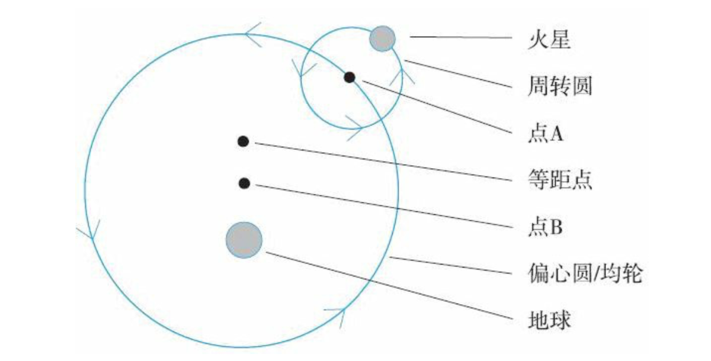
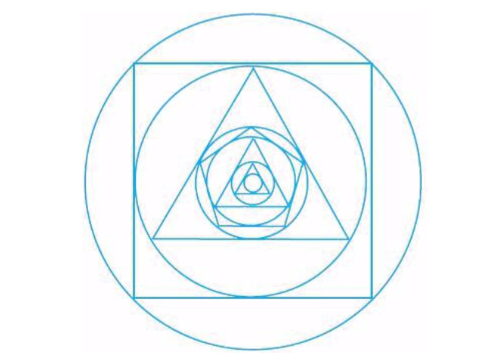

### 第二部分 从亚里士多德世界观到牛顿世界观的转变

#### 第九章 亚里士多德世界观中的宇宙结构

##### **宇宙的物理结构**

关于亚里士多德世界观：

+ 约公元前300年~公元1600年间，亚里士多德世界观在西方世界占主导地位；
+ 地心说最初的原因，是以经验为基础的推理结果；（自然朴素的观点，非唯心说）
+ 地球是球形的，而不是平的；（在亚里士多德时代之前，人们就已经知道）
+ 距离地球最近的天体是月亮，以月球为界分为月上区（月球之外）和月下区（月亮和地球之间）；
+ 月球之外行星和太阳的顺序：水星、金星、太阳、火星、木星、土星及所谓的恒星球面；
+ 太阳、恒星、行星由类似的物质（以太）构成，而且与地球上的任何物质都不相同；
+ 宇宙边缘为恒星球面，以自身轴线为中心转动，转一圈大约24小时，所有恒星与地球距离相等，都镶嵌在恒星球面上，球面转动时带动其上的恒星一起转动。
+ 按照现在的标准，其所认为的宇宙大小是一个相对较小的概念；

 

##### **关于宇宙的概念性观点**

亚里士多德世界观中最重要的两个概念：

+ 目的论
  + 目的论解释vs机械论解释
    + 目的论解释：从为实现一个目标、目的或功能的角度给出的解释。比如为什么心脏会跳动？-- 为了输送血液；为什么剑龙背上有巨大的骨板？-- 为了调节体温。
    + 机械论解释：不涉及目标、目的或功能的解释。比如为什么苹果树会结出苹果？-- 在苹果树演化过程中，这种可结出苹果的苹果树祖先存活了下来，而且比那些不结苹果的苹果树更容易繁殖。因此，在苹果树这个物种的总数中，这种结出苹果的苹果树所占比例特别高。
    + 亚里士多德世界观中，目的论解释被认为是合理的科学解释。而在现代科学中，机械论解释占主导地位；
  + 亚里士多德世界观中，每个基本元素都有它的天然目标，就是要到达其在宇宙中的天然位置，比如土元素的天然趋势是要到宇宙中心。
+ 本质论
  + 亚里士多德世界观中，天然存在的物体都认为具有本质属性，而物体的本质属性就是目的论的属性。换句话说，物体所具有的本质属性决定了物体会有它的本质属性所展现出来的行为模式。
  + 比如橡树果的天然目标是长成一棵成熟的橡树，而这是由橡树果的本质属性决定的，而这个本质属性来自于组成橡树果的物质和这种物质的组成方式。

总结：所有自然物体都有本质属性；本质属性是目的论的属性；本质属性决定了物体会有它们所展现出来的行为模式。简言之，宇宙被认为是一个目的论的、本质论的宇宙。

 

#### 第十章 托勒密《至大论》序言：地球是球形的、静止的，并且位于宇宙中心

本章的主要目标之一，是说明尽管亚里士多德世界观中的观点与我们的观点非常不同，但仍然得到了强有力的支撑。

+ 前人的观点并不幼稚或天真；
+ 支持亚里士多德世界观的论据是很完整的，虽然最终证明是错误的，但是其中的错误非常不容易察觉；
+ 造成论据中错误的原因远不是那么显而易见，这些论据的瑕疵是经过科学史上很多著名人物（比如伽利略、笛卡尔、牛顿）共同努力才找到的；

这里要讨论的论据来自托勒密《至大论》序言，其中托勒密提出了大量关于宇宙结构和运转方式的论据。

> 注：《至大论》在公元150年左右发表，是一本非常专业的科技著作，包括大量的文字和示意图，是一部内容翔实艰深的著作。

 

##### **地球为球形**

从古希腊时代开始，受过教育的人中几乎没有人认为地球是平的。而在《至大论》序言中针对地球为球形提出很多论据：

1. 地球上不同的观察者看到的太阳、月亮升落的时间并不相同，而且住在东边的人看到的早，西边的人看到的晚；

2. 同一时刻的月食现象，不同观察者记录的时间并不相同；

3. 越靠近北极，南方天空的星星越少，北方天空的星星开始出现；

4. 向高山或地势高的地方航行时，无论何时何方向何前进角度，目的地都一点点增加，像是从海底升起来的；

 

##### **地球是静止的**

早在古希腊时期，人们就思考过地球围绕太阳运动或以自身轴线为中心旋转的可能性。《至大论》明确考虑了后者，并给出了多个论据。

+ 常识论据：
  + 假设地球在运动，考虑自转一周的情况。地球周长约25000英里（古希腊的人们已经有大概认识），如果每天自转一周，在赤道地区，地球表面运动速度将超过1000英里/小时，参考坐车对运动的感受，这么高速的运动人们丝毫没有观察到这样的运动效果，这样就给地球在运动提供了不证实证据；
  + 公转的情况类似，速度更快，但是人们没有观察到高速运动的现象；
  + 考虑地球上的巨大物体必须有很大的外力作用下，才能保持运动状态，如果地球是运动的，那么这么巨大的外力谁能一直提供呢？
+ 基于运动物体的论据：
  + 现实情形：将一个物体竖直向空中抛出，物体会垂直于地面向上运动，然后垂直落到地球表面；
  + 等价问题：我们在运动时，向上竖直抛出一个物体，这个物体会落在我们身后，还是会沿弧线运动，然后重新落在我们手中，或落到我们手边的位置？
  + 托勒密针对以上问题根据直觉经验选择落在身后，这就成为针对“地球在运动”的不证实推理的论据。
+ 基于恒星视差的论据：
  + 《至大论》中指出恒星的角距离总是保持不变，这个事实支持了“地球是静止的”这一观点；
  + 视差是由于观察者的运动造成的物体位置的明显偏移，因为在很长的历史时期中（直到1838年）在地球上都没有观察到恒星视差，所以托勒密确定地球没有在运动；
  + 这里的关键辅助假设和距离有关，恒星和地球的距离越大，视差越小。而恰恰这个距离超过了托勒密时期人们的想象，因为过于巨大，导致视差很难被直接观察到。

 

##### **地球在宇宙中心**

托勒密引用了多个亚里士多德在《论天》中的论据：

+ 如果地球是球形的，且是静止的，通过观察月球、太阳、恒星、行星都围绕地球转动，作为天体的共同中心，认为地球是宇宙中心是很自然的；
+ 根据亚里士多德世界观，由于地球本身似乎主要由土元素组成，而土元素有向宇宙中心运动的天然趋势，推导出地球本身位于宇宙中心；
+ “重的物体有一种向宇宙中心运动的天然趋势”是另一个论据；

 

<!--more-->

#### 第十一章 天文学数据：经验事实

##### **恒星运动**

+ 恒星运动似乎以一种规律的模式，将近每24小时重复一次；
+ 恒星与其他恒星的相对位置都保持不变；

 

##### **太阳的运动**

+ 东升西落，将近24小时重复一次；
+ 太阳在东方升起的位置在一年之中存在南北移动的现象；
+ 以其他恒星作为参照点，太阳每天相对于它们的位置都会向东偏移；

 

##### **月球的运动**

+ 东升西落，但并不按24小时的周期运动；每天晚上，月球升起的时间都比前一天晚上推迟一些；
+ 稍多于29天月球相位循环一次；
+ 和太阳一样，月球相对于其他恒星的位置每天都会向东偏移，但偏移速度比太阳快，大约经过27天就回到相对于其他恒星的原来的位置；

 

##### **行星的运动**

+ 考虑到之前的科技水平，对天体观察无法借助先进的观察工具。在裸眼观察的条件下，恒星和行星看起来很像。
+ 前人通过很多夜晚的观察，发现有5个亮点的运动模式与其他亮点不同（金木水火土，五大行星）；
+ 五大行星与月球和太阳类似，也有向东偏移的现象，同时存在“逆行运动”的现象，且逆行间隔都不一样；（比如木星、土星大约一年有一次逆行，火星大约每两年有一次，金星大约每一年半一次，水星大约一年三次）
+ 与恒星不同的是，行星的亮度变化很大；
+ 几个重要的经验事实：
  + 水星和金星的位置从来不会离太阳很远；
  + 火星、木星和土星在进行“逆行运动”时达到亮度最大值；

 

#### 第十二章 天文学数据：哲学性/概念性事实

本章探讨的内容有关两个重要事实：正圆事实和匀速运动事实。

 

##### **天体运动的一个科学问题**

+ 惯性定律vs17世纪前运动定律
  + 惯性定律：任何物体在不受任何外力作用的情况下，总保持匀速直线运动状态或者静止状态，直到有外力迫使其改变这种状态；
  + 17世纪前运动定律：正在运动的物体都会停下来，除非有外界因素使其保持运动；
  + 日常生活经验让我们更认可后者；

+ 是什么外界因素让天体一直保持运动？
  + 考虑这个外界因素本身就是在运动状态，（比如用手推着钢笔在桌面上滚动，钢笔运动的因素是手，而手本身也处于运动状态，它也需要一个外界因素来保持运动）对于天体而言，无法解释这种情况；
  + 考虑这个外界因素本身不运动，（比如有人站在远处叫你，你向他走去）亚里士多德认为天空是个几乎不变的完美的地方，唯一绝对的完美将是“神明”的完美，天体一定是渴望模仿神明的完美而运动。而模仿神明的完美，最好的方法是进行完美的运动，而**最完美的一种运动就是沿正圆轨道，保持不变速度进行运动**。

+ 三点要注意的方面：
  + 上面所说的天体对模仿神明的渴望，是一种无意识的渴望，或者说是一种自然的、内在的、目标导向的趋势；
  + 天体的渴望是由于以太元素带来的，以太的基本性质就是沿正圆轨道，以统一不变速度运动；
  + 亚里士多德认为“神明”是某种学术完美，与宗教无关。而在其后的几个世纪里，各宗教的哲学家和神学家把宗教与亚里士多德的观点进行了混合，这个“神明”逐渐转变为宗教里的神。

 

##### **这可以用来解释运动的地球吗**

考虑土元素如果也具有类似以太元素的性质，沿圆形轨道进行运动的天然趋势，就会和其他观点拼图出现矛盾，比如“自然情况下，石块会向下掉落”，“土元素是最终的元素”等，所以这个观点无法成立。

 

#### 第十三章 托勒密体系

##### **背景知识**

托勒密理论是历史上第一个可以对相关天文学事件进行准确预言的理论，而且在其之前或之后1400年里，没有其他关于宇宙结果的理论在进行解释和预言方面能达到与托勒密体系相接近的水平。

+ 该体系明确尊重正圆事实；
+ 它所采用的的核心观点（地心说）和采用的大多数数学工具都是几个世纪前就存在的；
+ 经验事实方面的表现非常出色，可以准确地进行预言和解释；
+ 它实际上并不是一个体系，针对不同的天体，托勒密使用的方法各有不同，并没有对整个宇宙进行统一的、体系化的介绍；

 

##### **托勒密火星研究的简要介绍**

图3: 托勒密体系对火星的研究结果

周转圆-均轮系统：

+ 火星沿以A为圆心的正圆轨道运转，该轨道称为周转圆；
+ 周转圆以点B为圆心的正圆轨道运转，该轨道称为偏心圆/均轮，如果点B没有位于地球中心，则称为偏心圆，位于地球中心，则称为均轮；
+ 等距点是与火星所在的周转圆运转速度相关的一个点；

 

##### **这些研究内容背后的基本原理**

+ 周转圆-均轮系统非常灵活，包括周转圆和均轮/偏心圆的半径、沿着周转圆和均轮/偏心圆运动的速度及方向，都可以做调整，这样能产生大量不同的运动；
+ 为了增加灵活性，可以为整个系统添加次要周转圆（均轮+次要周转圆可以构成准确描述火星的一种方式，另一种是偏心圆+周转圆的方式）；
+ 为了尊重匀速运动事实，托勒密体系必须引入一个点，而周转圆圆心相对于这个点做匀速运动，这个点被称为等距点；

图4: 托勒密体系对火星的研究结果2

 

#### 第十四章 哥白尼体系

##### **背景信息**

+ 哥白尼（1473~1543）体系是一个日心说体系，认为太阳是宇宙中心；
+ 其和托勒密体系非常相近，也运用了周转圆、均轮和偏心圆，只是不需要等距点，最明显的区别就是太阳和地球的位置不同；
+ 其和托勒密体系面对相同的经验事实，只是数据不完全一样，这两个体系间哲学性和概念性事实也是一致的，都尊重正圆事实和匀速运动事实；
+ 很多人传统的印象是哥白尼体系远远简化于托勒密体系，其实这是一个错误的认识，哥白尼体系很容易就变得像托勒密体系一样复杂，乃至于其在预言和解释方面也没有好于托勒密体系，甚至更糟。

 

##### **哥白尼体系概述**

+ 火星围绕以点A为圆心的周转圆运转；
+ 点A围绕以点B为圆心的均轮/偏心圆运转；
+ 点B也在运动，但是相对点C的位置保持不变；
+ 点C是地球沿偏心圆运转时的偏心圆圆心；
+ 点C沿点D为圆心的圆形轨道运转；
+ 最后点D围绕太阳沿圆形轨道运转；

图5: 哥白尼体系对火星的研究结果

哥白尼体系描述其他外行星时，包括土星和木星，与图5类似，描述地球和月球时会简单一些，描述内行星包括金星、水星的运动会比图5更复杂。

 

##### **托勒密体系与哥白尼体系的对比**

+ 两者在解释经验数据的准确性方面类似，而在正圆轨道和匀速运动方面，哥白尼体系稍好一些（不需要等距点）；
+ 两者复杂性方面相当；
+ 对逆行运动的解释方面：托勒密体系利用周转圆来解释，而哥白尼体系对于火星、土星和木星逆行运动与这些行星最大亮度之间的相互关系（逆行时行星与地球最近），以及对于金星和水星总是出现在距离太阳不远处的事实，都给出了更自然的解释；
+ 哪个体系与当时最先进的科学更为一致？答案很明显，托勒密体系优于哥白尼体系。

 

##### **是什么因素促动了哥白尼**

哥白尼体系很明显与所有支持“地球是静止的”观点的证据相矛盾，当时，哥白尼没有得到任何新的经验证据来支持“地球在运动”的观点。到底是什么因素促使哥白尼花费近毕生的时间来发展一个看起来似乎不可能正确的理论？

+ 柏拉图和新柏拉图主义
  + 柏拉图的观点：我们的知识是关于一个或多个客观存在，但又没有实体的永恒形式。这些永恒的形式不仅涉及数学真理，还涉及“更高”的形式，比如真理和美的形式，最高层次是至善形式（洞穴寓言）；
  + 新柏拉图主义，将柏拉图哲学与基督教精神相融合，柏拉图的至善形式与基督教的“上帝”画上等号，而太阳是柏拉图对至善的暗喻，也就成了上帝的代表；
  + 有些学者认为哥白尼深受新柏拉图主义影响，如果真是这样，那么哥白尼可能会认为太阳是“上帝”在宇宙中的实体代表，其最合适的位置将是宇宙的中心，这样就能说明为什么哥白尼会秉持以太阳为中心的宇宙观；

+ 哥白尼深信匀速运动事实，而无法接受等距点这样的概念。这很好地说明了哥白尼是如何在哲学性/概念性事实而不是经验事实的促动下发展其理论的；
+ 在科学史上，哲学性/概念性事实通常都是促使科学家发展新理论的部分因素；

 

##### **对哥白尼理论的评价**

+ 自哥白尼去世（发表其体系同一年）后几年开始，直到16世纪末，哥白尼的理论被广泛阅读、讨论、纳入课堂，并运用到实际生活中。其是自托勒密后，在15世纪里发表的第一个全面、复杂的天文学体系，被称为“托勒密第二”；

+ 16世纪制作天文学表格的天文学家是以哥白尼理论为基础的，使哥白尼体系得到推广；
+ 在天文学界，托勒密体系是被用现实主义态度对待，而哥白尼体系则被用工具主义态度对待；

 

#### 第十五章 第谷体系

+ 第谷（1546~1601）体系包括了大多数哥白尼体系得到认可的优势，又保留了“地球是宇宙中心”的观点；
+ 第谷体系认为，地球是宇宙中心，月球和太阳围绕地球转动，行星围绕太阳转动；
+ 从数学角度看，第谷体系等价于哥白尼体系；
+ 第谷体系为地心说和日心说提供了一个可行的妥协方案，同时保留了两者的特点；

 

#### 第十六章 开普勒体系

##### **背景信息**

第谷的天文学观察对开普勒（1571~1630）最终发展出其体系产生了非常重要的影响。

+ 第谷是至他所在时代为止最谨慎、准确和勤奋的观察者；
+ 在20年时间里，第谷收集了关于太阳、月球和行星运动非常准确的数据（其准确性实际达到了肉眼观察的极限）；
+ 第谷收集了大量关于火星观测位置的数据；

开普勒的研究背景：

+ 基于第谷积累的关键数据；
+ 从火星运动出发，基于日心说的方法；
+ 到了17世纪初期，意识到所有以匀速运动为基础和仅以正圆轨道为基础的体系都无法解释已观察到的火星运动，于是摒弃了这两个关键的哲学性/概念性事实；

 

##### **开普勒体系**

开普勒行星运动定律：

+ 行星围绕太阳沿椭圆形轨道运转，太阳占据椭圆轨道两个焦点之一的位置；
+ 以行星为起点画一条直线和太阳连接起来，这条直线在相等的时间内扫过的面积相同；

 

##### **什么因素促动了开普勒**

开普勒有生之年始终促使他进行研究的一个因素是他渴望读懂“上帝”所思。

他所关心的一个问题：为什么上帝创造宇宙时正好创造了6颗行星（金木水火土星+地球），而不是5颗、7颗或其他？他利用了多面体和球形构建了一个组合结构，得到了一组同心球体的距离关系，其球体的相对距离和行星之间的相对距离非常接近。这是开普勒第一个重要发现，而这也是他希望为第谷工作的主要原因之一。开普勒希望与当时最好的观察者一起工作，部分原因是为了帮助自己确认这个发现。

图6: 开普勒的多面体架构：上为多面体和球形的组合结构，下为去掉多面体的同心球体结构

开普勒在找出上帝构建宇宙的规律性方面倾注了巨大热情，事实上他毕生坚持对关于多面体的架构进行研究，正是这种热情引领他找到了他的核心发现。

 

##### **结语**

人们是如何接受开普勒体系的？

+ 许多天文学家试图在保留正圆和匀速运动的同时，利用开普勒的研究成果来修正当时的体系；
+ 开普勒1609年发表了他的体系，但是仅在天文学家范围内传播；第二年伽利略发表了他使用望远镜所得的发现，得到更广泛的关注；
+ 而在1610年其后不久，天主教正式表示反对日心说，开普勒后续著作被列为禁书，影响了他的理论的传播；
+ 在17世纪20年代末，开普勒基于其体系做出了一套天文学表格，效果远优于其他体系。
+ 由于开普勒体系的简易性及对经验数据更好的解释，以及伽利略通过望远镜所得到的支持日心说的证据，最终（17世纪中期）开普勒体系得到广泛认可。

 

#### 第十七章 伽利略和通过望远镜得到的证据

##### **背景知识**

伽利略时代的宗教状况：

+ 教会更偏爱地心说观点，一个原因是天主教教义很多段落都暗示地球是静止的，太阳围绕地球转动；
+ 天主教在之前的历史上对新科学观点是持宽容态度的，通常也愿意在新发现需要时重新对教义进行解读；
+ 起于16世纪初的宗教改革，让天主教阻止其认定的异教思想观点传播，到了17世纪，教会对新科学观点已经不是那么宽容了；
+ 伽利略本人是一位虔诚的天主教徒；

 

对由望远镜得来的证据性质的说明：

+ 即使有了望远镜，也无法直接判定日心说和地心说哪个是正确的；
  + 肉眼观察得到的数据是支持地心说观点的；
  + 甚至从太空直接拍摄的照片也不能直接证明地球是否围绕太阳旋转；
    + 无法确定哪个是中心，只能展示出太阳和行星时相对彼此运动的；
    + 以地球为中心的第谷体系，和日心说体系都能解释行星和太阳的运动；
  + 地球围绕太阳旋转最为直接的证据是最终于20世纪90年代首次被观测到的恒星视差；
+ 我们通过技术得到的证据很少会像我们通常所认为的那样直接；

+ 望远镜发现的证据提供了一系列的间接证据；

 

##### **伽利略通过望远镜得到的证据**

+ 月球上有山峰
  + 表明亚里士多德世界观出现瑕疵，“天空中的物体都由以太组成”可能不成立；
  + 表明日心说更有道理，月球如果是由岩石组成，而且能够保持运动，地球就也可能围绕太阳进行持续运动；
+ 发现太阳黑子
  + 表明亚里士多德世界观的另一个瑕疵，月上区不是其所认为的那样没有变化的完美区域；
+ 土星的光环
  + 表明天体不都是正球体；
+ 木星的卫星
  + 证明宇宙中的圆周运动并非都围绕唯一的中心；
+ 金星相位
  + 托勒密体系中，我们最多能看到金星被太阳照亮中的一半中的一小部分，永远看不到一颗完整的金星，或者处于亏凸月位/盈凸月位或上/下弦月位的金星；
  + 日心说体系中，我们可以预计金星会经历一个完整的周期性相位；
  + 伽利略的发现为托勒密体系提供了不证实证据，为日心说体系提供了证实证据；
  + 但它无法解决日心说和地心说之争，比如参考第谷体系，让金星围绕太阳转，而其他天体都围绕地球转，这样也能符合观测结果；
    + 这个例子表明，新证据，甚至于非常重要的新证据，通常都同时与两个或更多个相互竞争的理论相一致。换句话说，可用的证据通常不能单独决定某个具体的理论是否正确。(理论的不充分确定性）

+ 发现很多恒星，表明宇宙非常之大；

 

##### **对伽利略发现的接受情况**

+ 教会可以接受以工具主义的态度来对待日心说体系，但不能接受现实主义态度来对待；
+ 教会天文学家贝拉明和其他人复现了伽利略的观察结果，证明是准确的；
+ 贝拉明和伽利略都接受通过望远镜得到的数据，都承认宗教教义的权威性，都认为宗教教义提出的是太阳围绕地球运动，都同意通过望远镜取得的数据表明可能是地球围绕太阳运动；
+ 伽利略认为在教义救赎之外的问题上，通过望远镜得到的证据可以胜过宗教教义给出的证据；贝拉明则认为宗教教义方方面面都无可争议是正确的；
  + 说明了有关可证伪性命题说到底通常归结为”怎样的证据最为有力“的命题，而这个命题往往关乎一个人的整个观点体系；

 

#### 第十八章 亚里士多德世界观所面临问题的总结

##### **亚里士多德世界观的问题**

+ 包括什么因素使地球保持运动，重量大的物体会向宇宙中心运动不成立，感受不到地球在高速运动，没有观察到恒星视差，宇宙是否为无限大等等问题；
+ 日心说观点需要一个巨大的宇宙，恒星球面不存在，这让天堂在恒星球面之外，恒星球面出于对完美的渴望而运转（与基督教上帝相关联）都不成立；
+ 如果宇宙空荡荡，地球只是其中一粒小尘土，那么“人类很特别”的观点就会有问题；

 

##### **对新科学的需求**

地心说观点的瓦解意味着亚里士多德科学体系的瓦解，糟糕的是，那时并没有别的科学体系来替代它；

 

#### 第十九章 新科学发展过程中的哲学性/概念性关联

##### **宇宙的尺寸**

宇宙无限大和原子论

 

#### 第二十章 新科学和牛顿世界观概述

##### **新科学**

牛顿1687年发表著作《自然哲学的数学原理》。

 

##### **运动三大定律**

+ 惯性定律：任何物体在不受任何外力作用的情况下，总保持匀速直线运动状态或者静止状态，直到有外力迫使其改变这种状态；
+ 第二定律：物体运动的改变与其所受作用力成正比，而且与其所受作用力的方向成一直线；
+ 第三定律：对任何作用力，总会存在一个方向相反，大小相等的反作用力；

 

##### **万有引力**

两个物体间的万有引力作用与物体质量成正比，与物体之间距离的平方成反比；

 

##### **牛顿世界观概述**

+ 与亚里士多德世界观科学紧密相连的宇宙观，也就是认为“宇宙是有目的、有本质存在”的观点，被一个新的机械论的宇宙观所替代；
+ 行星的运动被解释成是惯性及重力作用共同的结果，新科学不需要上帝来使宇宙运转；

 

##### **哲学思考：对待牛顿重力概念的工具主义和现实主义态度**

牛顿对于重力持工具主义态度。

 

#### 第二十一章 哲学插曲：什么是科学定律

##### **科学定律**

+ 自然规律：负责宇宙运转的宇宙基本特点；
+ 科学定律：近似地反映了这些自然规律的定律；

 

##### **与科学定律相关的特点**

+ 反映了无例外的规律性；
+ 反映了宇宙的客观特点；

 

##### **无例外的规律性**

潜在科学定律的无例外的规律性与非潜在科学定律的无例外的规律性之间有什么区别？前者即使面对多种反事实条件仍然可以保持为真，而后者无法做到这一点。

> 注：非潜在科学定律的无例外的规律性举例，比如所有曾被写出的英文句子，出现的所有单词数量略小于100万，因此，这是一个关于英文句子的无例外的规律性。

+ 反事实条件句：“如果......那么......"的句式结构，其中“如果”的部分反映的都是过去没有发生而且你也知道没有发生的事情；
  + 语境依赖性：一个反事实条件句的真假依赖于其所处的语境，这意味着真假依赖于相关人士的知识和利益。由此说明对反事实条件句的使用破坏了科学定律的表明客观性；
+ 其他条件不变句：比如说如果木星是一颗行星，那么在其他一切条件都相同的情况下（比如，没有小行星和彗星撞击的冲击、没有其他行星的影响，等等），木星将遵循开普勒行星运动第二定律。
  + 标红的部分就是所说的“其他条件不变句”；
  + 会引发新的问题：
    + 在上面的例子中，其他条件不变句本身和现实相反，也就是它其实是一个反事实条件，从而也具有反事实条件的各种问题；
    + 一一列举所有可能的其他条件不变句是不可能的，能做的只能是列出一些条件，加上“等其他类似的影响”；然而，相似性的概念与人类利益密切相关，取决于人类的判断，这就又和科学定律的客观性矛盾；

 

#### 第二十二章 1700~1900年牛顿世界观的发展

##### **对科学主要分支发展的评述，1700~1900年**

+ 化学：
  + 现代化学的起源在18世纪晚期，以拉瓦锡的研究为标志；
  + 现代化学由之前的定性研究转向定量研究；
  + 19世纪早期，道尔顿构建了他的原子理论，认为理解气体运动模式最好的方法是把它们看做是例子因互斥力而相互作用的结果；
  + 运用牛顿方法，化学研究取得卓著成果，某些分支逐渐变成物理学的分支；
+ 生物学：
  + 与神经相关联的电学活动的物理、化学基础都将得到很好的理解；
  + 用非有机化合物合成有机化合物；
  + 关于演化论的研究；
+ 电磁理论：
  + 库伦定律；
  + 法拉第发现电磁感应；
  + 麦克斯韦方程式；

 

##### **几块小乌云**

+ 迈克尔逊-莫雷实验
+ 黑体辐射
+ 受热元素发出的光线具有特定波长模式
+ X射线的波粒二象性
+ 放射性元素的性质

 