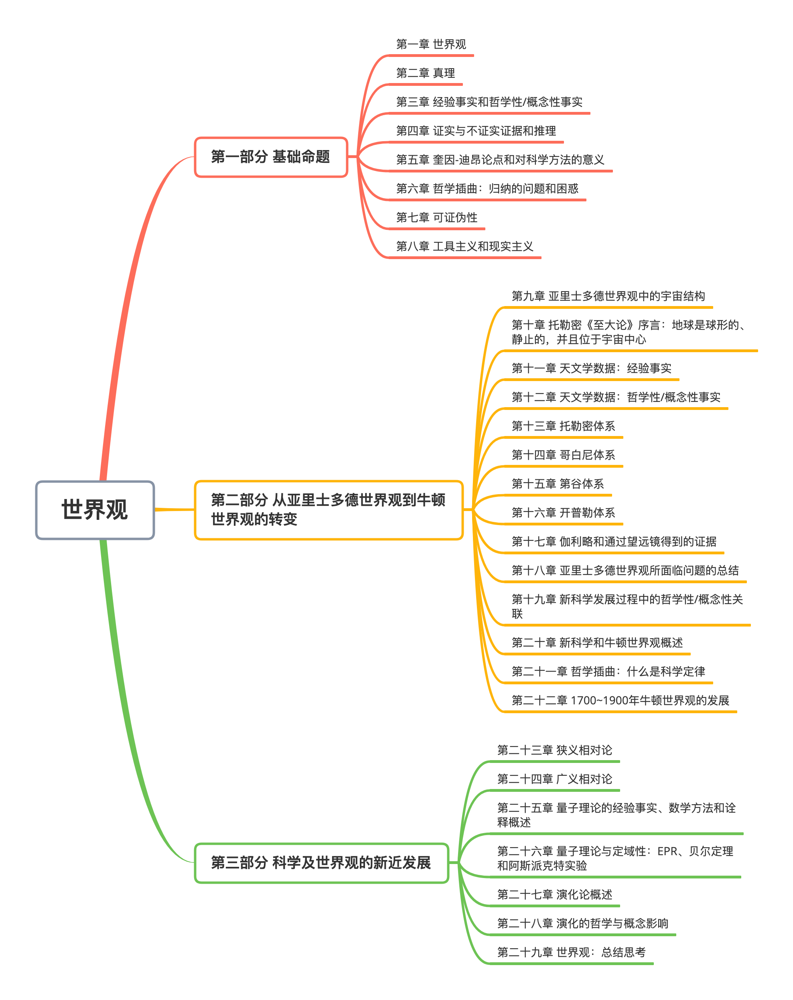
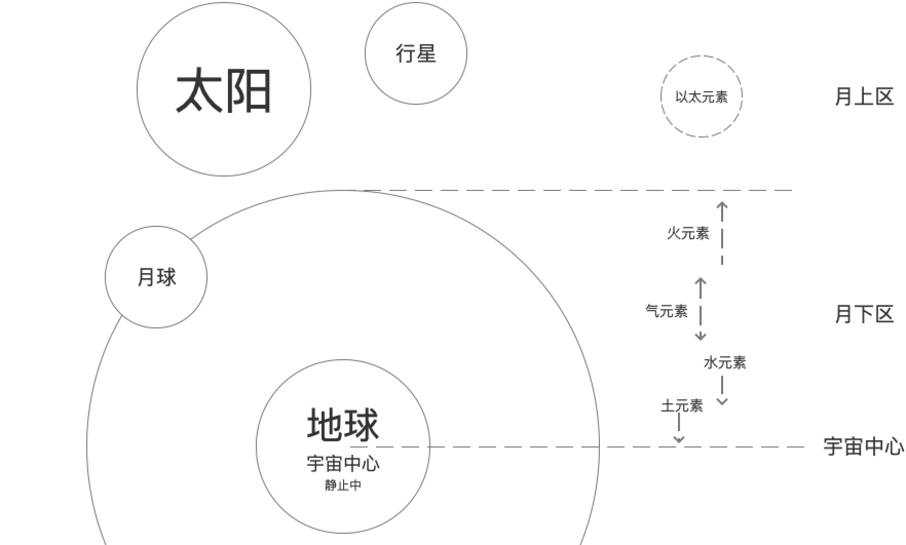
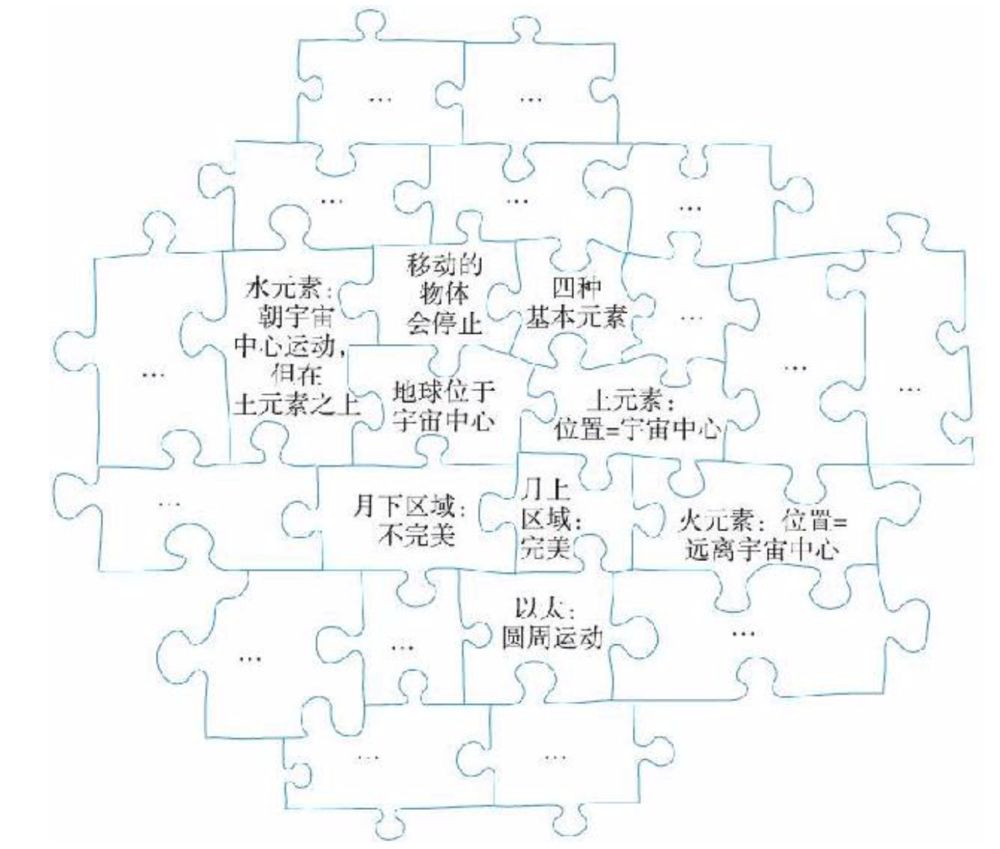

### 目录

### 前言

该书的结构分为三部分：

+ 第一部分是对科学史和科学哲学中的某些基础命题的介绍，包括世界观的概念、科学方法和推理、真理、证据、经验事实和哲学性/概念性事实之间的对比、可证伪性以及工具主义和现实主义。
+ 第二部分探讨从亚里士多德世界观到牛顿世界观的转变，并关注在这一变化过程中某些哲学性/概念性命题所扮演的角色。
+ 第三部分介绍新近的科学发现和发展，重点关注的是相对论、量子力学和演化论。

 

### 第一部分 基础命题

#### 第一章 世界观

+ 定义：“世界观”指的是一个**观点体系**，其中不同观点如同**拼图**的一块块拼板一样相互联结。是一个不同观点相互交织、相互关联、相互联结的体系。

+ **该书中所说的“世界观”是一个更广义的概念，它并非特指某个人的观点体系，而是指以代表人物的内在精神为核心，以西方主流世界的共识为基础，由一群人共同持有的观点拼合在一起，形成的一个环环相扣、具有一致性和稳定性的观点体系。**

 

##### **亚里士多德世界观**

其并不特指亚里士多德本人的观点集合，而是指其后，西方主流文化共享的一系列观点，而这一系列观点很大程度上以亚里士多德的观点为基础。

下面是亚里士多德本人的一小部分观点：

+ 地球位于宇宙中心。
+ 地球是静止的。（不围绕任何其他天体运行 -- 无公转，也不围绕自身轴线旋转 -- 无自转）
+ 月亮、其他行星和太阳围绕地球运行。（约每24小时传一圈）
+ 月下区（地球和月球之间，包括地球）内，有四种基本元素，**土、水、气、火**。
+ 月上区（月球以外，包括月亮、太阳、行星和恒星）内的物体由第五种元素**“以太”**组成。
+ 每种基本元素都有一个基本性质，其决定了元素的表现特征。
+ 每种基本元素的基本性质通过这一元素的运动趋势表现出来。
+ 土元素有一种向宇宙中心（地球中心）运动的天然趋势。
+ 水元素也有向宇宙中心运动的天然趋势，但比土元素弱。
+ 气元素天然地向土和水以上、火以下区域运动。
+ 火元素有一种向远离宇宙中心的方向运动的天然趋势。
+ 以太元素组成了行星和恒星等物体，有一种进行完美的圆周运动的天然趋势。
+ 月下区中，运动的物体会自然趋于静止。导致静止的原因有两个：（第二个更常见）
  + 组成该物体的元素到达了其在宇宙中的自然位置；
  + 组成该物体的元素被其他东西阻止（比如地球表面）；

图1: 亚里士多德世界观示意图

这些观点并非随机，而是相互关联、环环相扣的观点体系，类似于拼图：

图2: 亚里士多德观点拼图

观点拼图有几个特点：

+ 观点间相互拼合，体现出逻辑关系。比如“土元素天然地向宇宙中心运动”和“地球是宇宙中心”相互关联。
+ 核心拼板和外围拼板，对应着核心观点和外围观点。外围拼板容易被替换掉，而核心拼板因为关联很多其他拼板，动一发系全身。类似地外围观点容易改变，而核心观点如果不成立会导致整个观点体系崩塌。比如“地球是静止的，并且在宇宙中心”是一个核心观点。如果改成“太阳是宇宙中心”，则其他观点都要随之调整。

 

##### **牛顿世界观**

这一观点体系以艾萨克·牛顿及其同时代人的著作为基础，并在其后多年中得到了相当可观的丰富和发展。

其所包含的一部分观点：

+ 地球围绕自身轴线旋转，大约每24小时旋转一周。
+ 地球和行星沿椭圆形轨道围绕太阳运转。
+ 宇宙中基本元素的种类略多于100种。
+ 物体表现出来的运动特征主要受外力影响（如重力）。
+ 组成行星和恒星这样物体的基本元素和组成地球上物体的基本元素相同。
+ 描述地球上物体运动规律同样适用于其他行星和恒星上的物体。

 

##### **证据**

+ 我们很难拿出直接证据（直观感受）来证明我们所持有的某些观点，比如“地球围绕太阳旋转”；
+ 对于大多数（几乎所有）观点来说，我们之所以秉持这些观点，主要是因为它们可以跟我们的世界观拼合在一起；

 

##### **常识**

+ 从我们的日常生活经验中，牛顿世界观其实是反直觉的，或者说是反常识的，比如“没有东西会一直保持运动”、“看起来太阳是围绕地球转动的”。
+ 牛顿世界观的部分观点，并不是我们通过常识或者一般经验就能得到的，我们接受它是因为从小就被灌输了这些观点。
+ 同样地，现代科学如量子力学、相对论都是反直觉、反常识的，不能通过一般经验来获取到。

 

#### 第二章 真理

一个似乎传播广泛的观点是，“事实的累积是一个相对直接的过程，而科学的功能（在很大程度上也可以说是科学的主要目的），是提供正确的理论来解释这些事实”。这两点基本上是对事实、真理，以及两者与科学之间关系的错误理解。相对于该观点而言，事实、真理和科学三者之间的关系更加复杂和有争议性。

 

##### **基本命题**

什么是真理？在字典里，真理的定义是“被证实的或者不存在争议的事实”，事实的定义是“被认为是真的事物”，这种循环定义对区分这些概念没有什么建设性作用。这里没有给出确定的答复，也侧面体现了某些复杂性。

虽然人们对真理这个命题缺乏主动思考，但是在指导自身行为上每时每刻都将“真理”当作是理所当然的（无意识的），随之带来的后果也不能说是无足轻重的。

 

##### **澄清问题**

核心问题：什么是真理？

对等问题：真/假的叙述（或观点）有什么共同点使它们成为真/假的？

区别问题：我们通过什么方式知道哪些叙述和观点是真/假的？这属于认识论范畴，和我们的核心问题有区别。

两大类关于真理的理论：

+ 真理符合论：通过判断观点是否与独立、客观的现实相符合，来决定这个观点为真还是为假。
+ 真理融贯论：通过判断观点是否能融入一个整体的观点集合，来决定这个观点为真还是为假。

 

##### **真理符合论**

+ 知觉表征论：
  + 核心观点：感官（如视觉、听觉、味觉等）为我们提供了外部世界各种物体的表征。
  + 重要推论：意味着我们每个人从某种意义上来说与这个世界都是隔绝的，更具体地说，我们没有办法确定自身感官所提供的表征是否准确。
  + 推导过程：要评估表征的准确性，需要把表征（比如某棵树的照片）和表征所代表的事物本身进行对比，但是我们无法跳出意识经验直接得到事物本身的信息，比如我们拿照片直接和事物本体做对比的时候，仍然是通过视觉表征（用眼睛看到的树）来和照片做对比，并没有用事物本身信息做对比。
  + 关键点：这里的关键是意识经验是基于人的大脑物质，即表征信息受大脑影响，无法作为外部客观信息存在。（参考缸中之脑思想实验，《理性，真理与历史》，Hilary Putnam， 1981）

+ 知觉表征论并没有否定真理符合论，而是从认识论角度说明了我们的认知边界，让真理符合论丧失了吸引力。
+ 笛卡尔的“我思故我在”：笛卡尔想先找到某些确定的观点，在以此为基础推演出其他观点，从而构建出一个具有完全确定的基础的知识结构。但他只能确定“在思考时，存在一个思维主体”这样一个基础观点，这个基础太小，而无法在其上进行知识构建。

 

##### **真理融贯论**

+ 融贯论根据观点集合所属不同，分为两大类：
  + 个人主义融贯论：以是否融入个人的观点集合作为判断的依据；
  + 以科学为基础的融贯论：以是否融入西方科学家的群体观念集合作为判断依据，也称团体融贯论；

+ 个人融贯论的现实困境：个人的观点缺乏普遍性，都是相对于个体而言，是一种极端的相对主义。
+ 团体融贯论的现实困境：
  + 没有考虑一个群体可能秉持错误观点的可能；
  + 没有办法明确哪些人可以算作群体的一分子；
  + 对任何一个群体而言，都不存在由一个整个群体共同秉持的、具有一致性的观点；

 

<!--more-->

#### 第三章 经验事实和哲学性/概念性事实

##### **初步观察**

+ 两类事实：
  + 经验事实：以直接的、经过观察得来的证据为基础的事实。比如我们看到“书桌上有一支铅笔”。
  + 哲学性/概念性事实：以我们对自己生活的世界的哲学性/概念性认识为基础的事实。比如，我们把一支铅笔放到抽屉里，关上抽屉，虽然我们无法直接看到铅笔，但是依照“组成这个世界的大部分物体都是稳定的，即使在没有观察到，也仍然保持存在”这样的认知，我们判断“抽屉里有一支铅笔”是个事实。

+ 在科学史中，在对待各个理论和这些理论要尊重的事实时，某些事实被人们认为是比较明确的经验事实，但其实更多的是依赖于人们对自己所处世界的一些哲学性/概念性判断。
+ 在经验事实和哲学性/概念性事实间，其实很难有一个很明确的界限。大多数观点的基础既包括经验性的、通过观察得来的证据，也包括对我们所处世界更概括性的认识。比如亚里士多德世界观认为行星围绕太阳沿圆周轨道做匀速运动，虽然其在观点集合中与其他观点（“如行星由以太构成，以太元素有一种完美的圆周运动的天然趋势”）有紧密联系，可以认为是哲学性/概念性事实，但也有人们早期天文观察得到的证据支持，属于经验事实。

 

##### **关于术语的一点说明**

书中对于阶段性正确的观点（比如亚里士多德世界观）也采用“事实”这个称呼，一方面是因为没有更合适的词语；另一方面也想提醒读者，从相关的世界观来看，这些被证明不正确的内容并不仅仅是简单的假设、观点或意见，也是有一些经验事实和哲学性/概念性事实支撑的（即使是阶段性和带有局限性的）。

 

##### **结语**

+ 经验事实和哲学性/概念性事实并不好区分。虽然日常生活中我们一般不会特别区分，但如果要判断的话，很多观点需要仔细思考，有时还要克服极大困难，才能分辨出来它们是以哪类事实作为基础。
+ 不要简单的认为哲学性/概念性事实就是错误的、幼稚的。有一些虽然被证明是错误的，但在当时这些观点能和整体观点体系拼合在一起，并不幼稚（比如“正圆事实”和“匀速运动事实”）；而有些可以经得住时间考验，证明至少部分是正确的。另外，也不要错误地认为在现代科学的时代，就摆脱了相信哲学性/概念性事实的陷阱（比如量子力学和相对论）。

 

#### 第四章 证实与不证实证据和推理

##### **证实推理**

+ 定义描述：当我们以某个特定理论为基础得出某些预言，而这些预言后来被证明是正确的，这些预言至少提供了某些证据，来证明这个特定理论的正确性。
+ 简化描述：如果T，那么得出O & O证明是正确的 => 所以T非常可能是正确的

+ 举例：爱因斯坦的广义相对论推理出引力效应会将光线弯曲（T => O），而1919年5月的日全食提供了很好的观测机会，最终观测证实了该预言（O是正确的）。

 

##### **不证实推理**

+ 定义描述：当我们根据某个特定理论得出某些预言，而这些预言最终证明是错误的，我们就会以此作为该理论不正确的证据。
+ 简化描述：如果T，那么得出O & O证明是错误的 => T是不正确的

 

##### **归纳推理&演绎推理**

+ 归纳推理：
  + 在一个好的归纳推理过程中，即使所有前提条件都是真的，所得出的结论也有可能是错的；
  + 因为以下两点存在，大多数科学理论都无法保证永远是正确的；
    + 证实推理模式是广泛用于支撑科学理论的推理模式；
    + 证实推理模式是一种归纳推理；
  + 实际用于证实科学理论的证据通常非常复杂，所以不仅是因为证实推理模式的归纳推理性质让它无法严格证明某个理论的正确性，而且这一推理模式中的实际证据和推理过程往往相互交织、非常复杂，从而让证据不是这么直接明确。
    + 举例：1919年5月的实际观测中，要对恒星光线上出现弯折点的位置进行计算预测，为了将计算量控制在可操作范围，对整个模型做了大量简化，比如假设太阳是一个正球体，没有自转，也不受任何外力影响（比如地球、月球及其他行星的引力作用），从事实上来看，这些假设本身是错误的。
    + 结论：实际用于证实科学理论的证据所涉及的因素往往比人们通常所认识的要复杂得多。

+ 演绎推理：
  + 在一个好的演绎推理过程中，如果所有前提条件都是真的，那么其所得出的结论一定就是真的；
  + 不证实推理是一种演绎推理；
  + 不证实推理实际应用的局限性：
    + 相对于简化描述的准确描述：如果T，且A1，A2，A3，... ，An，那么得出O，其中Ai指辅助假设。这个描述说明，除了主体理论T满足外，所有辅助假设Ai都正确的情况下，才能得出O这个结论。
    + 辅助假设很关键，往往是隐含条件。当O被验证是错误的时候，不一定说明是T不成立，也可能是辅助假设中的几个不正确，这往往不是很直观。
  + 基于以上，使用不证实推理的客观做法：
    + 在面对能证明一个理论不正确的证据时，可以坚持这一理论，同时摒弃一个或几个辅助假设。
    + 对于什么情况下该放弃理论，什么情况下该摒弃一个或几个辅助假设，没有标准答案。

 

##### **结语**

本章要点：科学领域里（在日常生活中同样）的证据和推理都出人意料地复杂。

 

#### 第五章 奎因-迪昂论点和对科学方法的意义

本章关于科学方法的讨论将完成两个任务：

+ 从历史的角度，让我们看到某些关于进行科学研究的适当方法的观点。
+ 让我们有机会看到围绕在科学方法论周围的某些命题。

 

##### **奎因-迪昂论点**

三个关键点：

+ 我们的观点并不是单独而是作为整体来接受验证的（接受经验的裁判）。
  + 以不证实推理为例，进行实验验证时，并不是单独地验证主要理论假设，也包括相关的辅助假设。当证据不成立时，可以选择摒弃主要理论，也可以摒弃一个或多个辅助假设。
  + 面对验证的观点的范围是多大则没有一个标准答案。奎因激进地认为应该包括整个观点网络，包括所有核心观点及外围观点。迪昂则倾向于其中的一部分观点集合，并不是针对整个。

+ 通常不存在可以用来判断两个竞争理论中哪一个正确的“关键性实验”。
  + “关键实验”：
    + 定义：当面对两个相互竞争的理论时，有可能设计出一个实验，关于这个实验的结果，两个理论的预言是相互矛盾的。理想的情况，由于两个理论预言相互矛盾，通过实验至少可以证明其中一个理论不成立。
    + 考虑不证实推理的情况，当预言不成功时，我们可以选择摒弃某些辅助假设而不是主要理论，这样就说明无法通过“关键实验”来证明某个理论不成立。
  + 奎因-迪昂怀疑论：
    + 力度较弱版本：相互竞争的理论通常都分别可以与所谓的关键实验结论相吻合。科学史上有无数实例支持这个表述。
    + 力度更强版本：任何实验结果，无论是什么，都可以与任一理论相吻合。

+ 非充分决定性的概念，也就是现有可用的数据，通常不足以让人们找到唯一正确的理论。
  + 理论的不充分确定性：
    + 根据证实推理的概念，通过现有数据和所有实验结论，是无法确定理论的绝对正确性的；
    + 根据不证实推理的概念，通过现有数据和所有实验结论，也无法明确证明任何相互竞争的理论是不正确的；
    + 有时有些数据可以支持两个或多个相互竞争的理论；
  + 对理论的不充分确定性有很广泛的解读：比如温和的理解，理论都是不充分确定的；更激进的理解，科学理论和科学知识都是“社会构建”的，反映的是社会条件，而不是客观的物质世界，不存在唯一得到确认且客观正确的科学理论。

> 注：威拉德·奎因（1908-2000）是20世纪最有影响力的哲学家之一，毕生研究兴趣都在与科学哲学相关的命题上；皮埃尔·迪昂（1861-1916）是一位威望颇高的法国哲学家，研究范围包括关于对科学假设和理论进行验证的问题。

 几个关于适当的科学研究方法的主张：

+ 对“科学方法”的传统认知：
  + 收集相关事实 => 收集解释这些事实的假设 => 验证假设（利用证实推理或不证实推理）；
  + 根据奎因-迪昂论点的几个命题，我们有理由怀疑，以上方法是否有这么直接明确；
+ 亚里士多德的“公理化方法”：
  + 在亚里士多德世界观中，科学通常是以提供确定的知识为目标的，这意味着科学知识必须为真，且必定为真。
  + “公理化方法”使用基于必定为真的基本原则的演绎推理模式。
    + 认为给出一个科学解释从本质上来说其实是给出某种符合逻辑的论证过程（以逻辑作为工具）；
    + 认为一个合理的科学解释都应包括实证，所谓实证就是一个三段论链条，其中最后一个三段论的结论就是要解释的内容。
    + 认为科学知识必须是确定的知识，即三段论的结论必须为真。（与现代科学的概念不同，现在，科学的目的通常被认为是提供可能正确的理论，我们不期望能保证理论是正确的）
  + “第一原则”：
    + 为了保证“公理化方法“中的结论为真，必须保证前提为真；
    + 而三段论链条中的起始点，这些本身为真的前提，通常被称为”第一原则“；
    + 第一原则被当作是关于这个世界基本的，必定为真的事实，也就是公理；（比如欧几里得几何中的五大公设）
    + 第一原则的困境：通过之前的讨论，几乎不可能存在关于基本事实是由哪些内容组成的任何共识，至于那些必定为真的事实是由哪些内容组成的，更不可能有共识。

+ 笛卡尔的“公理化方法”：
  + 与亚里士多德公理化方法类似，也是希望利用演绎推理从必定为真的起始点得到确定的知识；
  + 如之前所说，他只能确定“在思考时，存在一个思维主体”这样一个基础观点，这个基础太小，无法在其上进行知识构建。
+ 波普的“证伪主义”：
  + 认为科学强调的应该是尝试对理由进行反驳，而不是证实理论；
  + 认为一个理论所冒的风险越大（可证伪性越大），它的科学性就越强；比如爱因斯坦的相对论理论与弗洛伊德的精神分析法，前者更容易被证伪，所以科学性更强；
  + “证伪主义”的困境：
    + 证伪本身的难度：几乎没有不证实推理的例子像它们本身看起来这么简单的（奎因-迪昂论点）；
    + 对于与预言不吻合的理论，也可以选择摒弃辅助假设，而不是摒弃掉主要理论，而且往往这种选择更为合理。这进一步降低了证伪的意义。
    + 综上，虽然不证实证据在科学中扮演着重要角色，但是围绕这类证据的命题却非常复杂，从而使证伪不太可能成为科学的核心特点。

+ “假设演绎法”：
  + 上面提到的传统的科学方法；
  + 基本思想是从一个或一组假设（或者更宽泛地说，一个理论）可以演绎出一系列可经观察得来的结果，然后去验证这些结果是否可以观察地到。如果可以观察地到，基于证实推理，就被认为是支持了假设；如果没有观察到预言的结果，基于不证实推理，会被当成证明假设不成立的证据。
  + “假设演绎法”的困境：假设演绎法，归根结底就是证实和不证实推理，虽然在科学中扮演重要角色，但根据之前的所有讨论，它的基本观点是对科学过于简单化的描述，无法称为严格的“科学方法”。

 

#### 第六章 哲学插曲：归纳的问题和困惑

###### **休谟的归纳问题**

+ 当我们进行推理时，经常（几乎所有）会涉及到隐藏的前提。
  + 举例说明：假设我们约定这个星期天到市区一起吃饭，需要用到你的车，但你不知道去餐厅的路线。又假设我告诉你有一辆公交车从你家开到餐厅，因此你可以坐公交车赴约。这里隐藏的一个前提是，公交车在星期天也正常运营。
+ 典型的归纳推理：（往往与未来相关）
  + 命题模式：在我们过去的经验中，【某某】总是或有规律地发生，所以未来，【某某】非常可能继续发生。
  + 举例说明：在我们的经验中，太阳总是从东方升起，所以未来，太阳非常可能继续从东方升起。
  + 这类命题包含了一个关键前提：未来会继续像过去一样。
+ 休谟的归纳问题：
  + 针对关于未来的归纳推理，我么为什么会认为“未来会继续像过去一样”？
    + 主要原因，可能是今天与昨天非常相像（太阳从东方升起，白天过后是黑夜），昨天与前天非常相像，以此类推。
    + 最佳答案：在我们过去的经验中，未来像过去一样，所以未来很有可能继续像过去一样。
  + 针对上面的最佳答案（本身也是一个典型的归纳推理），所隐含的前提是“未来会继续像过去一样”，这就进入了循环论证。
  + **休谟的归纳问题否认了“我们可以从逻辑上为我们未来的推理提供依据”的可能。**

 

##### **亨普尔的乌鸦悖论**

+ 逻辑基础：原命题与它的逆否命题等价。
  + 举例：以下两个观点互为逆否命题，且它们是等价的
    + 观点A：“所有类星体都在距离地球十分遥远的地方”；
    + 观点B：“所有距离地球不遥远的物体都不是类星体”；

+ 乌鸦悖论：如果观点A（原命题）和观点B（逆否命题）等价，那对于任何支撑观点B的证据也应该支撑观点A，如果支持观点B的证据成千上万，那每一个都可以加强观点A的正确性，这让人产生了荒谬的感觉。
  + 举例：比如"我手头上的书不是类星体"支持了上面的观点B，那它也应该成为观点A成立的证据。

 

##### **古德曼的蓝绿问题**

+ 问题假设：定义一种绿宝石叫“绿蓝”，它在未来日期A前首次发现时是绿色的，而它在日期A后首次发现时是蓝色的。而到目前为止，我们发现的“绿蓝”宝石都是绿色的。而在日期A前，该假设对以下两个命题的归纳支撑是完全相同的。
  + 未来，所有被观察到的绿宝石都将为绿色；（可预期判断）
  + 未来，所有被观察到的绿宝石都将为“绿蓝”；（不可预期判断）

+ “可预期判断”和“不可预期判断”间的差异是什么？

> 注：大卫·休谟（1711-1776），苏格兰不可知论哲学家、经济学家、历史学家。亨普尔（1905-1997）德裔美籍科学哲学家，逻辑经验主义后期的主要代表。尼尔森·古德曼（1906-1998），美国科学哲学家，语言哲学家。

 