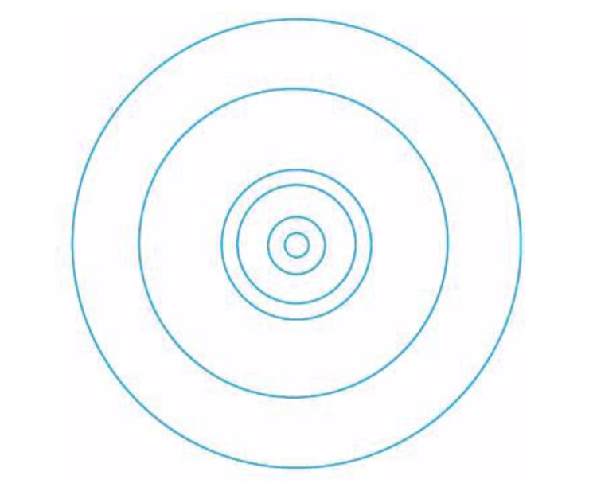

### 目录

### 前言

该书的结构分为三部分：

+ 第一部分是对科学史和科学哲学中的某些基础命题的介绍，包括世界观的概念、科学方法和推理、真理、证据、经验事实和哲学性/概念性事实之间的对比、可证伪性以及工具主义和现实主义。
+ 第二部分探讨从亚里士多德世界观到牛顿世界观的转变，并关注在这一变化过程中某些哲学性/概念性命题所扮演的角色。
+ 第三部分介绍新近的科学发现和发展，重点关注的是相对论、量子力学和演化论。

 

### 第一部分 基础命题

#### 第一章 世界观

+ 定义：“世界观”指的是一个**观点体系**，其中不同观点如同**拼图**的一块块拼板一样相互联结。是一个不同观点相互交织、相互关联、相互联结的体系。

+ **该书中所说的“世界观”是一个更广义的概念，它并非特指某个人的观点体系，而是指以代表人物的内在精神为核心，以西方主流世界的共识为基础，由一群人共同持有的观点拼合在一起，形成的一个环环相扣、具有一致性和稳定性的观点体系。**

 

##### **亚里士多德世界观**

其并不特指亚里士多德本人的观点集合，而是指其后，西方主流文化共享的一系列观点，而这一系列观点很大程度上以亚里士多德的观点为基础。

下面是亚里士多德本人的一小部分观点：

+ 地球位于宇宙中心。
+ 地球是静止的。（不围绕任何其他天体运行 -- 无公转，也不围绕自身轴线旋转 -- 无自转）
+ 月亮、其他行星和太阳围绕地球运行。（约每24小时传一圈）
+ 月下区（地球和月球之间，包括地球）内，有四种基本元素，**土、水、气、火**。
+ 月上区（月球以外，包括月亮、太阳、行星和恒星）内的物体由第五种元素**“以太”**组成。
+ 每种基本元素都有一个基本性质，其决定了元素的表现特征。
+ 每种基本元素的基本性质通过这一元素的运动趋势表现出来。
+ 土元素有一种向宇宙中心（地球中心）运动的天然趋势。
+ 水元素也有向宇宙中心运动的天然趋势，但比土元素弱。
+ 气元素天然地向土和水以上、火以下区域运动。
+ 火元素有一种向远离宇宙中心的方向运动的天然趋势。
+ 以太元素组成了行星和恒星等物体，有一种进行完美的圆周运动的天然趋势。
+ 月下区中，运动的物体会自然趋于静止。导致静止的原因有两个：（第二个更常见）
  + 组成该物体的元素到达了其在宇宙中的自然位置；
  + 组成该物体的元素被其他东西阻止（比如地球表面）；

图1: 亚里士多德世界观示意图

这些观点并非随机，而是相互关联、环环相扣的观点体系，类似于拼图：

图2: 亚里士多德观点拼图

观点拼图有几个特点：

+ 观点间相互拼合，体现出逻辑关系。比如“土元素天然地向宇宙中心运动”和“地球是宇宙中心”相互关联。
+ 核心拼板和外围拼板，对应着核心观点和外围观点。外围拼板容易被替换掉，而核心拼板因为关联很多其他拼板，动一发系全身。类似地外围观点容易改变，而核心观点如果不成立会导致整个观点体系崩塌。比如“地球是静止的，并且在宇宙中心”是一个核心观点。如果改成“太阳是宇宙中心”，则其他观点都要随之调整。

 

##### **牛顿世界观**

这一观点体系以艾萨克·牛顿及其同时代人的著作为基础，并在其后多年中得到了相当可观的丰富和发展。

其所包含的一部分观点：

+ 地球围绕自身轴线旋转，大约每24小时旋转一周。
+ 地球和行星沿椭圆形轨道围绕太阳运转。
+ 宇宙中基本元素的种类略多于100种。
+ 物体表现出来的运动特征主要受外力影响（如重力）。
+ 组成行星和恒星这样物体的基本元素和组成地球上物体的基本元素相同。
+ 描述地球上物体运动规律同样适用于其他行星和恒星上的物体。

 

##### **证据**

+ 我们很难拿出直接证据（直观感受）来证明我们所持有的某些观点，比如“地球围绕太阳旋转”；
+ 对于大多数（几乎所有）观点来说，我们之所以秉持这些观点，主要是因为它们可以跟我们的世界观拼合在一起；

 

##### **常识**

+ 从我们的日常生活经验中，牛顿世界观其实是反直觉的，或者说是反常识的，比如“没有东西会一直保持运动”、“看起来太阳是围绕地球转动的”。
+ 牛顿世界观的部分观点，并不是我们通过常识或者一般经验就能得到的，我们接受它是因为从小就被灌输了这些观点。
+ 同样地，现代科学如量子力学、相对论都是反直觉、反常识的，不能通过一般经验来获取到。

 

#### 第二章 真理

一个似乎传播广泛的观点是，“事实的累积是一个相对直接的过程，而科学的功能（在很大程度上也可以说是科学的主要目的），是提供正确的理论来解释这些事实”。这两点基本上是对事实、真理，以及两者与科学之间关系的错误理解。相对于该观点而言，事实、真理和科学三者之间的关系更加复杂和有争议性。

 

##### **基本命题**

什么是真理？在字典里，真理的定义是“被证实的或者不存在争议的事实”，事实的定义是“被认为是真的事物”，这种循环定义对区分这些概念没有什么建设性作用。这里没有给出确定的答复，也侧面体现了某些复杂性。

虽然人们对真理这个命题缺乏主动思考，但是在指导自身行为上每时每刻都将“真理”当作是理所当然的（无意识的），随之带来的后果也不能说是无足轻重的。

 

##### **澄清问题**

核心问题：什么是真理？

对等问题：真/假的叙述（或观点）有什么共同点使它们成为真/假的？

区别问题：我们通过什么方式知道哪些叙述和观点是真/假的？这属于认识论范畴，和我们的核心问题有区别。

两大类关于真理的理论：

+ 真理符合论：通过判断观点是否与独立、客观的现实相符合，来决定这个观点为真还是为假。
+ 真理融贯论：通过判断观点是否能融入一个整体的观点集合，来决定这个观点为真还是为假。

 

##### **真理符合论**

+ 知觉表征论：
  + 核心观点：感官（如视觉、听觉、味觉等）为我们提供了外部世界各种物体的表征。
  + 重要推论：意味着我们每个人从某种意义上来说与这个世界都是隔绝的，更具体地说，我们没有办法确定自身感官所提供的表征是否准确。
  + 推导过程：要评估表征的准确性，需要把表征（比如某棵树的照片）和表征所代表的事物本身进行对比，但是我们无法跳出意识经验直接得到事物本身的信息，比如我们拿照片直接和事物本体做对比的时候，仍然是通过视觉表征（用眼睛看到的树）来和照片做对比，并没有用事物本身信息做对比。
  + 关键点：这里的关键是意识经验是基于人的大脑物质，即表征信息受大脑影响，无法作为外部客观信息存在。（参考缸中之脑思想实验，《理性，真理与历史》，Hilary Putnam， 1981）

+ 知觉表征论并没有否定真理符合论，而是从认识论角度说明了我们的认知边界，让真理符合论丧失了吸引力。
+ 笛卡尔的“我思故我在”：笛卡尔想先找到某些确定的观点，在以此为基础推演出其他观点，从而构建出一个具有完全确定的基础的知识结构。但他只能确定“在思考时，存在一个思维主体”这样一个基础观点，这个基础太小，而无法在其上进行知识构建。

 

##### **真理融贯论**

+ 融贯论根据观点集合所属不同，分为两大类：
  + 个人主义融贯论：以是否融入个人的观点集合作为判断的依据；
  + 以科学为基础的融贯论：以是否融入西方科学家的群体观念集合作为判断依据，也称团体融贯论；

+ 个人融贯论的现实困境：个人的观点缺乏普遍性，都是相对于个体而言，是一种极端的相对主义。
+ 团体融贯论的现实困境：
  + 没有考虑一个群体可能秉持错误观点的可能；
  + 没有办法明确哪些人可以算作群体的一分子；
  + 对任何一个群体而言，都不存在由一个整个群体共同秉持的、具有一致性的观点；

 

<!--more-->

#### 第三章 经验事实和哲学性/概念性事实

##### **初步观察**

+ 两类事实：
  + 经验事实：以直接的、经过观察得来的证据为基础的事实。比如我们看到“书桌上有一支铅笔”。
  + 哲学性/概念性事实：以我们对自己生活的世界的哲学性/概念性认识为基础的事实。比如，我们把一支铅笔放到抽屉里，关上抽屉，虽然我们无法直接看到铅笔，但是依照“组成这个世界的大部分物体都是稳定的，即使在没有观察到，也仍然保持存在”这样的认知，我们判断“抽屉里有一支铅笔”是个事实。

+ 在科学史中，在对待各个理论和这些理论要尊重的事实时，某些事实被人们认为是比较明确的经验事实，但其实更多的是依赖于人们对自己所处世界的一些哲学性/概念性判断。
+ 在经验事实和哲学性/概念性事实间，其实很难有一个很明确的界限。大多数观点的基础既包括经验性的、通过观察得来的证据，也包括对我们所处世界更概括性的认识。比如亚里士多德世界观认为行星围绕太阳沿圆周轨道做匀速运动，虽然其在观点集合中与其他观点（“如行星由以太构成，以太元素有一种完美的圆周运动的天然趋势”）有紧密联系，可以认为是哲学性/概念性事实，但也有人们早期天文观察得到的证据支持，属于经验事实。

 

##### **关于术语的一点说明**

书中对于阶段性正确的观点（比如亚里士多德世界观）也采用“事实”这个称呼，一方面是因为没有更合适的词语；另一方面也想提醒读者，从相关的世界观来看，这些被证明不正确的内容并不仅仅是简单的假设、观点或意见，也是有一些经验事实和哲学性/概念性事实支撑的（即使是阶段性和带有局限性的）。

 

##### **结语**

+ 经验事实和哲学性/概念性事实并不好区分。虽然日常生活中我们一般不会特别区分，但如果要判断的话，很多观点需要仔细思考，有时还要克服极大困难，才能分辨出来它们是以哪类事实作为基础。
+ 不要简单的认为哲学性/概念性事实就是错误的、幼稚的。有一些虽然被证明是错误的，但在当时这些观点能和整体观点体系拼合在一起，并不幼稚（比如“正圆事实”和“匀速运动事实”）；而有些可以经得住时间考验，证明至少部分是正确的。另外，也不要错误地认为在现代科学的时代，就摆脱了相信哲学性/概念性事实的陷阱（比如量子力学和相对论）。

 

#### 第四章 证实与不证实证据和推理

##### **证实推理**

+ 定义描述：当我们以某个特定理论为基础得出某些预言，而这些预言后来被证明是正确的，这些预言至少提供了某些证据，来证明这个特定理论的正确性。
+ 简化描述：如果T，那么得出O & O证明是正确的 => 所以T非常可能是正确的

+ 举例：爱因斯坦的广义相对论推理出引力效应会将光线弯曲（T => O），而1919年5月的日全食提供了很好的观测机会，最终观测证实了该预言（O是正确的）。

 

##### **不证实推理**

+ 定义描述：当我们根据某个特定理论得出某些预言，而这些预言最终证明是错误的，我们就会以此作为该理论不正确的证据。
+ 简化描述：如果T，那么得出O & O证明是错误的 => T是不正确的

 

##### **归纳推理&演绎推理**

+ 归纳推理：
  + 在一个好的归纳推理过程中，即使所有前提条件都是真的，所得出的结论也有可能是错的；
  + 因为以下两点存在，大多数科学理论都无法保证永远是正确的；
    + 证实推理模式是广泛用于支撑科学理论的推理模式；
    + 证实推理模式是一种归纳推理；
  + 实际用于证实科学理论的证据通常非常复杂，所以不仅是因为证实推理模式的归纳推理性质让它无法严格证明某个理论的正确性，而且这一推理模式中的实际证据和推理过程往往相互交织、非常复杂，从而让证据不是这么直接明确。
    + 举例：1919年5月的实际观测中，要对恒星光线上出现弯折点的位置进行计算预测，为了将计算量控制在可操作范围，对整个模型做了大量简化，比如假设太阳是一个正球体，没有自转，也不受任何外力影响（比如地球、月球及其他行星的引力作用），从事实上来看，这些假设本身是错误的。
    + 结论：实际用于证实科学理论的证据所涉及的因素往往比人们通常所认识的要复杂得多。

+ 演绎推理：
  + 在一个好的演绎推理过程中，如果所有前提条件都是真的，那么其所得出的结论一定就是真的；
  + 不证实推理是一种演绎推理；
  + 不证实推理实际应用的局限性：
    + 相对于简化描述的准确描述：如果T，且A1，A2，A3，... ，An，那么得出O，其中Ai指辅助假设。这个描述说明，除了主体理论T满足外，所有辅助假设Ai都正确的情况下，才能得出O这个结论。
    + 辅助假设很关键，往往是隐含条件。当O被验证是错误的时候，不一定说明是T不成立，也可能是辅助假设中的几个不正确，这往往不是很直观。
  + 基于以上，使用不证实推理的客观做法：
    + 在面对能证明一个理论不正确的证据时，可以坚持这一理论，同时摒弃一个或几个辅助假设。
    + 对于什么情况下该放弃理论，什么情况下该摒弃一个或几个辅助假设，没有标准答案。

 

##### **结语**

本章要点：科学领域里（在日常生活中同样）的证据和推理都出人意料地复杂。

 

#### 第五章 奎因-迪昂论点和对科学方法的意义

本章关于科学方法的讨论将完成两个任务：

+ 从历史的角度，让我们看到某些关于进行科学研究的适当方法的观点。
+ 让我们有机会看到围绕在科学方法论周围的某些命题。

 

##### **奎因-迪昂论点**

三个关键点：

+ 我们的观点并不是单独而是作为整体来接受验证的（接受经验的裁判）。
  + 以不证实推理为例，进行实验验证时，并不是单独地验证主要理论假设，也包括相关的辅助假设。当证据不成立时，可以选择摒弃主要理论，也可以摒弃一个或多个辅助假设。
  + 面对验证的观点的范围是多大则没有一个标准答案。奎因激进地认为应该包括整个观点网络，包括所有核心观点及外围观点。迪昂则倾向于其中的一部分观点集合，并不是针对整个。

+ 通常不存在可以用来判断两个竞争理论中哪一个正确的“关键性实验”。
  + “关键实验”：
    + 定义：当面对两个相互竞争的理论时，有可能设计出一个实验，关于这个实验的结果，两个理论的预言是相互矛盾的。理想的情况，由于两个理论预言相互矛盾，通过实验至少可以证明其中一个理论不成立。
    + 考虑不证实推理的情况，当预言不成功时，我们可以选择摒弃某些辅助假设而不是主要理论，这样就说明无法通过“关键实验”来证明某个理论不成立。
  + 奎因-迪昂怀疑论：
    + 力度较弱版本：相互竞争的理论通常都分别可以与所谓的关键实验结论相吻合。科学史上有无数实例支持这个表述。
    + 力度更强版本：任何实验结果，无论是什么，都可以与任一理论相吻合。

+ 非充分决定性的概念，也就是现有可用的数据，通常不足以让人们找到唯一正确的理论。
  + 理论的不充分确定性：
    + 根据证实推理的概念，通过现有数据和所有实验结论，是无法确定理论的绝对正确性的；
    + 根据不证实推理的概念，通过现有数据和所有实验结论，也无法明确证明任何相互竞争的理论是不正确的；
    + 有时有些数据可以支持两个或多个相互竞争的理论；
  + 对理论的不充分确定性有很广泛的解读：比如温和的理解，理论都是不充分确定的；更激进的理解，科学理论和科学知识都是“社会构建”的，反映的是社会条件，而不是客观的物质世界，不存在唯一得到确认且客观正确的科学理论。

> 注：威拉德·奎因（1908-2000）是20世纪最有影响力的哲学家之一，毕生研究兴趣都在与科学哲学相关的命题上；皮埃尔·迪昂（1861-1916）是一位威望颇高的法国哲学家，研究范围包括关于对科学假设和理论进行验证的问题。

 几个关于适当的科学研究方法的主张：

+ 对“科学方法”的传统认知：
  + 收集相关事实 => 收集解释这些事实的假设 => 验证假设（利用证实推理或不证实推理）；
  + 根据奎因-迪昂论点的几个命题，我们有理由怀疑，以上方法是否有这么直接明确；
+ 亚里士多德的“公理化方法”：
  + 在亚里士多德世界观中，科学通常是以提供确定的知识为目标的，这意味着科学知识必须为真，且必定为真。
  + “公理化方法”使用基于必定为真的基本原则的演绎推理模式。
    + 认为给出一个科学解释从本质上来说其实是给出某种符合逻辑的论证过程（以逻辑作为工具）；
    + 认为一个合理的科学解释都应包括实证，所谓实证就是一个三段论链条，其中最后一个三段论的结论就是要解释的内容。
    + 认为科学知识必须是确定的知识，即三段论的结论必须为真。（与现代科学的概念不同，现在，科学的目的通常被认为是提供可能正确的理论，我们不期望能保证理论是正确的）
  + “第一原则”：
    + 为了保证“公理化方法“中的结论为真，必须保证前提为真；
    + 而三段论链条中的起始点，这些本身为真的前提，通常被称为”第一原则“；
    + 第一原则被当作是关于这个世界基本的，必定为真的事实，也就是公理；（比如欧几里得几何中的五大公设）
    + 第一原则的困境：通过之前的讨论，几乎不可能存在关于基本事实是由哪些内容组成的任何共识，至于那些必定为真的事实是由哪些内容组成的，更不可能有共识。

+ 笛卡尔的“公理化方法”：
  + 与亚里士多德公理化方法类似，也是希望利用演绎推理从必定为真的起始点得到确定的知识；
  + 如之前所说，他只能确定“在思考时，存在一个思维主体”这样一个基础观点，这个基础太小，无法在其上进行知识构建。
+ 波普的“证伪主义”：
  + 认为科学强调的应该是尝试对理由进行反驳，而不是证实理论；
  + 认为一个理论所冒的风险越大（可证伪性越大），它的科学性就越强；比如爱因斯坦的相对论理论与弗洛伊德的精神分析法，前者更容易被证伪，所以科学性更强；
  + “证伪主义”的困境：
    + 证伪本身的难度：几乎没有不证实推理的例子像它们本身看起来这么简单的（奎因-迪昂论点）；
    + 对于与预言不吻合的理论，也可以选择摒弃辅助假设，而不是摒弃掉主要理论，而且往往这种选择更为合理。这进一步降低了证伪的意义。
    + 综上，虽然不证实证据在科学中扮演着重要角色，但是围绕这类证据的命题却非常复杂，从而使证伪不太可能成为科学的核心特点。

+ “假设演绎法”：
  + 上面提到的传统的科学方法；
  + 基本思想是从一个或一组假设（或者更宽泛地说，一个理论）可以演绎出一系列可经观察得来的结果，然后去验证这些结果是否可以观察地到。如果可以观察地到，基于证实推理，就被认为是支持了假设；如果没有观察到预言的结果，基于不证实推理，会被当成证明假设不成立的证据。
  + “假设演绎法”的困境：假设演绎法，归根结底就是证实和不证实推理，虽然在科学中扮演重要角色，但根据之前的所有讨论，它的基本观点是对科学过于简单化的描述，无法称为严格的“科学方法”。

 

#### 第六章 哲学插曲：归纳的问题和困惑

##### **休谟的归纳问题**

+ 当我们进行推理时，经常（几乎所有）会涉及到隐藏的前提。
  + 举例说明：假设我们约定这个星期天到市区一起吃饭，需要用到你的车，但你不知道去餐厅的路线。又假设我告诉你有一辆公交车从你家开到餐厅，因此你可以坐公交车赴约。这里隐藏的一个前提是，公交车在星期天也正常运营。
+ 典型的归纳推理：（往往与未来相关）
  + 命题模式：在我们过去的经验中，【某某】总是或有规律地发生，所以未来，【某某】非常可能继续发生。
  + 举例说明：在我们的经验中，太阳总是从东方升起，所以未来，太阳非常可能继续从东方升起。
  + 这类命题包含了一个关键前提：未来会继续像过去一样。
+ 休谟的归纳问题：
  + 针对关于未来的归纳推理，我么为什么会认为“未来会继续像过去一样”？
    + 主要原因，可能是今天与昨天非常相像（太阳从东方升起，白天过后是黑夜），昨天与前天非常相像，以此类推。
    + 最佳答案：在我们过去的经验中，未来像过去一样，所以未来很有可能继续像过去一样。
  + 针对上面的最佳答案（本身也是一个典型的归纳推理），所隐含的前提是“未来会继续像过去一样”，这就进入了循环论证。
  + **休谟的归纳问题否认了“我们可以从逻辑上为我们未来的推理提供依据”的可能。**

 

##### **亨普尔的乌鸦悖论**

+ 逻辑基础：原命题与它的逆否命题等价。
  + 举例：以下两个观点互为逆否命题，且它们是等价的
    + 观点A：“所有类星体都在距离地球十分遥远的地方”；
    + 观点B：“所有距离地球不遥远的物体都不是类星体”；

+ 乌鸦悖论：如果观点A（原命题）和观点B（逆否命题）等价，那对于任何支撑观点B的证据也应该支撑观点A，如果支持观点B的证据成千上万，那每一个都可以加强观点A的正确性，这让人产生了荒谬的感觉。
  + 举例：比如"我手头上的书不是类星体"支持了上面的观点B，那它也应该成为观点A成立的证据。

 

##### **古德曼的蓝绿问题**

+ 问题假设：定义一种绿宝石叫“绿蓝”，它在未来日期A前首次发现时是绿色的，而它在日期A后首次发现时是蓝色的。而到目前为止，我们发现的“绿蓝”宝石都是绿色的。而在日期A前，该假设对以下两个命题的归纳支撑是完全相同的。
  + 未来，所有被观察到的绿宝石都将为绿色；（可预期判断）
  + 未来，所有被观察到的绿宝石都将为“绿蓝”；（不可预期判断）

+ “可预期判断”和“不可预期判断”间的差异是什么？

> 注：大卫·休谟（1711-1776），苏格兰不可知论哲学家、经济学家、历史学家。亨普尔（1905-1997）德裔美籍科学哲学家，逻辑经验主义后期的主要代表。尼尔森·古德曼（1906-1998），美国科学哲学家，语言哲学家。

 

#### 第七章 可证伪性

##### **基本概念**

+ 可证伪性是对待理论的一种态度；
+ 对于某个理论，当你觉得存在一种“这个理论也许不正确”的可能性时，这种态度就是可证伪性；
+ 可证伪性是一个比乍看起来更微妙、更复杂的命题；

 

##### **复杂因素**

+ 参考“证伪主义”的困境，对于与预言不吻合的理论，可以优先选择摒弃辅助假设，而不是摒弃掉主要理论，而且往往这种选择更为合理。那么当证据数量达到多少时，才让人可以放弃这个理论，并没有明确的答案；
+ 而什么样的证据可以算作是有意义的证据，也是一个关键的问题。在几乎所有现实生活的实例中，人们的主要分歧点并不是一方或另一方在面对足够多证据时是否愿意放弃自己的理论，而是什么样的证据可以算作是最有意义，最重要的证据。（比如有人愿意相信经文中的内容，而有人相信以实际经验为基础的证据）

 

#### 第八章 工具主义和现实主义

##### **预言和解释**

我们希望从科学理论中得到什么？

+ 对未来的预言
+ 对过去的解释
+ 之外的一些（简明、优雅和美等）

我们是否需要理论反映现实事物的情况？

+ 对工具主义者来说，只需要理论可以给出预言和解释，不需要反映和模拟现实世界；
+ 对现实主义者来说，以上两者都需要；

对待理论的态度：

+ 秉持工具主义，或者现实主义；
+ 对某理论的不同部分采用不同态度（17世纪，很多人对托勒密体系中地球为宇宙中心持现实主义态度，而对周转圆持工具主义态度）
+ 对不同理论采用不同态度（比如，对以太阳为中心的太阳系模型持现实主义态度，对量子力学持工具主义态度）
+ 分别用工具主义态度和现实主义态度来同时接受两个相互竞争的理论（比如，16世纪末期，有些人对托勒密体系持现实主义态度，而因为哥白尼理论更易于应用，所以对哥白尼体系持工具主义态度）

 

 

### 第二部分 从亚里士多德世界观到牛顿世界观的转变

#### 第九章 亚里士多德世界观中的宇宙结构

##### **宇宙的物理结构**

关于亚里士多德世界观：

+ 约公元前300年~公元1600年间，亚里士多德世界观在西方世界占主导地位；
+ 地心说最初的原因，是以经验为基础的推理结果；（自然朴素的观点，非唯心说）
+ 地球是球形的，而不是平的；（在亚里士多德时代之前，人们就已经知道）
+ 距离地球最近的天体是月亮，以月球为界分为月上区（月球之外）和月下区（月亮和地球之间）；
+ 月球之外行星和太阳的顺序：水星、金星、太阳、火星、木星、土星及所谓的恒星球面；
+ 太阳、恒星、行星由类似的物质（以太）构成，而且与地球上的任何物质都不相同；
+ 宇宙边缘为恒星球面，以自身轴线为中心转动，转一圈大约24小时，所有恒星与地球距离相等，都镶嵌在恒星球面上，球面转动时带动其上的恒星一起转动。
+ 按照现在的标准，其所认为的宇宙大小是一个相对较小的概念；

 

##### **关于宇宙的概念性观点**

亚里士多德世界观中最重要的两个概念：

+ 目的论
  + 目的论解释vs机械论解释
    + 目的论解释：从为实现一个目标、目的或功能的角度给出的解释。比如为什么心脏会跳动？-- 为了输送血液；为什么剑龙背上有巨大的骨板？-- 为了调节体温。
    + 机械论解释：不涉及目标、目的或功能的解释。比如为什么苹果树会结出苹果？-- 在苹果树演化过程中，这种可结出苹果的苹果树祖先存活了下来，而且比那些不结苹果的苹果树更容易繁殖。因此，在苹果树这个物种的总数中，这种结出苹果的苹果树所占比例特别高。
    + 亚里士多德世界观中，目的论解释被认为是合理的科学解释。而在现代科学中，机械论解释占主导地位；
  + 亚里士多德世界观中，每个基本元素都有它的天然目标，就是要到达其在宇宙中的天然位置，比如土元素的天然趋势是要到宇宙中心。
+ 本质论
  + 亚里士多德世界观中，天然存在的物体都认为具有本质属性，而物体的本质属性就是目的论的属性。换句话说，物体所具有的本质属性决定了物体会有它的本质属性所展现出来的行为模式。
  + 比如橡树果的天然目标是长成一棵成熟的橡树，而这是由橡树果的本质属性决定的，而这个本质属性来自于组成橡树果的物质和这种物质的组成方式。

总结：所有自然物体都有本质属性；本质属性是目的论的属性；本质属性决定了物体会有它们所展现出来的行为模式。简言之，宇宙被认为是一个目的论的、本质论的宇宙。

 

#### 第十章 托勒密《至大论》序言：地球是球形的、静止的，并且位于宇宙中心

本章的主要目标之一，是说明尽管亚里士多德世界观中的观点与我们的观点非常不同，但仍然得到了强有力的支撑。

+ 前人的观点并不幼稚或天真；
+ 支持亚里士多德世界观的论据是很完整的，虽然最终证明是错误的，但是其中的错误非常不容易察觉；
+ 造成论据中错误的原因远不是那么显而易见，这些论据的瑕疵是经过科学史上很多著名人物（比如伽利略、笛卡尔、牛顿）共同努力才找到的；

这里要讨论的论据来自托勒密《至大论》序言，其中托勒密提出了大量关于宇宙结构和运转方式的论据。

> 注：《至大论》在公元150年左右发表，是一本非常专业的科技著作，包括大量的文字和示意图，是一部内容翔实艰深的著作。

 

##### **地球为球形**

从古希腊时代开始，受过教育的人中几乎没有人认为地球是平的。而在《至大论》序言中针对地球为球形提出很多论据：

1. 地球上不同的观察者看到的太阳、月亮升落的时间并不相同，而且住在东边的人看到的早，西边的人看到的晚；

2. 同一时刻的月食现象，不同观察者记录的时间并不相同；

3. 越靠近北极，南方天空的星星越少，北方天空的星星开始出现；

4. 向高山或地势高的地方航行时，无论何时何方向何前进角度，目的地都一点点增加，像是从海底升起来的；

 

##### **地球是静止的**

早在古希腊时期，人们就思考过地球围绕太阳运动或以自身轴线为中心旋转的可能性。《至大论》明确考虑了后者，并给出了多个论据。

+ 常识论据：
  + 假设地球在运动，考虑自转一周的情况。地球周长约25000英里（古希腊的人们已经有大概认识），如果每天自转一周，在赤道地区，地球表面运动速度将超过1000英里/小时，参考坐车对运动的感受，这么高速的运动人们丝毫没有观察到这样的运动效果，这样就给地球在运动提供了不证实证据；
  + 公转的情况类似，速度更快，但是人们没有观察到高速运动的现象；
  + 考虑地球上的巨大物体必须有很大的外力作用下，才能保持运动状态，如果地球是运动的，那么这么巨大的外力谁能一直提供呢？
+ 基于运动物体的论据：
  + 现实情形：将一个物体竖直向空中抛出，物体会垂直于地面向上运动，然后垂直落到地球表面；
  + 等价问题：我们在运动时，向上竖直抛出一个物体，这个物体会落在我们身后，还是会沿弧线运动，然后重新落在我们手中，或落到我们手边的位置？
  + 托勒密针对以上问题根据直觉经验选择落在身后，这就成为针对“地球在运动”的不证实推理的论据。
+ 基于恒星视差的论据：
  + 《至大论》中指出恒星的角距离总是保持不变，这个事实支持了“地球是静止的”这一观点；
  + 视差是由于观察者的运动造成的物体位置的明显偏移，因为在很长的历史时期中（直到1838年）在地球上都没有观察到恒星视差，所以托勒密确定地球没有在运动；
  + 这里的关键辅助假设和距离有关，恒星和地球的距离越大，视差越小。而恰恰这个距离超过了托勒密时期人们的想象，因为过于巨大，导致视差很难被直接观察到。

 

##### **地球在宇宙中心**

托勒密引用了多个亚里士多德在《论天》中的论据：

+ 如果地球是球形的，且是静止的，通过观察月球、太阳、恒星、行星都围绕地球转动，作为天体的共同中心，认为地球是宇宙中心是很自然的；
+ 根据亚里士多德世界观，由于地球本身似乎主要由土元素组成，而土元素有向宇宙中心运动的天然趋势，推导出地球本身位于宇宙中心；
+ “重的物体有一种向宇宙中心运动的天然趋势”是另一个论据；

 

#### 第十一章 天文学数据：经验事实

##### **恒星运动**

+ 恒星运动似乎以一种规律的模式，将近每24小时重复一次；
+ 恒星与其他恒星的相对位置都保持不变；

 

##### **太阳的运动**

+ 东升西落，将近24小时重复一次；
+ 太阳在东方升起的位置在一年之中存在南北移动的现象；
+ 以其他恒星作为参照点，太阳每天相对于它们的位置都会向东偏移；

 

##### **月球的运动**

+ 东升西落，但并不按24小时的周期运动；每天晚上，月球升起的时间都比前一天晚上推迟一些；
+ 稍多于29天月球相位循环一次；
+ 和太阳一样，月球相对于其他恒星的位置每天都会向东偏移，但偏移速度比太阳快，大约经过27天就回到相对于其他恒星的原来的位置；

 

##### **行星的运动**

+ 考虑到之前的科技水平，对天体观察无法借助先进的观察工具。在裸眼观察的条件下，恒星和行星看起来很像。
+ 前人通过很多夜晚的观察，发现有5个亮点的运动模式与其他亮点不同（金木水火土，五大行星）；
+ 五大行星与月球和太阳类似，也有向东偏移的现象，同时存在“逆行运动”的现象，且逆行间隔都不一样；（比如木星、土星大约一年有一次逆行，火星大约每两年有一次，金星大约每一年半一次，水星大约一年三次）
+ 与恒星不同的是，行星的亮度变化很大；
+ 几个重要的经验事实：
  + 水星和金星的位置从来不会离太阳很远；
  + 火星、木星和土星在进行“逆行运动”时达到亮度最大值；

 

#### 第十二章 天文学数据：哲学性/概念性事实

本章探讨的内容有关两个重要事实：正圆事实和匀速运动事实。

 

##### **天体运动的一个科学问题**

+ 惯性定律vs17世纪前运动定律
  + 惯性定律：任何物体在不受任何外力作用的情况下，总保持匀速直线运动状态或者静止状态，直到有外力迫使其改变这种状态；
  + 17世纪前运动定律：正在运动的物体都会停下来，除非有外界因素使其保持运动；
  + 日常生活经验让我们更认可后者；

+ 是什么外界因素让天体一直保持运动？
  + 考虑这个外界因素本身就是在运动状态，（比如用手推着钢笔在桌面上滚动，钢笔运动的因素是手，而手本身也处于运动状态，它也需要一个外界因素来保持运动）对于天体而言，无法解释这种情况；
  + 考虑这个外界因素本身不运动，（比如有人站在远处叫你，你向他走去）亚里士多德认为天空是个几乎不变的完美的地方，唯一绝对的完美将是“神明”的完美，天体一定是渴望模仿神明的完美而运动。而模仿神明的完美，最好的方法是进行完美的运动，而**最完美的一种运动就是沿正圆轨道，保持不变速度进行运动**。

+ 三点要注意的方面：
  + 上面所说的天体对模仿神明的渴望，是一种无意识的渴望，或者说是一种自然的、内在的、目标导向的趋势；
  + 天体的渴望是由于以太元素带来的，以太的基本性质就是沿正圆轨道，以统一不变速度运动；
  + 亚里士多德认为“神明”是某种学术完美，与宗教无关。而在其后的几个世纪里，各宗教的哲学家和神学家把宗教与亚里士多德的观点进行了混合，这个“神明”逐渐转变为宗教里的神。

 

##### **这可以用来解释运动的地球吗**

考虑土元素如果也具有类似以太元素的性质，沿圆形轨道进行运动的天然趋势，就会和其他观点拼图出现矛盾，比如“自然情况下，石块会向下掉落”，“土元素是最终的元素”等，所以这个观点无法成立。

 

#### 第十三章 托勒密体系

##### **背景知识**

托勒密理论是历史上第一个可以对相关天文学事件进行准确预言的理论，而且在其之前或之后1400年里，没有其他关于宇宙结果的理论在进行解释和预言方面能达到与托勒密体系相接近的水平。

+ 该体系明确尊重正圆事实；
+ 它所采用的的核心观点（地心说）和采用的大多数数学工具都是几个世纪前就存在的；
+ 经验事实方面的表现非常出色，可以准确地进行预言和解释；
+ 它实际上并不是一个体系，针对不同的天体，托勒密使用的方法各有不同，并没有对整个宇宙进行统一的、体系化的介绍；

 

##### **托勒密火星研究的简要介绍**

图3: 托勒密体系对火星的研究结果

周转圆-均轮系统：

+ 火星沿以A为圆心的正圆轨道运转，该轨道称为周转圆；
+ 周转圆以点B为圆心的正圆轨道运转，该轨道称为偏心圆/均轮，如果点B没有位于地球中心，则称为偏心圆，位于地球中心，则称为均轮；
+ 等距点是与火星所在的周转圆运转速度相关的一个点；

 

##### **这些研究内容背后的基本原理**

+ 周转圆-均轮系统非常灵活，包括周转圆和均轮/偏心圆的半径、沿着周转圆和均轮/偏心圆运动的速度及方向，都可以做调整，这样能产生大量不同的运动；
+ 为了增加灵活性，可以为整个系统添加次要周转圆（均轮+次要周转圆可以构成准确描述火星的一种方式，另一种是偏心圆+周转圆的方式）；
+ 为了尊重匀速运动事实，托勒密体系必须引入一个点，而周转圆圆心相对于这个点做匀速运动，这个点被称为等距点；

图4: 托勒密体系对火星的研究结果2

 

#### 第十四章 哥白尼体系

##### **背景信息**

+ 哥白尼（1473~1543）体系是一个日心说体系，认为太阳是宇宙中心；
+ 其和托勒密体系非常相近，也运用了周转圆、均轮和偏心圆，只是不需要等距点，最明显的区别就是太阳和地球的位置不同；
+ 其和托勒密体系面对相同的经验事实，只是数据不完全一样，这两个体系间哲学性和概念性事实也是一致的，都尊重正圆事实和匀速运动事实；
+ 很多人传统的印象是哥白尼体系远远简化于托勒密体系，其实这是一个错误的认识，哥白尼体系很容易就变得像托勒密体系一样复杂，乃至于其在预言和解释方面也没有好于托勒密体系，甚至更糟。

 

##### **哥白尼体系概述**

+ 火星围绕以点A为圆心的周转圆运转；
+ 点A围绕以点B为圆心的均轮/偏心圆运转；
+ 点B也在运动，但是相对点C的位置保持不变；
+ 点C是地球沿偏心圆运转时的偏心圆圆心；
+ 点C沿点D为圆心的圆形轨道运转；
+ 最后点D围绕太阳沿圆形轨道运转；

图5: 哥白尼体系对火星的研究结果

哥白尼体系描述其他外行星时，包括土星和木星，与图5类似，描述地球和月球时会简单一些，描述内行星包括金星、水星的运动会比图5更复杂。

 

##### **托勒密体系与哥白尼体系的对比**

+ 两者在解释经验数据的准确性方面类似，而在正圆轨道和匀速运动方面，哥白尼体系稍好一些（不需要等距点）；
+ 两者复杂性方面相当；
+ 对逆行运动的解释方面：托勒密体系利用周转圆来解释，而哥白尼体系对于火星、土星和木星逆行运动与这些行星最大亮度之间的相互关系（逆行时行星与地球最近），以及对于金星和水星总是出现在距离太阳不远处的事实，都给出了更自然的解释；
+ 哪个体系与当时最先进的科学更为一致？答案很明显，托勒密体系优于哥白尼体系。

 

##### **是什么因素促动了哥白尼**

哥白尼体系很明显与所有支持“地球是静止的”观点的证据相矛盾，当时，哥白尼没有得到任何新的经验证据来支持“地球在运动”的观点。到底是什么因素促使哥白尼花费近毕生的时间来发展一个看起来似乎不可能正确的理论？

+ 柏拉图和新柏拉图主义
  + 柏拉图的观点：我们的知识是关于一个或多个客观存在，但又没有实体的永恒形式。这些永恒的形式不仅涉及数学真理，还涉及“更高”的形式，比如真理和美的形式，最高层次是至善形式（洞穴寓言）；
  + 新柏拉图主义，将柏拉图哲学与基督教精神相融合，柏拉图的至善形式与基督教的“上帝”画上等号，而太阳是柏拉图对至善的暗喻，也就成了上帝的代表；
  + 有些学者认为哥白尼深受新柏拉图主义影响，如果真是这样，那么哥白尼可能会认为太阳是“上帝”在宇宙中的实体代表，其最合适的位置将是宇宙的中心，这样就能说明为什么哥白尼会秉持以太阳为中心的宇宙观；

+ 哥白尼深信匀速运动事实，而无法接受等距点这样的概念。这很好地说明了哥白尼是如何在哲学性/概念性事实而不是经验事实的促动下发展其理论的；
+ 在科学史上，哲学性/概念性事实通常都是促使科学家发展新理论的部分因素；

 

##### **对哥白尼理论的评价**

+ 自哥白尼去世（发表其体系同一年）后几年开始，直到16世纪末，哥白尼的理论被广泛阅读、讨论、纳入课堂，并运用到实际生活中。其是自托勒密后，在15世纪里发表的第一个全面、复杂的天文学体系，被称为“托勒密第二”；

+ 16世纪制作天文学表格的天文学家是以哥白尼理论为基础的，使哥白尼体系得到推广；
+ 在天文学界，托勒密体系是被用现实主义态度对待，而哥白尼体系则被用工具主义态度对待；

 

#### 第十五章 第谷体系

+ 第谷（1546~1601）体系包括了大多数哥白尼体系得到认可的优势，又保留了“地球是宇宙中心”的观点；
+ 第谷体系认为，地球是宇宙中心，月球和太阳围绕地球转动，行星围绕太阳转动；
+ 从数学角度看，第谷体系等价于哥白尼体系；
+ 第谷体系为地心说和日心说提供了一个可行的妥协方案，同时保留了两者的特点；

 

#### 第十六章 开普勒体系

##### **背景信息**

第谷的天文学观察对开普勒（1571~1630）最终发展出其体系产生了非常重要的影响。

+ 第谷是至他所在时代为止最谨慎、准确和勤奋的观察者；
+ 在20年时间里，第谷收集了关于太阳、月球和行星运动非常准确的数据（其准确性实际达到了肉眼观察的极限）；
+ 第谷收集了大量关于火星观测位置的数据；

开普勒的研究背景：

+ 基于第谷积累的关键数据；
+ 从火星运动出发，基于日心说的方法；
+ 到了17世纪初期，意识到所有以匀速运动为基础和仅以正圆轨道为基础的体系都无法解释已观察到的火星运动，于是摒弃了这两个关键的哲学性/概念性事实；

 

##### **开普勒体系**

开普勒行星运动定律：

+ 行星围绕太阳沿椭圆形轨道运转，太阳占据椭圆轨道两个焦点之一的位置；
+ 以行星为起点画一条直线和太阳连接起来，这条直线在相等的时间内扫过的面积相同；

 

##### **什么因素促动了开普勒**

开普勒有生之年始终促使他进行研究的一个因素是他渴望读懂“上帝”所思。

他所关心的一个问题：为什么上帝创造宇宙时正好创造了6颗行星（金木水火土星+地球），而不是5颗、7颗或其他？他利用了多面体和球形构建了一个组合结构，得到了一组同心球体的距离关系，其球体的相对距离和行星之间的相对距离非常接近。这是开普勒第一个重要发现，而这也是他希望为第谷工作的主要原因之一。开普勒希望与当时最好的观察者一起工作，部分原因是为了帮助自己确认这个发现。

图6: 开普勒的多面体架构：上为多面体和球形的组合结构，下为去掉多面体的同心球体结构

开普勒在找出上帝构建宇宙的规律性方面倾注了巨大热情，事实上他毕生坚持对关于多面体的架构进行研究，正是这种热情引领他找到了他的核心发现。

 

##### **结语**

人们是如何接受开普勒体系的？

+ 许多天文学家试图在保留正圆和匀速运动的同时，利用开普勒的研究成果来修正当时的体系；
+ 开普勒1609年发表了他的体系，但是仅在天文学家范围内传播；第二年伽利略发表了他使用望远镜所得的发现，得到更广泛的关注；
+ 而在1610年其后不久，天主教正式表示反对日心说，开普勒后续著作被列为禁书，影响了他的理论的传播；
+ 在17世纪20年代末，开普勒基于其体系做出了一套天文学表格，效果远优于其他体系。
+ 由于开普勒体系的简易性及对经验数据更好的解释，以及伽利略通过望远镜所得到的支持日心说的证据，最终（17世纪中期）开普勒体系得到广泛认可。

 

#### 第十七章 伽利略和通过望远镜得到的证据

##### **背景知识**

伽利略时代的宗教状况：

+ 教会更偏爱地心说观点，一个原因是天主教教义很多段落都暗示地球是静止的，太阳围绕地球转动；
+ 天主教在之前的历史上对新科学观点是持宽容态度的，通常也愿意在新发现需要时重新对教义进行解读；
+ 起于16世纪初的宗教改革，让天主教阻止其认定的异教思想观点传播，到了17世纪，教会对新科学观点已经不是那么宽容了；
+ 伽利略本人是一位虔诚的天主教徒；

 

对由望远镜得来的证据性质的说明：

+ 即使有了望远镜，也无法直接判定日心说和地心说哪个是正确的；
  + 肉眼观察得到的数据是支持地心说观点的；
  + 甚至从太空直接拍摄的照片也不能直接证明地球是否围绕太阳旋转；
    + 无法确定哪个是中心，只能展示出太阳和行星时相对彼此运动的；
    + 以地球为中心的第谷体系，和日心说体系都能解释行星和太阳的运动；
  + 地球围绕太阳旋转最为直接的证据是最终于20世纪90年代首次被观测到的恒星视差；
+ 我们通过技术得到的证据很少会像我们通常所认为的那样直接；

+ 望远镜发现的证据提供了一系列的间接证据；

 

##### **伽利略通过望远镜得到的证据**

+ 月球上有山峰
  + 表明亚里士多德世界观出现瑕疵，“天空中的物体都由以太组成”可能不成立；
  + 表明日心说更有道理，月球如果是由岩石组成，而且能够保持运动，地球就也可能围绕太阳进行持续运动；
+ 发现太阳黑子
  + 表明亚里士多德世界观的另一个瑕疵，月上区不是其所认为的那样没有变化的完美区域；
+ 土星的光环
  + 表明天体不都是正球体；
+ 木星的卫星
  + 证明宇宙中的圆周运动并非都围绕唯一的中心；
+ 金星相位
  + 托勒密体系中，我们最多能看到金星被太阳照亮中的一半中的一小部分，永远看不到一颗完整的金星，或者处于亏凸月位/盈凸月位或上/下弦月位的金星；
  + 日心说体系中，我们可以预计金星会经历一个完整的周期性相位；
  + 伽利略的发现为托勒密体系提供了不证实证据，为日心说体系提供了证实证据；
  + 但它无法解决日心说和地心说之争，比如参考第谷体系，让金星围绕太阳转，而其他天体都围绕地球转，这样也能符合观测结果；
    + 这个例子表明，新证据，甚至于非常重要的新证据，通常都同时与两个或更多个相互竞争的理论相一致。换句话说，可用的证据通常不能单独决定某个具体的理论是否正确。(理论的不充分确定性）

+ 发现很多恒星，表明宇宙非常之大；

 

##### **对伽利略发现的接受情况**

+ 教会可以接受以工具主义的态度来对待日心说体系，但不能接受现实主义态度来对待；
+ 教会天文学家贝拉明和其他人复现了伽利略的观察结果，证明是准确的；
+ 贝拉明和伽利略都接受通过望远镜得到的数据，都承认宗教教义的权威性，都认为宗教教义提出的是太阳围绕地球运动，都同意通过望远镜取得的数据表明可能是地球围绕太阳运动；
+ 伽利略认为在教义救赎之外的问题上，通过望远镜得到的证据可以胜过宗教教义给出的证据；贝拉明则认为宗教教义方方面面都无可争议是正确的；
  + 说明了有关可证伪性命题说到底通常归结为”怎样的证据最为有力“的命题，而这个命题往往关乎一个人的整个观点体系；

 

#### 第十八章 亚里士多德世界观所面临问题的总结

##### **亚里士多德世界观的问题**

+ 包括什么因素使地球保持运动，重量大的物体会向宇宙中心运动不成立，感受不到地球在高速运动，没有观察到恒星视差，宇宙是否为无限大等等问题；
+ 日心说观点需要一个巨大的宇宙，恒星球面不存在，这让天堂在恒星球面之外，恒星球面出于对完美的渴望而运转（与基督教上帝相关联）都不成立；
+ 如果宇宙空荡荡，地球只是其中一粒小尘土，那么“人类很特别”的观点就会有问题；

 

##### **对新科学的需求**

地心说观点的瓦解意味着亚里士多德科学体系的瓦解，糟糕的是，那时并没有别的科学体系来替代它；

 

#### 第十九章 新科学发展过程中的哲学性/概念性关联

##### **宇宙的尺寸**

宇宙无限大和原子论

 

#### 第二十章 新科学和牛顿世界观概述

##### **新科学**

牛顿1687年发表著作《自然哲学的数学原理》。

 

##### **运动三大定律**

+ 惯性定律：任何物体在不受任何外力作用的情况下，总保持匀速直线运动状态或者静止状态，直到有外力迫使其改变这种状态；
+ 第二定律：物体运动的改变与其所受作用力成正比，而且与其所受作用力的方向成一直线；
+ 第三定律：对任何作用力，总会存在一个方向相反，大小相等的反作用力；

 

##### **万有引力**

两个物体间的万有引力作用与物体质量成正比，与物体之间距离的平方成反比；

 

##### **牛顿世界观概述**

+ 与亚里士多德世界观科学紧密相连的宇宙观，也就是认为“宇宙是有目的、有本质存在”的观点，被一个新的机械论的宇宙观所替代；
+ 行星的运动被解释成是惯性及重力作用共同的结果，新科学不需要上帝来使宇宙运转；

 

##### **哲学思考：对待牛顿重力概念的工具主义和现实主义态度**

牛顿对于重力持工具主义态度。

 

#### 第二十一章 哲学插曲：什么是科学定律

##### **科学定律**

+ 自然规律：负责宇宙运转的宇宙基本特点；
+ 科学定律：近似地反映了这些自然规律的定律；

 

##### **与科学定律相关的特点**

+ 反映了无例外的规律性；
+ 反映了宇宙的客观特点；

 

##### **无例外的规律性**

潜在科学定律的无例外的规律性与非潜在科学定律的无例外的规律性之间有什么区别？前者即使面对多种反事实条件仍然可以保持为真，而后者无法做到这一点。

> 注：非潜在科学定律的无例外的规律性举例，比如所有曾被写出的英文句子，出现的所有单词数量略小于100万，因此，这是一个关于英文句子的无例外的规律性。

+ 反事实条件句：“如果......那么......"的句式结构，其中“如果”的部分反映的都是过去没有发生而且你也知道没有发生的事情；
  + 语境依赖性：一个反事实条件句的真假依赖于其所处的语境，这意味着真假依赖于相关人士的知识和利益。由此说明对反事实条件句的使用破坏了科学定律的表明客观性；
+ 其他条件不变句：比如说如果木星是一颗行星，那么在其他一切条件都相同的情况下（比如，没有小行星和彗星撞击的冲击、没有其他行星的影响，等等），木星将遵循开普勒行星运动第二定律。
  + 标红的部分就是所说的“其他条件不变句”；
  + 会引发新的问题：
    + 在上面的例子中，其他条件不变句本身和现实相反，也就是它其实是一个反事实条件，从而也具有反事实条件的各种问题；
    + 一一列举所有可能的其他条件不变句是不可能的，能做的只能是列出一些条件，加上“等其他类似的影响”；然而，相似性的概念与人类利益密切相关，取决于人类的判断，这就又和科学定律的客观性矛盾；

 

#### 第二十二章 1700~1900年牛顿世界观的发展

##### **对科学主要分支发展的评述，1700~1900年**

+ 化学：
  + 现代化学的起源在18世纪晚期，以拉瓦锡的研究为标志；
  + 现代化学由之前的定性研究转向定量研究；
  + 19世纪早期，道尔顿构建了他的原子理论，认为理解气体运动模式最好的方法是把它们看做是例子因互斥力而相互作用的结果；
  + 运用牛顿方法，化学研究取得卓著成果，某些分支逐渐变成物理学的分支；
+ 生物学：
  + 与神经相关联的电学活动的物理、化学基础都将得到很好的理解；
  + 用非有机化合物合成有机化合物；
  + 关于演化论的研究；
+ 电磁理论：
  + 库伦定律；
  + 法拉第发现电磁感应；
  + 麦克斯韦方程式；

 

##### **几块小乌云**

+ 迈克尔逊-莫雷实验
+ 黑体辐射
+ 受热元素发出的光线具有特定波长模式
+ X射线的波粒二象性
+ 放射性元素的性质

 

 

### 第三部分 科学及世界观的新近发展

#### 第二十三章 狭义相对论

阿尔伯特·爱因斯坦（1879~1955）于1905年发表了狭义相对论，于1916年发表了广义相对论，前者仅仅适用于某些特殊情况，而后者可以广泛应用于各种情况。

 

##### 绝对空间和绝对时间

+ 静止长度为1米的金属棒如果运动起来，它的长度为多少？
  + 如果秉持绝对空间的观点，就会认为空间不会因为运动而缩小或扩大，会认为运动的金属棒还是1米长；
+ 假设一对同卵双胞胎，同一时刻出生，如果你见到其中一个现在年龄是20岁，那另外一个是多少岁？
  + 如果秉持绝对时间的观点，就会认为不管在哪里，对谁来说，时间的流逝都是相等的；

 

##### 狭义相对论概述

两个前提条件：

+ 光速恒定原则：在真空中，光速的测量值总是相等；
+ 相对性原则：
  + （粗略版）不存在一个优先视角来判定谁在运动而谁是静止的；
  + （严谨版）如果两个观察者在两个完全相同的实验室里，只是两个实验室相对于彼此在进行匀速直线运动（也就是既不加速也不减速），如果此时两个实验室里正在进行完全相同的实验，那么两个实验的结果将完全相同；

 

光速恒定原则和相对性原则会造成以下几个结果：

+ 时间膨胀：运动时，时间流逝按以下比率变慢：

  $\sqrt{1-(\frac{v}{c})^2}$  ，洛伦兹-菲茨杰拉德方程式

+ 长度收缩：运动时，长度按以下比率缩短：

  $\sqrt{1-(\frac{v}{c})^2}$ 

+ 同时性的相对性：从一个正在运动的视角看来同时发生的事件，如果从一个静止的视角来看就不是同时发生的，快的时间如下：

  $\frac{lv}{c^2}$ , 其中l代表对移动观察者来说两块时钟之间的距离。（相对于运动方向来看，位置在后面的那块时钟，时间走的更快）

 

##### 不可抗拒的为什么

我们大多数人一直认为自己关于时间和空间的某些常识性观点是显而易见的经验性事实，但其实都是错误的哲学性/概念性事实。

 

##### 狭义相对论自相矛盾吗

用大卫·莫明在其著作《狭义相对论中的空间和时间》中所使用的方法来解释。

 

##### 时空、不变量以及研究相对论的几何学方法

根据相对论，闵可夫斯基引入的“时空间隔”的属性是一个不变量属性，具体定义如下：

​		$s^2=c^2\Delta t^2-\Delta x^2-\Delta y^2-\Delta z^2$

 

#### 第二十四章 广义相对论

##### 基本原理

两个基本原理：

+ 广义协变性原理：在任何参考系中，物理定律都是相同的。（爱因斯坦称其为“相对性的广义原理”）
  + 相对性原则从本质上说物理定律在所有惯性参考系中都是相同的，而广义协变性原理所表述的则是在所有参考系中，物理定律都是相同的。这就是广义相对论被认为是一个广义理论的原因。

+ 等效原理：加速度产生的效果和重力产生的效果是无法进行区分的。

 

##### 爱因斯坦场方程和广义相对论的预言

爱因斯坦场方程：

+ 基本思路是这些方程式所得的解可以表明时间、空间和物质是如何影响的。举几个例子：
  + 其中一个解表明了当存在一个像太阳这样的物体时，空间和时间会受到什么样的影响；
  + 另一个解则表明了当一个大质量恒星坍缩形成一个密度非常大的残骸（比如黑洞）时，空间和时间会受到什么样的影响；

 

广义相对论的预言：

+ 水星近日点近动现象
+ 引力红移现象
+ 当存在一个强引力场时（等价的说法是在一个正在加速的参考系中），时间流逝会变慢
+ 大质量物体会导致时空曲率

 

##### 哲学反思：广义相对论和重力

+ 在广义相对论中，不受任何力作用的物体会沿最短路线（测地线）运动；
+ 根据广义相对论，大质量物体会导致时空曲率，比如太阳，曲率之大会使火星运动所沿的测地线变成围绕太阳的一个椭圆形。换句话说，太阳和火星之间不存在吸引力，事实上，火星只是沿直线运动，但是由于时空曲率，这条直线变成了围绕太阳的一个椭圆形；
+ 如果用现实主义态度对待物理学理论，就应该用现实主义态度对待相对论，而用工具主义态度对待牛顿理论；

 

#### 第二十五章 量子理论的经验事实、数学方法和诠释概述

三个相关命题：

+ 涉及“量子实体”的经验事实
+ 量子理论本身，也就是量子理论的数学核心
+ 与诠释量子理论有关的命题

 

##### 事实、理论和诠释

对以上三个独立命题的区分：

+ 量子事实：涉及量子实体的经验事实。
  + 包括以下方面：
    + 有关电子、中子、质子和其他亚原子粒子的实验结果；
    + 有关光子，也就是光线单元的实验结果；
    + 有关放射性衰变时释放出的粒子等的实验结果；
  + 量子事实不存在争议，但是如何诠释这些事实存在争议。（比如正常大小的物体是否应该被当做量子实体存在争议）

+ 量子理论：量子理论的数学核心。
  + 到目前为止取得巨大成功；
  + 在过去70年中几乎从来没有发生过变化，也没有做出过不正确的预言；
  + 在预言和解释方面，可以说是我们所遇到过的的最成功的理论；

+ 量子诠释：对量子理论的诠释。
  + 核心问题：什么样的现实可以既与量子事实和量子理论数学相一致，又可以导致这些量子事实

对现实事实的讨论：

+ 波粒二象性
+ 测量问题

 

##### 量子理论数学概述

薛定谔方程

 

##### 量子理论的诠释

+ 哥本哈根诠释（标准诠释）
  + 投影假设，控制的通常所说的波函数的坍缩或衰减；
  + 两个问题：
    + 什么算是量子实体？
    + 什么算是测量？
  + “现实依赖测量”的几个版本
    + 温和派观点：只有基本粒子可以处于态叠加状态，而且几乎任何一种测量都足以使波函数坍缩。（微观效应）
    + 适度派观点：把所有物体都算作量子实体，任何一种测量都能使波函数坍缩，且在人或任何其他生物感知之前就产生坍缩。（宏观效应）
    + 激进派观点：现实依赖于意识。任何物体都算作量子实体，且只有人类的意识才能算作真正的测量。
+ 隐变量诠释
  + 爱因斯坦实在论（已无法与新近发现的量子事实保持一致）
    + 量子实体的属性一直都存在，即使是在对这些属性测量之前；
    + 量子理论数学是不完整的，存在没有包含的“现实因素”；
  + 波姆实在论
    + 量子实体是粒子，受通常所说的引导波的作用影响；
    + 引导波具有超距作用，与相对论矛盾；

+ 多世界诠释
+ 关于量子理论诠释：
  + 对于诠释问题，秉持工具主义态度是很常见的；（在无法得出完备的现实主义诠释理论时，通常采用工具主义态度）
  + 量子理论不能与常识性的现实保持一致；
  + 当前每个关于量子理论的诠释都有某些方面不那么有说服力，不仅仅对哪个诠释是正确的不存在共识，甚至于哪个诠释更可取也没有共识。你更喜欢哪个诠释，说到底基本上是个审美问题。

 

#### 第二十六章 量子理论与定域性：EPR、贝尔定理和阿斯派克特实验

主要目标：

+ 理解关于量子理论的新近实验；
+ 分析这些实验对我们看待现实的观点产生什么影响？

 

##### 背景信息

+ 这些新近实验被归类为量子事实；
+ 这些量子事实与非定域有关；
+ 通过研究“EPR/贝尔/阿斯派克特三部曲”来理解这些事实：
  + EPR思想实验（爱因斯坦、波多尔斯基、罗森，1935年）
  + 贝尔不等式（约翰·贝尔，1964年）
  + 阿莱恩·阿斯派克特实验（20世纪80年代早期）

 

##### ERP思想实验

+ 孪生光子：具有相同极化属性的光子
+ 实验内容：假设有这样两粒孪生光子，把它们分开，然后向两个设置在相反方向的极化探测器发射出去。两个探测器称为A和B，假设B和光子源之间的距离略大于A与光子源的距离。假设其中一个光子到达A处时，探测器探测到光子是上极化，我们可以知道，瞬间后，另一个光子到达B，也会被探测到为上极化。而在该光子到达B后，确实探测到它为上极化。
+ ERP尝试推导出量子理论是不完整的：
  + 光子一定是先具有一个确定的极化，然后才被测量为具有这个极化属性；（1）
  + 而量子理论表达的，是在测量前这个极化属性并不能被确定；（2）

 

+ 定域性假设：发生在一个地点的事件不能对发生在另一个地点的事件产生影响，除非两个地点之间存在某种联系和通信；（粗略版，定域性假设 => 命题1）

 

##### 贝尔定理

贝尔不等式表明量子理论和定域性假设彼此不能保持一致，无法同时正确。

 

##### 阿斯派克特实验

根据贝尔定理实施的实验，结果表明，量子理论被证明是对的。

 

##### 定域性、非定域性和幽灵般超距作用

+ 爱因斯坦定域性：发生在一个地点的事件，无法影响发生在超距处的另一个事件；
+ 因果定域性：发生在一个地点的时间，不能对发生在超距处的另一个事件产生因果影响；

+ 信息定域性：发生在一个地点的事件，不能用来向一个在远处的地点传递信息；

 

#### 第二十七章 演化论概述

两个目标：

+ 清晰理解演化论的基本内容；
+ 理解演化论的发展过程；

 

##### 演化论基本内容概述

+ 演化的概念：随时间发生的变化，背后真正的含义是种群的连续代际中的变化。（这里的种群是个广泛的概念，包括非生物实体，比如汽车、电脑等）
+ 演化的基本内容：
  + （可以传递给后代的）变化
  + 生存竞争（这将影响什么样的变化可以在后代上继续存在）
+ 演化的范畴边界（是什么，不是什么）：
  + 目的论
    + 广为传播且最具误导性的错误概念：某些特性，比如智力、语言、工具的使用等，是“更高等“或”更好“的特性，因此演化过程将会产生具有这些特性的生物有机体。
    + 以上观点认为演化是一个以目标为导向的认识论的过程，实际上是在演化过程中，继承下来的特点刚好使得生物体得以生存和繁殖。
  + 概率
    + 另一个错误概念：演化是以概率为基础的。
    + 演化论认为，演化是一个概率与选择共同发挥作用的过程。（生存竞争，其实说的就是选择过程）
  + 演化论”只是一个理论“
    + 演化论并不是像”弦理论“那样，缺乏直接的实验数据支撑。相比之下，支持演化论的经验证据的力度非同一般，几乎可以算是现代科学所有观点中最强的。
  + 人类从类人猿演化而来
    + 正确的观点是现代人类和现代类人猿有共同的祖先。（约500万年）
    + 与和现代黑猩猩的关系相比，现代人类与其他许多物种的关系实际更近，比如尼安德特人（大多数古人类学者认为至少有其他四个物种的人类存在过，现代人类和他们的关系要比类人猿更近）

 

##### 19世纪早期至今演化论的发展

两个代表人物，查尔斯·达尔文（1809-1882）和阿尔弗雷德·罗素·华莱士（1823-1913）

+ 达尔文观点的发展

  

  | 事件                                 | 时间               |
  | ------------------------------------ | ------------------ |
  | 小猎犬号旅行                         | 19世纪30年代早期   |
  | 回英国整理笔记                       | 19世纪30年代后半段 |
  | 阅读马尔萨斯的《人口论》             | 19世纪30年代末     |
  | 完成200页短著作来解释自己的核心观点  | 1844年             |
  | 发表著作《论通过自然选择的物种起源》 | 1859年底           |

 

+ 华莱士观点的发展
  + 1855年，发表短论文阐述”有机种群会随时间经历大量变化，而且新物种可能会出现“的观点。
  + 1858年年初航行中意识到”生存竞争“的概念，写出一篇短文解释其核心观点，同时把短文寄给了达尔文。
  + 1858年年底，华莱士的论文和达尔文1844年的手稿，以及新准备的一篇观点总述，共同在一个伦敦科学协会即将召开的会议上发表，是演化论核心观点首次公布于众。

+ 同时期的一些主流观点
  + 融合遗传：核心观点是有机体的特定从一代传递到下一代涉及亲体特点的融合。比如父母一个很高，一个很矮，则子女将获得高矮融合的特点，通常会是中等个头。
  + 拉马克主义：一部分是关于后天习得特性的遗传。核心观点是如果有机体在其有生之年习得某种特性，这些后天特性会传给下一代。

+ 孟德尔遗传学
  + 格力高·孟德尔（1822-1884）在1859年前后进行了一系列育种研究，其中重点关注一种特定的豌豆。
  + 研究结论表明：
    + 至少对某些特性来说，遗传并不是以融合方式发生。相反，至少某些特性需要经由某种遗传单元才能传递到后代，而这种单元在从亲体传递到后代时保持不变。（这些单元就是后来所说的基因）
    + 至少对某些特性来说，就其中每一个特性而言，后代都是从两个亲体分别继承了一个单元。
    + 至少对某些特性来说，即使后代没有表现出亲体所具有的这些特性，但这些特性仍然可以出现在后续世代上。

+ 20世纪演化论的发展
  + 渐进主义VS突变主义：
    + 渐进主义认为自然选择是演化背后的主要推动力量，认为演化是通过微小变化缓慢累积而发生的。
    + 突变主义认为演化一定是间断的、以大幅不连续的跳跃形式发生的。
  + 现代综合论
    + 罗纳德·费希尔1930年出版了《自然选择的遗传理论》，阐明孟德尔遗传学与”自然选择是演化背后的主要机制“的观点是一致的。
  + 群体遗传学
    + 关注饲养有机体的遗传组成，特别是群体中基因分布会如何随时间发生改变，也就是群体如何演化
    + 四种推动演化的因素：
      + 自然选择：演化发生的基本机制。
      + 遗传漂变：群体基因组成由于随机事件而产生的变化。（如小行星撞击地球导致恐龙群体灭绝）
      + 基因流动：群体基因组成由于迁徙而发生变化。
      + 基因突变：由辐射和影响DNA的化学制品等因素造成的DNA改变所导致的变化。
  + 遗传学物理基础研究
    + 染色体
    + DNA
    + 蛋白质编码
    + 限制酶

> 注：演化（evolution），本意为随时间发生变化，又译作”进化“。在本书中，作者认为变化没有高低之分，而人类也只是世界上现有上千万物种中的一种，故译为”演化“。

 

#### 第二十八章 演化的哲学与概念影响

##### 对宗教的影响

+ 学者阵营（丹尼尔·丹尼特、理查德·道金斯、爱德华·威尔逊、史蒂文·温伯格等）
  + 严肃对待演化论和整个自然科学，就没有给西方世界关于上帝的传统观点或类似观点留下余地。
  + 宇宙起源、生命发展，以及包括具体事件的发展走向在内的宇宙日常运转问题，都是经验命题。
  + 演化论在任何字面意义上都和”人类是特别的“这一观点不一致。

+ 其他观点
  + 约翰·霍特：认为上帝在开始创造宇宙之后不就就完成了工作，随后世界变成了一个试验场。
  + 阿弗烈·诺夫·怀海德的过程哲学
  + 德·夏尔丹的过程神学

+ 类比伽利略和贝拉明之间的争论

 

##### 道德观与伦理学

伦理学的两个领域：

+ 规范伦理学：主要关注伦理规范，也就是人们该如何行事。
+ 元伦理学：关注一些有关伦理学更宽泛的问题，比如什么样的表达才是道德表达。

 

合作和利他行为的演化

+ 亲缘利他主义
+ 互惠利他主义
+ 囚徒困境
+ 最后通牒博弈
+ 信任博弈

 

演化与规范伦理学：

+ 自然主义谬误
+ 霍特：演化为规范伦理学提供了基础
+ 鲁斯和威尔逊：规范伦理学是演化遗传的一个错觉

 

#### 第二十九章 世界观：总结思考

 

##### 概述

关于世界的隐喻：

+ 亚里士多德世界观：世界是一个有机体
+ 牛顿世界观：世界是一台机器

 

##### 对相对论的思考

人们常把哲学性/概念性事实当做经验性事实

 

##### 对量子理论的思考

是否能坚持”宏观世界的物体按照牛顿世界观中机械的方式来运动”的观点？

物理学家已经成功表明，在实体尺寸更大、距离更远的情况下，贝尔影响也存在。

 

##### 对演化论的思考

演化论否定了“人类很特殊”的观点，我们必须接受人类是一个自然过程，而非超自然过程的结果。

 

 

### 《世界观》思维脑图

