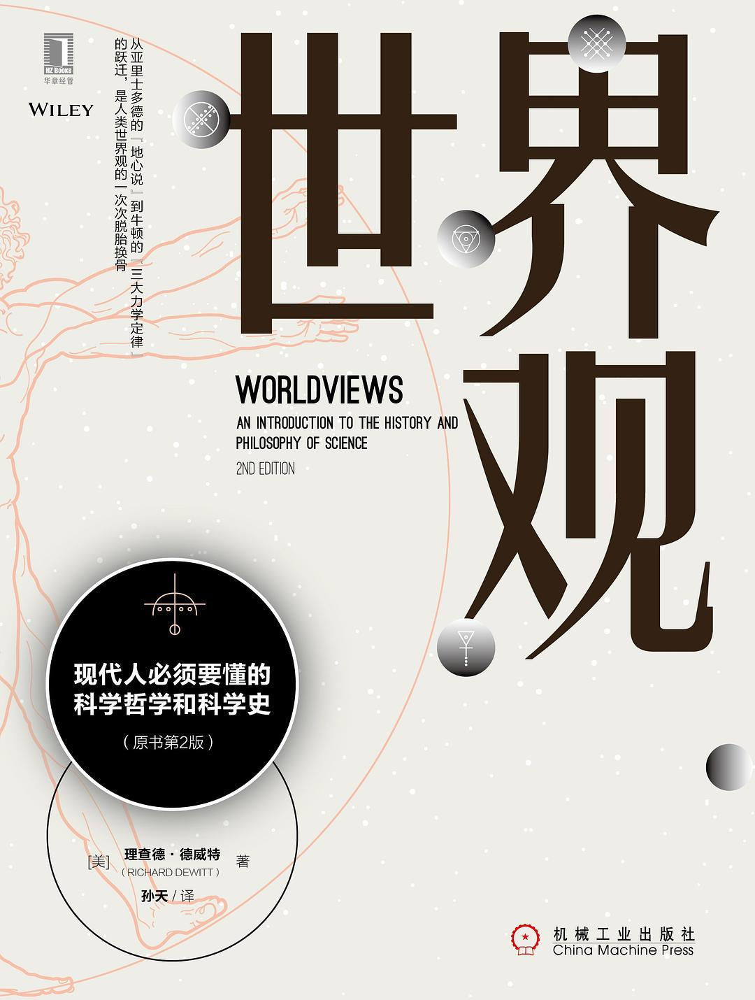

 

> “你连世界都没观过，哪儿来的世界观？！” —— 《后会无期》

 

&emsp;&emsp;我们从小就被教育要培养正确的世界观、人生观和价值观，以及要科学地看待世界。那么正确的标准是什么？何为科学地看待？这些在我脑海中并没有留下太多明显地印记。也许是学生时代“随风潜入夜”地潜移默化，让我对这些概念只是模糊地理解，直到通读《世界观》这本书。

《世界观》封面

&emsp;&emsp;[《世界观》](https://book.douban.com/subject/30379527/)是一本普及型读物，也就是说读这本书不需要太多前置知识。副标题是“现代人必须要懂的科学哲学和科学史”，很直观，讲的是科学哲学和科学史的内容。第一部分介绍了科学哲学中的各种概念，第二部分讲从亚里士多德时代到牛顿时代整个物理科学的演进历史，最后一部分介绍了近现代的核心科学理论的发展，涉及到量子力学、相对论和进化论。

&emsp;&emsp;看目录内容感觉四平八稳，实际读起来，对以往固有认知的冲击此起彼伏。这种冲击并非是横冲直撞式地颠覆，更多地是让人进入一种深思的状态。

 

### **什么是世界观**

&emsp;&emsp;按照以往理解，世界观就是如何看待外在客观世界，而《世界观》则给出了一个非常形象化的拼图比喻。人的各个观点可以看做是拼图的一小块，而最终要形成一个完整的拼图，则需要各个小块能够恰当地拼合在一起。这里的关键点是“拼合”，也就是所谓的自洽。翻译一下，世界观就是一组有关对世界认知的逻辑自洽的观点。

&emsp;&emsp;拼图有两个特点：一是块数越多越难拼，对比到观点上，观点越多，越容易出现矛盾，越难自洽；二是牵一发而动全身，一块拼图有问题，特别是中间的拼图出问题，影响范围会很大。换句话说假如核心观点被推翻，整个世界观可能就要重建。这很形象地说明了建立一个自洽的观点体系是多么难的一件事。

&emsp;&emsp;而对于人们如何获得观点，书中介绍了两大类理论：真理符合论和真理融合论。简单讲，真理符合论是用理论预测结果和实际的外在客观现象进行对比，符合客观现实即为真；而真理融贯论，则是指观点是否能与当前观点集合相融合，换句话讲，就是是否符合当前公认的科学知识体系（以科学为基础的融贯论）。前者依赖的是对外在世界的观察和实验，后者则偏重于理论的融合。

&emsp;&emsp;乍一看，真理符合论更靠谱，我都直接观察到了，岂不是更有说服力。但很遗憾的是，一方面，知觉表征论告诉人们你所看到的未必就是客观现实（参考缸中之脑思想实验），另一方面，你想观察到直接证据远没这么简单，拿简单的日心说来讲，地球围绕太阳旋转最为直接的证据是最终于20世纪90年代首次被观测到的恒星视差。也就是说，你的感官直觉很难告诉你科学真相。假设你没有任何物理知识，扔到古代去，你绝大可能会认为是太阳围绕着地球转动。《后会无期》里有句话说“你连世界都没观过，哪儿来的世界观？！”抱歉，即使你自己去观，得到的结果也很可能是错的，世界真没有人们想象中的这么直观和简单。

&emsp;&emsp;这也侧面说明了知识教育和知识传承的重要性。

 

### **有关科学理论的演进**

&emsp;&emsp;阅读《世界观》之前，我对科学的基本性质有两个认知：一是科学的可证伪性；另一个是科学理论是真实世界规律的近似，也就预示着科学革命的必然性。而《世界观》告诉读者，虽然大概如此，但是事情仍然不是这么简单。

&emsp;&emsp;通常，以物理科学为例，基本上是从理论假设出发提出预测，并对其进行实验验证，再对比结果判断理论真伪这样的过程。实验符合预测的情况叫做证实推理，相悖的叫做不证实推理。本质上，证实推理属于归纳推理的一种。但是，由于科学理论本身会有很多预设或者叫辅助假设，也就是说预测是由主体理论结合辅助假设构成的一系列条件推导出来的，而如果预测与实验结果不符，并不能说明主体理论不成立，也可能是辅助假设的问题；相反地，如果预测与实验结果相符，也不能完全地认定主体理论是正确的，也可能会受到辅助假设的干扰。而对于主体理论和辅助假设的取舍，往往也很复杂，没有一个理论标准。《世界观》还提到了休谟的归纳问题、亨普尔的乌鸦悖论、奎因-迪昂论点等等，在整个科学哲学部分，都在反复强调科学理论证据和推理的复杂性。

&emsp;&emsp;而在科学史部分，尤其是从亚里士多德到牛顿这个历史阶段的科学理论演进，能看到整个过程是一步步迭代发展的。从亚里士多德开始，经历托勒密、哥白尼、第谷、开普勒，一直到牛顿，围绕地心说和日心说的理论，在哲学性/概念性事实的影响下，逐步推进。直到近现代，两朵乌云引发的物理大厦的重建，成为科学革命的重大事例。

 

### **有关科学史的细节**

&emsp;&emsp;我读《世界观》收获最多的有两个方面，一是科学哲学的启示，另一个就是科学史中的细节。以下是其中部分节选内容：

+ 在亚里士多德之前，人们就知道世界是平的，而地心说是以经验为基础的自然朴素的观点，并非唯心说。如之前所提到的，很难通过直觉或以当时的观测条件来获得真相，所以不要怀疑古人的智商。
+ 哥白尼的日心说理论的计算方法与托勒密的地心说理论非常相近，只是太阳和地球的位置不同，且不需要等距点。他们都基于相同的经验事实，且尊重正圆事实和匀速运动事实（哲学性/概念性事实）。但实质上，哥白尼体系和托勒密体系一样复杂，乃至于在预测和解释方面比托勒密更差。
+ 在没有强力证据的支持下，科学家对客观规律的认知会受个人的哲学偏向（哲学性/概念性事实）所影响：
  + 哥白尼可能受新柏拉图主义的影响，认为太阳是“上帝”在宇宙中心的实体代表，所以提出日心说；
  + 开普勒在找出上帝构建宇宙的规律性方面倾注了巨大热情，毕生坚持对于多面体架构的研究，最终提出了三定律；
+ 天主教在16世纪初的宗教改革之前，对新科学观点是持宽容态度的，也愿意在新发现需要时重新对教义进行解读。
+ 人们对于科学理论的工具主义态度：
  + 在哥白尼时代，在天文学界，人们是以现实主义态度对待托勒密体系，而以工具主义态度对待哥白尼体系（使用哥白尼理论制作天文学表格）；
  + 在广义相对论中，引力效应是大质量物体导致时空曲率的一种体现，并不是真实存在的；而实际上，牛顿对于重力也是持工具主义态度的，他自己也不确认引力的客观性；
  + 如果用现实主义态度对待物理学理论，那么就应该用现实主义态度对待相对论，而用工具主义态度对待牛顿理论；

&emsp;&emsp;通过以上的历史细节，可以体会到科学史过程并不是这么简单和直观的。就如作者而言，很多看起来一目了然、已成定式的科学观念并非就这么理所应当，而整个观念形成的过程比想象的复杂很多。简单只是假象，复杂才是根本。科学先驱将现实世界通过简单的公式进行提炼、归纳，意图用简洁优美的数学进行概括，并通过科学教育传达给大众，而在整个过程中，有些细节信息被隐藏过滤掉了，而这些细节并非可有可无，反倒是体现了很多接近本质的东西。

 

### **什么是科学的态度**

&emsp;&emsp;有人把科学当作信仰，而我从《世界观》中体会到的，科学不是信仰，更多的是一种态度和方法论。自我审视和自我批判，以及严谨的对待现实，这些都是科学精神的一部分。毕竟，科学理论在哲学层面上是无限接近真实，而并非真实。

&emsp;&emsp;我阅读《世界观》最大的收获，就是去努力秉持一种科学的态度去看待世界。此外还有一些感想：

1. 对科学知识的更迭过程的了解，有助于形成对科学更加客观健康的认知态度，一定程度上避免对权威的盲目崇信，逐步形成个人的独立思考习惯。

2. 世界是复杂的。对规律的提炼简化，有助于人们的认知理解和学习传播，但并非一定真实可靠。

3. 对外在世界的认知态度，最好的还是从客观理性出发，严谨求真，不盲从不逆心，形成独立思考的能力和习惯。

4. 基于以上，在通识教育里，对科学史科学哲学的介绍是有必要的，能够帮助学生在学习阶段的中前期就形成对科学规律更加客观的认知。

 

&emsp;&emsp;有些书，会开启心智，拓宽胸襟，激发人的自省意识。《世界观》即是如此。

 

>  借我借我一双慧眼吧
>
>  让我把这纷扰
>
>  看得清清楚楚、明明白白、真真切切。
>
> ​			—— 《雾里看花》

 

相关链接：

[《世界观》读书笔记（一）](https://nkduran.github.io/2020/03/30/shijieguan-notes/)

[《世界观》读书笔记（二）](https://nkduran.github.io/2020/05/28/shijieguan-notes-2/)

[《世界观》读书笔记（三）](https://nkduran.github.io/2020/05/28/shijieguan-notes-3/)

