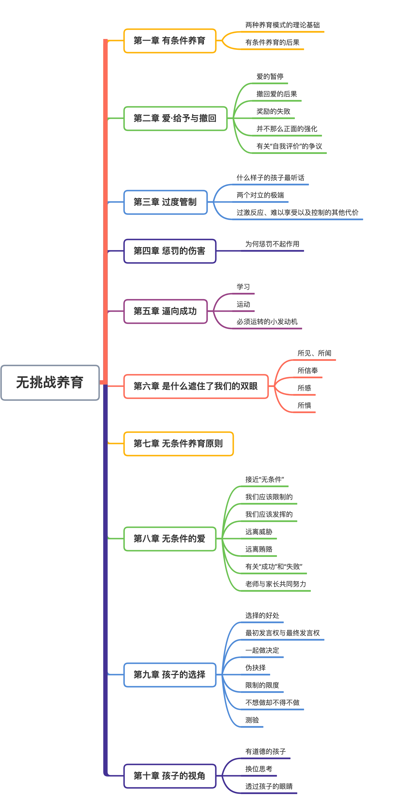
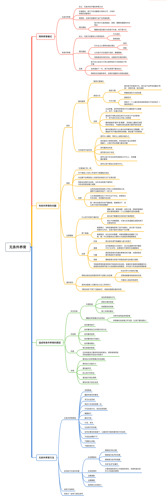

### 目录

### 第一章 有条件养育

#### 1、两种养育模式

+ 无条件养育：无条件给予爱的养育方式。
  + 价值取向：孩子不应该赢得父母的认可，父母本来就应该爱他们。**重要的并不是父母认为在无条件的爱他们，而是他们感觉父母在无条件的爱他们。**
  + 预测性：无条件地爱孩子将会产生积极结果。

+ 有条件养育：对孩子的爱和认可附带条件，要么是**行为良好**，要么是取得**成就**。

 

#### 2、两种模式的理论基础

##### 针对有条件养育：

+ 与行为主义心理学相近（代表人物斯金纳），其认为人类所有行为，无论是行止，还是热情冷漠，都是建立在是否被**“强化”**的基础之上。“强化”方式包括奖励和惩罚。
+ 仅仅关注外在行为，而忽视孩子的个性、想法、感觉和需求，会导致父母对那些仅以强制孩子做什么（或停止某种行为）为目的的训导技巧产生依赖。
+ 除行为主义理论外，还有其他因素：
  + 比如，认为孩子天生就是不良的，把家长不附带任何条件的爱解读成对自私、苛求、贪婪、不体谅他人行为的纵容。
  + 以成人社会的规则作为判断标准，将人与人之间的互动，甚至是家庭成员之间的互动，当做经济交易的倾向。认为劳有所得、多劳多得，不能不劳而获，没有付出就不应该有回报。

##### 针对无条件养育：

+ 孩子的行为，只不过是其感觉、思想、需要和意愿的外在表达。**重要的是实施行为的孩子本身，而不是行为。**

+ 孩子需要引导和帮助，但他们不是小怪物，不需要被驯化，不能强迫其就范。孩子在成长过程中可以形成许多个性，但大部分取决于他们如何成长。
+ “互换关系”并不适用于所有人际关系，有些人际关系是建立在关心之上的。

 

|                  | 无条件养育                       | 有条件养育                         |
| ---------------- | -------------------------------- | ---------------------------------- |
| 焦点             | 全面身心（包括理由、想法、感受） | 行为                               |
| 如何看待人性     | 积极或平衡                       | 消极                               |
| 如何看待父母的爱 | 天生被赋予                       | 需要争取的特权                     |
| 技巧             | 并肩协作（解决问题）             | 实施手段（通过奖励和惩罚加以控制） |

表1：针对两种养育行为的对比总结

 

#### 3、有条件养育的后果

+ 当家长的爱取决于孩子的行为时会产生哪些后果？作为“爱”的接受方，孩子会唾弃自己不受珍视的那部分，最终他们会认定自己只有以某种特定方式表现（思考、感觉）时才是有价值的。
+ 有条件养育模式可以传递给下一代。感觉自己为得到家长认可而必须达到某些条件的青少年，最终会变得不喜欢他们自己。
+ 得到的支持越有条件，自我价值感的认知就会越低。

非常重要的一点：**相比父母对孩子有何感受，孩子如何经历这些感受以及如何看待父母对待他们的方式才更重要**。

 

### 第二章 爱·给予与撤回

#### 1、爱的暂停

+ “暂停”是“暂停正面强化”的缩略语，后者起于半个世纪以前，用于训练实验室动物。发明“暂停”的行为主义者认为人类与其他生物物种没有区别。
+ “爱的撤回”与更加严厉的惩罚手段如出一辙，二者都是在向孩子表达：如果他们做了令我们不满意的事，我们就会为了改变其行为给他们制造不愉快。

+ 表现方式
  + 语言方面：
    + 轻微表现方式：面对孩子的某些行为，家长会不动声色地撤出“阵地”，变得冷漠、缺乏温情。
    + 强烈表现方式：明确拒绝的方式收回爱，比如“你那样做我就不爱你了”，“你做那样的事，我都不想跟你在一起了”。
  + 行为方面：
    + 家长走开。
    + 将孩子一个人留在房间或其他家长不在的地方 —— “强迫性孤立”（单独监禁）。

 

#### 2、撤回爱的后果

+ 长远来看，惩罚性养育技巧可以确保孩子立即顺从，但不一定真正有效。孩子对撤回爱的反应可能会让家长以为可以进一步训导。
+ 基本点：强迫孩子将焦点放在其行为对自己产生的影响下，而不是关注自己对他人的影响。
+ 某些情况下，“爱的撤回”有可能会比其他惩罚手段更恶劣和残酷，因为它所施加的最终威胁是“抛弃”或“隔离”。由于低龄儿童缺乏经验和时间观念，完全依赖于家长，并不能意识到这是家长暂时性的态度。
+ 童年时期没有什么比家长如何看待自己更重要，对“被抛弃”的不确定感和恐惧感，都可以深深影响我们，即使已长大成人。

 

#### 3、奖励的失败

+ 奖励属于“正面强化”的一种。
+ 奖励对于提高人们的工作或学习质量毫无效应。大量研究结果发现，无论是成人或孩子，被提供“奖励”后会更不容易完成、或出色地完成任务。
+ 奖励永远都不会帮助某人对某项任务或行为产生责任感。
+ 动机分为”内在动机“和”外在动机“，内在动机出于喜好等因素，外在动机出于获得奖励或逃避惩罚。外在动机很可能会侵蚀内在动机。当外在动机趋于强烈时，内在动机就会随之减弱。

 

#### 4、并不那么正面的强化

+ 实物奖励和象征性奖励对孩子产生的影响也同样适用于口头奖励。
+ 出色完成某项创造性工作的人在受到表扬之后，通常不会顺利完成下一项工作。原因有三：
  + 表扬会制造“维持原有成绩”的压力
  + 表扬会降低人对所做事情的兴趣
  + 一旦开始想着如何持续受到正面评价，人就会变得越来越不爱冒险，而冒险是创造力的先决条件。
+ 口头表扬通常反应了对行为过于关注。容易助长外在动机，而忽略内在动机。
+ “正面强化”是“一种有条件的爱”，父母有条件接受的不只是孩子的某种特定特征或行为，而在孩子看来，其“整体自我”只有在取悦父母时才是好的，**这是一种对自我评价的严重削弱**。极端情况下，会让孩子变成”表扬成瘾者“（讨好型人格）。
+ “正面强化”是否会对孩子产生负面影响（如果产生，有多严重）取决于很多因素，如何表扬、对谁表扬、为何表扬都是有区别的。有可能将负面影响降到最小，但也算不上理想。

 

#### 5、有关”自我评价“的争议

+ 较高的自我评价并不一定总伴随好的结果。
+ 无条件的自我评价对预测人生质量至关重要。
+ 当一个人把自己的价值感建立在是否迎合自己或他人的期望时，最开始的后果就是自我评价的剧烈起伏。有条件的自我评价可能会导致焦虑、敌意和自我防卫。
+ 不将自己的价值感建立在成绩之上的人，会更倾向于将失败看做是短暂的挫折和一个需要解决的问题，不容易陷入焦虑或绝望。

 

### 第三章 过度管制

&emsp;&emsp;**当今社会中，养育模式的最大问题并不在于纵容，而是对纵容的恐惧。**真正的挑战是，反思我们信以为真的事，并质疑其是否真正符合孩子的需要。

 

#### 1、什么样子的孩子最听话

+ 善解人意、宽容温厚、亲和力强、控制欲望弱的家长要比自认为“有权对孩子为所欲为、强加意愿给孩子、制定各种标准、不顾孩子需要和意愿粗暴干涉孩子行为”的家长，更容易拥有一个心甘情愿听话的幼龄童。
+ 家长给予尊重和支持的孩子要比家长强调控制手段的孩子做得更好。
+ 总的来说，家长不依赖强势、与家长关系温暖且坚固的孩子会更加听话。

 

#### 2、两个对立的极端

+ “专制的环境令人生病”。家长坚持绝对控制的结局：有些孩子会变得极度顺从，有些会变得极度反抗。
+ 专制性管制获得了孩子的顺从，却以其个性自由的缺失为代价，自信方面也可能会产生问题。
+ 有些孩子在生活中的意愿、判断和需要全部遭到了压制，唯一可以恢复其自主感的方式就是变得极度叛逆。

 

#### 3、过激反应、难以享受以及控制的其他代价

+ 【饮食方面】营养学家做过一个有趣的实验：他们观察了77名2~4岁的儿童，了解了家长视图控制孩子吃饭习惯的程度。发现那些坚持要求孩子只能在吃饭时间进食（而不是饿了就吃）、或鼓励孩子吃光盘里的食物（即使孩子已经饱了），或用食物（特别是甜食）奖励孩子的家长，会养出丧失调节热量摄入能力的孩子。
+ 【道德方面】在专制家庭长大的孩子，在讨论道德冲突中哪些行为“正当”时，会更倾向于使用外在（而非内在）道德取向。（外在指法律规范，内在指良心）
+ 【兴趣方面】当孩子做事受到过度管制时，会更容易变得对所做的事情没有兴趣，也更容易在面对挑战时半途而废。
+ 【技能方面】有的实验结果显示，管制型家长的孩子单独完成作业的能力较差。
+ 专制型养育容易导致孩子较低的内在动机、较差的价值观和道德感内化、较弱的自我调节能力以及较差的自我感觉，并对亲子关系造成有害影响。
+ 家长的任务是“掌管”，即为孩子创造一个健康、安全的生活环境，提供指导、设定界限，但并非“掌控”，即苛求绝对服从、依赖于压迫或无休止的规范。家长的目标是“授权”，不是归顺；方法是尊重，不是强迫。
+ 家长需要思考的是一种从根本上与控制不同的养育模式，而不是试图去寻找一种介于“过度管制”和“放任自流”之间的中庸之道。

 

<!-- more -->

### 第四章 惩罚的伤害

&emsp;&emsp;惩罚孩子就是给他们制造不愉快，或阻止他们感受愉快，目标往往在于改变他们的未来行为，并不限于体罚。

> 注：有一种“自然后果”的教育方式，是让父母不作为，或者说拒绝帮助孩子。（比如，孩子回家晚了，没有赶上吃晚饭，就让孩子饿着。）这是法国启蒙思想家卢梭提出的一种道德教育方法，主张让儿童通过体验其过失的不良后果去认识错误、吸取教训，学会服从“自然法则”，自行改正。而有专家指出，当父母对孩子的困境坐视不理的时候，孩子就会产生双重失望感，在失望自己做错事的同时，也会对你看起来漠不关心，没能出手帮助自己阻止意外发生的行为更加失望。因此这也是一种惩罚方式。

 

#### 1、为何惩罚不起作用

+ 惩罚令人暴怒，同时让人感觉无能为力。
+ 惩罚是权力使用的榜样。体罚给孩子竖立的榜样是暴力，让他们学会用暴力解决问题。
+ 惩罚最终会失效。
  + 孩子越大，越难控制。
  + 家长持续利用手中全力控制幼童会造成一个不可避免的结果，即永远都不知道该如何影响他们。因此家长越依赖于惩罚，就越不能用自己的力量真正影响孩子的人生。
+ 惩罚恶化亲子关系。
+ 惩罚让孩子忽视重要的事情。
  + 惩罚不会让孩子将焦点放到自己的行为上面，更不会让他们质疑为什么这样做，或者应该怎么做。
  + 孩子会倾向于将焦点放在惩罚行为本身，惩罚不公平以及下次如何逃避惩罚。
+ 惩罚让孩子更加以自我为中心。
  + 惩罚会引导孩子将注意力放在行为的主体上，即孩子自己。
  + 家长越依赖于惩罚性后果，孩子就越不关心自己的行为会对他人产生什么样的影响，反而会变得越来越喜欢做"成本效益分析"，即在“被抓住和被惩罚的风险”与“随心所欲做某事的快乐”之间做衡量。

 

### 第五章 逼向成功

&emsp;&emsp;心理学家埃里希·弗洛姆不无悲哀地说：“鲜有家长具备勇气和独立性，做到更关心孩子的幸福，而非孩子的成功。”

+ 稍大一点的孩子所感受到的压力，不仅是被期望表现顺从，还要获得成功；不仅要乖，还要出色。
+ 有些家长只不过是将孩子的幸福放在自己的幸福之上，通过孩子的成功获取间接快感，可能是过于将自我认同栓绑在孩子的成绩上。这种家长心中的方程式，“孩子的成功=我的成功”，“因为有我，所以孩子成功”，与选择性使用正面强化这样的养育技巧有直接关系。

 

#### 1、学习

+ 学生以"高分"为目标，还是以“解决问题”或“理解内容”为目标，二者存在巨大差别。
+ 当孩子被鼓励将焦点放在追求更好的学习成绩上时，会导致三种结果：
  + 失去对学习本身的兴趣：孩子越看重分数，其天生对世界保持的好奇心就越容易蒸发掉。
  + 试图逃避富有挑战性的任务
    + 从理性考虑，相对容易的任务是达到更好结果的保证；
    + 如果家长明确表示学习（及其带来的乐趣）比作品的质量更重要，孩子就会更倾向于竭尽全力解决自己感兴趣或新鲜的事物；
  + 不愿深入和批判性思考：以分数为目标，会导致学生以一种更肤浅、更表面的方式去思考，甚至于走捷径地方式去获取好成绩。

 

#### 2、运动

#### 3、必须运转的小发动机

+ 研究结果表面，竞争会阻碍人们竭尽全力去工作和学习，由于各种原因，在大多数任务中的最佳表现非但不要求人们试图打败别人，而且需要他们完全脱离这种场面。合作要比竞争更有意义。
+ 如果人在生活中的各个方面都能被无条件地去爱，他们还有取得成功的动力吗？
  + 即使这种说法有意义，那也或许只适用于成人。儿童需要被无条件地爱。
  + “努力工作”和“取得成果”是两码事。如果认可是建立在“努力工作”上，但这个不容易衡量，而后者受很多外部因素影响，不能作为单一要求。
  + “有条件接纳”的负面影响要远远超过“取得更多成就”带来的正面影响。
  + “有条件的接纳”通常不起作用。

+ “惧怕失败”不等于“迎接成功”，前者会阻碍后者的实现。另外，“惧怕失败”会在工作出现问题时，导致“情绪指向性应对”和自我修复，而非“问题指向性应对”。

 

### 第六章 是什么遮住了我们的双眼

&emsp;&emsp;我们的需求和恐惧 —— 主要取决于我们自己的成长过程 —— 是如何影响了我们与孩子的互动方式。

 

#### 1、所见所闻

+ 从养育自己的人身上学会了如何养育孩子；
+ 受家里长辈的影响；
+ 受身边亲戚朋友的影响；
+ 受某些育儿专家的影响；

&emsp;&emsp;糟糕的养育模式具备的内在特征让人产生不理智的习惯。包括：

+ 糟糕的训导手段用起来很容易；
+ 这种养育模式的效果立竿见影；（让孩子暂时顺从）

所以要意识到养育模式的问题，需要经常反思并判断出哪些价值观和养育行为是可取的，而哪些是没道理和有害的，这需要付出努力、进行尖锐的思辨，甚至需要勇气。

 

#### 2、所信奉

+ 我们如何看待孩子：
  + 针对美国成人的调查发现，大多数成人公民表示，他们讨厌所有年龄段的孩子，认为孩子粗鲁、懒惰、不负责任，而且缺乏基本的价值观。
  + （最近）每年，美国都有超过130万儿童无家可归，22%~26%的低龄儿童被列为“贫困”，这些彰显了我们对孩子的态度。

+ 我们如何看待自己对待孩子的方式：
  + 有的认为整整一代人被宠坏了，应该回归传统的养育模式，停止纵容他们；
  + 有的抱怨，孩子如今的生活太安逸，是因为我们竭尽全力试图为他们屏蔽生活中的沉重打击；

+ 我们如何看待竞争：
  + 据说“竞争”是美国的宗教信仰；
  + 我们与孩子间的关系被看做是一种“零和”关系；

+ 我们如何看待孩子的能力：
  + 依赖传统养育模式的人更倾向于高估孩子独立处理事务的能力；
  + 对孩子的行为和智力水平抱有不切实际的过高期望；
+ 我们如何看待顺从：
  + 研究结果显示，一种文化中的人们越想让孩子符合传统养育原则和专制养育，就越倾向于使用体罚。
+ 误将“报应”当正义
+ 二选一式思考：
  + 惩罚和忽视：要么对孩子施以惩罚，要么对他“听之任之”；

 

#### 3、所感

+ 原生家庭经历的影响；
  + 认为我们的父母对自己做的每一件事都是为我们好，要像父母对待自己一样对待孩子；
  + 依恋理论：如果你没有得到过无条件的爱，你就无法给予无条件的爱；
+ 照顾孩子需要太多的耐心；
+ 过多考虑自己需求和目标的家长，比起从整体上考虑孩子或家庭需要的家长，更倾向于不接纳他们的孩子，更容易使用惩罚和控制的手段去对待孩子。

 

#### 4、所惧

+ 害怕自己的养育模式存在缺陷
+ 害怕自己无能为力
  + 试图用控制自己孩子的方式来获得某种程度的控制感；
  + 有些家长的生活专注于满足自己表现强势的需要；
+ 害怕被评价
+ 担心孩子的安全
+ 害怕孩子娇生惯养
+ 害怕对孩子放任自流

 

&emsp;&emsp;真正伟大的家长，其过人之处就在于他们原因面对令人不安的问题，愿意质疑自己现在的所作所为，质疑自己童年的经历，当他们面对一个可以更好解决与孩子冲突的建议时，他们会抵抗住捍卫老观念的诱惑。除非我们准备好面对以下问题，否则我们不太可能实现寄予在孩子身上的长期养育目标：**我刚才对孩子的所作所为，是否可能与我的需要、我的恐惧和我的成长经历有关，而无关他们的真正兴趣和需要？**

 

### 第七章 无条件养育原则

&emsp;&emsp;本章及后面的章节，会提供一些粗略的育儿原则及取代传统养育模式方法的思路，绝非“如何养育出好孩子”的步骤式菜谱。这些来源于调查研究，其他深思熟虑的育儿顾问著作，作者个人的经验及对其他家庭的观察。是否合理和适用，需要读者自行判断。

13点原则：

+ 深思熟虑：诚实面对自己的动机，多花一些时间反思自己对孩子的所作所为；
+ 重新考虑你的要求：
  + 有些情况下，问题出在家长的要求并不符合对特定年龄段孩子的合理期望；
  + 在寻求让孩子乖乖听话的方法之前，应该首先花点时间去反思所提的要求的价值和必要性；

+ 专注长远目标：
  + 应该时刻想到自己真正追求的是什么，尽量避免掉进日常生活的琐碎陷阱。
  + 当家长尽力记住自己更宏大的养育目标时，也就是当他们把焦点放在任何更加雄心勃勃的大事，而非只是强迫孩子某一时刻的服从时，他们就会倾向于使用更好的养育技巧。

+ 将亲子关系放到第一位
+ 不仅改变行为，而且改变视角
  + 当孩子出现不当行为时，无条件养育家长会倾向于将其看做是一个需要解决的问题，一个教导的机会，而非让孩子痛苦的机会。

+ 尊重、尊重、尊重
  + 尊重孩子意味着努力避免对孩子的讽刺、挖苦，无视孩子的要求，怠慢孩子生气时的感受，轻视孩子的恐惧等，之外也要意识到孩子在某些问题上比我们有见识。不能总是臆断，仅仅因为自己更成熟，就一定比孩子更洞悉他们自己。

+ 真实可信
  + 当把事情搞糟时，应该向孩子道歉；
  + 与孩子发展一种真诚、温暖的关系，建立“连接”；
  + 即使我们坦承自己的不足，即使我们用心灵和孩子对话，即使孩子可以看到，无论成年人拥有多少特权和智慧，却依然要在世界上挣扎前行，要做好事，要衡量他人的需要，要不断学习 —— 就像他们自己一样，他们也依然会景仰我们。事实上，我们与他们相处时越真实，他们就越可能真正地尊敬我们。
+ 少说，多问
  + 引导孩子产生想法、异议和感受要比向孩子发号施令（即使态度友好）更有作用；
  + 一般来说，我们首要任务是找出问题根源，意识到孩子的所需；
+ 记住孩子的年龄
  + 必须让自己的期望值符合孩子力所能及的行为；
+ 在符合事实的前提下，以最好的可能性看待孩子的动机
  + 来源于两个事实：
    + 我们通常不能确切知道为何一个孩子会出现某种行为；
    + 我们对其行为理由的看法会创造出一个自我实现预言；
  + 这条原则对于低龄儿童尤为重要；
+ 不说没必要的“不”
  + 建议是尽可能在任何时候说“是”，它应该成为家长的默认反应，除非有很好的理由不答应孩子提出的事，或干涉阻止他们的行为；
  + 除了想让孩子感觉他们自己有能力，让他们享受探险世界、让他们尝试新鲜事物以外，还有个理由：执行一系列永无止境的禁令是很难做到的，这会产生一个两难境地：
    + 一方面，我们会感觉被迫退让，最后让孩子随心所欲，结果就是我们在真正必须设定界限的时候孩子不再拿我们当真；
    + 另一方面，我们会拒绝变通，因而花大量时间与孩子处于冲突状态，这对于双方来说都是极度的不愉快。
+ 不要那么死板：给孩子定制的规则可以有所放宽，根据情况灵活变通。
+ 不要匆匆忙忙：给孩子一点时间。

 

### 第八章 无条件的爱

#### 1、接近无条件

+ 第一步：留意“无条件养育”的整体概念。我们越按照这种方法去思考，越能反思我们对孩子的行为和语言是否被合理解读成了有条件的爱。
+ 第二步：我们需要养成自我诘问这样一个具体问题的习惯，“如果将我对孩子的那句评价用在自己身上，或者将我对孩子的行为施加到自己身上，我会感到无条件的爱吗？”
+ 无条件的爱在孩子难带时最重要。

 

#### 2、我们应该限制的

+ 限制批评的次数
+ 限制每次批评的范围
+ 限制每次批评的强度
+ 寻求“批评”的替代

 

#### 3、我们应该发挥的

+ 少做传递有条件认可信息的举动，多做传递无条件认可信息的事情

 

#### 4、远离威胁

+ 在家长与孩子之间建立一种与奖励-惩罚完全不同的互动形式

 

#### 5、远离贿赂

+ 取代孩子服从或取悦我们时给予他们奖励的方式的一个办法，就是没有特别理由地送给孩子东西，只是因为你爱他们。
+ 当孩子有好的表现时，应该怎么说：

| 不要说……                         | 试着说……                                                     |
| -------------------------------- | :----------------------------------------------------------- |
| “我喜欢你这样做……”               | 什么也不说（只是关注）                |
| “画的好！我喜欢这样画！”         | 描述你所看到的，而非评价：“嘿！你给那些人物脚上画了新东西。他们有了脚趾头！” |
| “你真是一个乐于助人的好孩子！”   | 解释其行为给他人带来的影响：“你摆好了桌子！这样我做饭时就方便多了。” |
| “你的论文写得不错！”             | 引导反思：“你怎么想到从一开头儿就这样抓住读者的注意力呢？” |
| “迈克尔！把东西分给别人就对啦！” | 提问，而非评价：“是什么让你决定把自己的巧克力饼干分给迪尔德丽的？你不用必须这样做啊？” |

表2：鼓励话术

 

#### 6、有关成功或失败

+ 我们不应该给孩子压力，而是支持、温和的指导、鼓励，信任孩子日益增长的能力，必要时给予帮助。
+ 我们不应该让孩子参加竞争性强的活动，而应给他们提供享受学习乐趣的机会，用不需要战胜他人的方式去学习。
+ 我们不应该过度专注于他们的学习成绩，而是应该对孩子所学的东西产生浓厚兴趣。
+ 帮助孩子获得 —— 无论是写作、滑雪、吹小号，还是电脑游戏 —— 成功的最有效（且破坏性最小）的办法就是尽可能地帮助他爱上他正在做的事。
+ 鼓励更多、评价更少、永远爱他。

 

#### 7、老师与家长共同努力

 

### 第九章 孩子的选择

#### 1、选择的好处

+ **我们所有人都有一个基本需求，即做我们生活的“主宰”，而非“小卒”。经历自主感很重要，一种我们是自己行为“创始人”的感觉。事实上，我们做了什么选择往往没有选择这个行为本身更有意义。**

+ 孩子学会做正确决定的方式就是通过做决定，而不是遵循安排；
+ 拥有自主权的孩子最能建设性地面对剥夺自主权的环境；

 

#### 2、最初发言权和最终发言权

+ 限制我们手中的权力并不一定意味着我们必须对自己的倾向保持沉默，而是应该尽可能地把最后的决定权放到孩子手中；
+ 即使我们不愿授予孩子最终发言权，但仍要授予他们最初发言权，也就是说，给予他们申辩的机会；

 

#### 3、一起做决定

+ 一项早期研究表明，当孩子被给予很多做决定的机会时，他们会变得更加“活跃、外向和率真”。在更近期的观察研究发现，仅有自由还不够，"家长与孩子之间的高度互动"也是必须的；
+ 我们必须积极主动地支持孩子做选择的能力，帮助他们感觉到至少在某种程度上是可以自己做决定的。我们的工作就是丰富他们的自主感，与他们共同思考如何协商找到解决具体问题的办法；

 

#### 4、伪抉择

+ 有时家长假装让孩子做决定，实际上自己保留了真正的决定权。这种“伪抉择”有三种形式：
  + 家长提出哄骗性问题。比如“你想现在洗碗？还是在你最喜欢的电视节目播出时洗碗？”
  + 在孩子做了被认为不当行为后，家长宣传将施加惩罚手段，却将其描述为是孩子自找的。比如“不要逼我打你屁股”。
  + 家长走过场地让孩子做抉择，但又明确每种选择必须导致什么后果。

 

#### 5、限制的限度

+ 孩子可以接受限制，甚至会承认其价值，但他们需要的是商量，而不是仅仅被束缚。

 

#### 6、不想做却不得不做

+ 运用侵犯性最少的策略：尽可能温和友好，不要用权势压制孩子。
+ 请诚实以待
+ 解释理由
+ 变成游戏
+ 以身作则
+ 给他们尽可能多的选择

 

### 第十章 孩子的视角

&emsp;&emsp;一个重要的问题，我们如何才能让孩子关心别人是否快乐？

#### 1、有道德的孩子

+ 关心他们。道德成长的根基在于家长与孩子之间的关系。
  + 安全的依附关系、滋养、尊重、响应和共情。这些事所有人类的基本需要。当这些需要得到满足时，孩子就从对它们的关注中解放出来，可以敞开胸怀帮助他人；
  + 知道自己被爱的孩子，安全感更多，戒备感更少，因此他们倾向于更有勇气向别人伸出援手；
  + 对家长安全依恋的孩子，不仅对他人反应热情，同时还更加坚定自信，独立自主，从各个角度上看，都显得富有社交能力，并且心理健康。
+ 向他们展示道德生活：家长要以身作则，帮助他人，更有道德；
+ 让他们练习，比如让孩子负责照顾弟弟妹妹；
+ 交谈，将良好的价值观直接传达给孩子，并以适合孩子理解的方式传达：
  + 我们需要建立明确的道德指南，清楚地表达我们期待什么，但尽量不使用强迫手段；
  + 耐心地阐述道理，让孩子的头脑参与其中，帮助他们反思道德疑问；
  + 告知胜于怒吼，解释胜于告知，讨论胜于解释；

 

#### 2、换位思考

&emsp;&emsp;走出自己的视角，思考别人眼里的世界是什么样子的，这是人类最不寻常的能力之一，称为换位思考。其有三大特点：

+ 空间感，我可以想象你怎样看待世界；
+ 我可以想象你如何思考事情；
+ 我可以想象你是如何感觉的；

让·皮亚杰认为，儿童要到7岁才具备这种能力。如何提高孩子的换位思考能力：

+ 树立榜样；
+ 通过和孩子一起讨论书或电视节目，鼓励他们换位思考；
+ 我们可以帮助低龄儿童变得对他人情绪敏感，可以温和地引导他们将注意力放在别人的语气、姿势或面部表情上，并邀请他们想一想这个人可能在想些什么以及他（她）是如何感觉的。重点不仅在于掌握一种技能，而且还要促进其形成一种性格。

 

#### 3、透过孩子的眼睛

家长从孩子的观点出发看待事情，有以下几点好处：

+ 帮助我们摸索出事情的真相；
+ 让我们面对孩子的情绪时更有耐心；
+ 我们要树立榜样，鼓励孩子一起换位思考；

 

### 内容脑图

