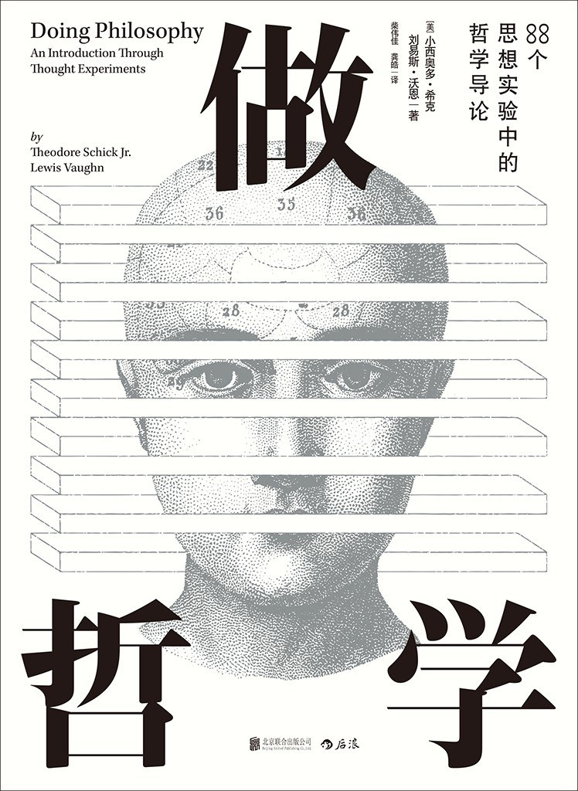

&emsp;&emsp;最近在读一本哲学入门的书籍，名字叫[《做哲学》](https://book.douban.com/subject/30136393/)，读的很爽。

《做哲学》封面

&emsp;&emsp;有时合上书本，我会琢磨这阅读快感从何而来，想来想去，大体原因有以下几个方面：

#### 1、和以往看过的以哲学史、哲学家为线索阐述哲学观点的方式不同，这本书是以核心问题作为出发点来组织材料。

该书围绕以下六大问题来展开介绍各个流派的哲学观点：

+ **心身问题**，即人的意识和物质的关系问题；
+ **人格同一性问题**，即在经过一些变化之后如何判断一个人与之前相比仍然是同一个人；
+ **自由意志和决定论问题**；
+ **道德相对主义问题**，即是否存在绝对的道德标准；
+ **恶与上帝的存在问题**，在恶存在的前提下是否还有全知全能全善的存在（上帝）；
+ **怀疑论问题**，人是否能够获得一个既全面又融贯的世界观（信念系统）；

通过这种内容组织方式，知识点得到了很好的串联，相对于以哲学史为线索罗列哲学家的观点而言，逻辑思路更紧凑，比较容易帮助读者建立一个知识脉络。

 

#### 2、该书的另一大特点是采用了大量的思想实验和一部分现实事例来引导读者针对某些观点做逻辑思辨。

&emsp;&emsp;一些国外作者在著书的时候喜欢在观点间穿插大量的细节事例和个人感悟，虽然可以一定程度辅助读者来理解他们的观点，但有时稍微控制不好就显得注水严重。相对而言，这本书很干，闲话很少，但是没有让人觉得干的塞牙，原因就是在介绍各种哲学观点间穿插了一部分现实事例和思想实验的内容。在很多人眼里，哲学可能是一个非常形而上的存在，与现实相距较远。而实质上，哲学问题的来源仍然是现实世界，只不过是在对问题本质的追根溯源的过程中，不断抽象而形成了一定的认知门槛。

&emsp;&emsp;以书内内容为例，比如针对堕胎会涉及心身问题和道德标准问题，法庭上的一些谋杀判定会涉及人格同一性问题，人工智能会涉及心身问题和自由意志问题等等。

&emsp;&emsp;而思想实验会支持构造一些超越现实的场景来引出问题，从而发现矛盾或者新的观点。这也是我理解的这本书的最大价值，锻炼读者的思辨能力。

&emsp;&emsp;总的来讲，该书所选的核心问题还是比较贴合现实，而不至于产生过高的理解门槛。

 

&emsp;&emsp;说到这，对于秉着实用主义观点的人可能会问“读这书有啥用啊？”，按我的理解，大概有三方面的作用：

#### 1、对思辨能力的锻炼，让人更趋于理性客观的看待外在世界，俗话来说就是不容易被人骗。

&emsp;&emsp;在该书的第一章里，有一节介绍了部分逻辑学的内容，包括三段论、充分和必要条件、演绎和归纳，以及一些非形式缪误。这一节很关键，可以说是阅读该书的基础。逻辑是针对哲学思辨的基础能力，其实也是针对日常是非判断所需的能力。阅读这几大核心问题的章节，思考这些思想实验，就是反复实践逻辑思辨的过程。

&emsp;&emsp;当前网络上充斥着各种良莠不齐的信息，其中就有大量的逻辑混乱的内容。通过这种思辨练习，可以过滤掉简单的无逻辑内容，省下很多时间，时间即是生命，也算是治病救人了。

&emsp;&emsp;另一方面是让你有意识的去过滤那些唬人的大词以及奇形怪状的新词。读《做哲学》的过程中，你会发现基本上不存在让你觉得不知所谓的词语。针对这一点在哲学逻辑的一些基本原则上也存在一些佐证，比如奥卡姆剃刀原则，尊重常识的原则等等。由此，新的概念只在非常必要的情况下才需要产生。从这个角度看，对于那些造词机器不客气地来讲，要么是傻要么是坏。

 

#### 2、培养对真善美的判断能力。

&emsp;&emsp;哲学是求真的学问，也是求善的学问。求真是关注事物本质，求善是关注道德标准，了解何为良好生活。以道德相对主义问题为例，这一章主要探讨的是伦理学的内容，涉及到了边沁的功利主义，康德的绝对道德，罗尔斯的正义论，诺齐克的自由至上主义，从道德谈到了人的内在价值，国家的合法性等等，和之前阅读的陈嘉映先生著的《何为良好生活》互为对照，颇有启发。

 

#### 3、开拓思路，提升认知，保持一颗对世界的好奇心。

&emsp;&emsp;向来荐书的主旨，就不用多述了。

 

&emsp;&emsp;最后提一件事。

&emsp;&emsp;很多年前，还在求学的时候，我买了一本侯捷先生著的《深入浅出MFC》，前言中引用了林语堂先生的一句话，至今记得，深以为然。

&emsp;&emsp;"只用一样东西，不明白它的道理，实在不高明！"